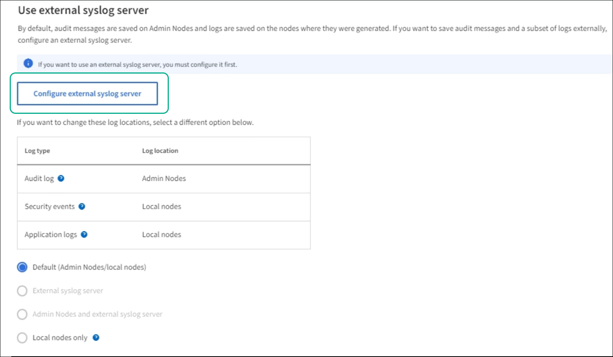

= Configure an external syslog server
:icons: font
:imagesdir: ../media/

[.lead]
 If you want to save audit messages and a subset of logs to a location outside of your grid, use this procedure to configure an external syslog server. 

.What you'll need

* You are signed in to the Grid Manager using a xref:../admin/web-browser-requirements.adoc[supported web browser].
* You have Maintenance or Root Access permissions.
* You have a syslog server with the capacity to receive and store the log files. 
//need specs

.About this task

By default, audit messages are saved on Admin Nodes and logs are saved on the nodes where they were generated. If you want to send audit information to an external syslog server, use this procedure to configure it. Local logs of audit records continue to be generated and stored when an external syslog server is configured

Sending audit information to an external syslog server enables you to:

* Collect and manage audit information such as audit messages, application logs, and authentication events more efficiently
* Reduce network traffic on your admin nodes

NOTE: When using an external syslog server, single logs greater than 8K are truncated at the end of the message. 

.Steps

. Select *CONFIGURATION* > *Monitoring* > *Audit messages and logs*.
+
image::../media/audit-messages-main-page.png[Audit messages main page]
//need update all screens

== [[Access-the-syslog-server-configuration-wizard]]Access the syslog server configuration wizard
. From the Audit messages and logs page, Select *Edit external syslog server*.
+

//need new screen

=== Enter syslog server address information
The Configure external syslog server page appears: 
//banner always there?

image::../media/enter-syslog-info.png[Enter syslog info]

. Enter the FQDN or IP of the remote server in the Host field.
. Enter the port of the remote server.
. Select the protocol used to send the audit messages to the remote server. 
TCP
TLS
RELP/TCP
RELP/TLS
UDP
//
+
.. If you select UDP or TCP, select *Continue*.
//additional protocol? 
[#attach-certificate]
.. IF you select TLS, you must upload at least one certificate. Do the following: 
//of the remote server? Select Browse to upload the new certificate.

//Select Browse to upload the new private key.

//Complete the Configuration wizard to save the new certificate and key.
=== Attach certificate

. To send audit information using  select the type of security certificate you want to attach to the endpoint.
+
The certificate secures the connections between
// S3 and Swift clients and the Load Balancer 
+
* *Upload certificate*. Select this option if you have custom certificates to upload.

* *Generate certificate*. Select this option if you have the values needed to generate a custom certificate.

//* *Use StorageGRID S3 and Swift certificate*. Select this option if you want to use the global S3 and Swift API certificate, which can also be used for connections directly to Storage Nodes. 
+

//tabbed blocks start here
+
[role="tabbed-block"]
====

.Upload certificate
--

.. Select *Upload certificate*.
.. Upload the required server certificate files:
 ** *Server certificate*: The custom server certificate file in PEM encoding.
 ** *Certificate private key*: The custom server certificate private key file (`.key`).
+
NOTE: EC private keys must be 224 bits or larger. RSA private keys must be 2048 bits or larger.

 ** *CA bundle*: A single optional file containing the certificates from each intermediate issuing certificate authority (CA). The file should contain each of the PEM-encoded CA certificate files, concatenated in certificate chain order.

.. Expand *Certificate details* to see the metadata for each certificate you uploaded. If you uploaded an optional CA bundle, each certificate displays on its own tab.
+
* Select *Download certificate* to save the certificate file or select *Download CA bundle* to save the certificate bundle.
+
Specify the certificate file name and download location. Save the file with the extension `.pem`.
+
For example: `storagegrid_certificate.pem`
* Select *Copy certificate PEM* or *Copy CA bundle PEM* to copy the certificate contents for pasting elsewhere.

.. Select *Create*. +
The load balancer endpoint is created. The custom certificate is used for all subsequent new connections between S3 and Swift clients and the endpoint.

--
//end Upload, begin Generate

.Generate certificate
--

.. Select *Generate certificate*.
.. Specify the certificate information:
 ** *Domain name*: One or more fully qualified domain names to include in the certificate. Use an * as a wildcard to represent multiple domain names.
 ** *IP*: One or more IP addresses to include in the certificate.
 ** *Subject*: X.509 subject or distinguished name (DN) of the certificate owner.
 ** *Days valid*: Number of days after creation that the certificate expires.

.. Select *Generate*.

.. Select  *Certificate details* to see the metadata for the generated certificate.

* Select *Download certificate* to save the certificate file.
+
Specify the certificate file name and download location. Save the file with the extension `.pem`.
+
For example: `storagegrid_certificate.pem`
* Select *Copy certificate PEM* to copy the certificate contents for pasting elsewhere.

.. Select *Create*.
+
The load balancer endpoint is created. The custom certificate is used for all subsequent new connections between S3 and Swift clients and this endpoint.

--

====
//end tabbed blocks

=== Manage Syslog content
//. Select **.

. Select *Continue*.

=== Send test messages
Use this page to send test messages to the newly configured remote syslog server to determine if the server is configured correctly. Test results will continuously appear on the page until the test is stopped. While the test is in progress, your audit messages continue to be sent to your previously configured destinations. 

. Click *Save*

== [[Change-audit-destinations]]Change audit information destinations

You can specify whether security event logs, application logs, and audit messages are sent to Admin Nodes (default), to an external syslog server, or both. 

. [[Select-the-destination-for-audit-messages-from-the-listed-options]]Select the destination for audit messages from the listed options.
+
[cols="1a,2a" options="header"]

|===
| Option| Description

|Admin Node
|Audit messages are sent to the audit log on the Admin Node.

|External syslog server
|Audit messages are sent to an external syslog server and saved on the local node. This option is enabled only after you have configured the external syslog server.

|Admin Node and external syslog server.
|Audit messages are sent to the audit log on the Admin Node and the external syslog server, and saved on the local node. 

|None
|No audit messages are sent to an Admin Node or remote syslog server. Audit messages are still logged on the local node.

|===
.Related information

xref:../admin/system-audit-messages.adoc[System audit messages]

xref:../admin/object-storage-audit-messages.adoc[Object storage audit messages]

xref:../admin/management-audit-message.adoc[Management audit message]

xref:../admin/client-read-audit-messages.adoc[Client read audit messages]

xref:../admin/index.adoc[Administer StorageGRID]

xref:../monitor/troubleshooting-syslog-server.adoc[Troubleshooting the external syslog server]