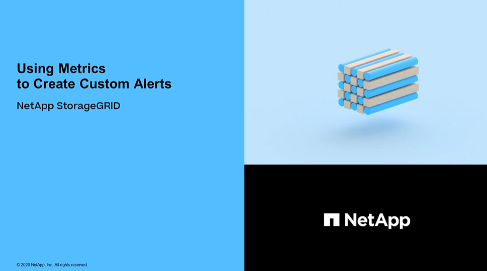
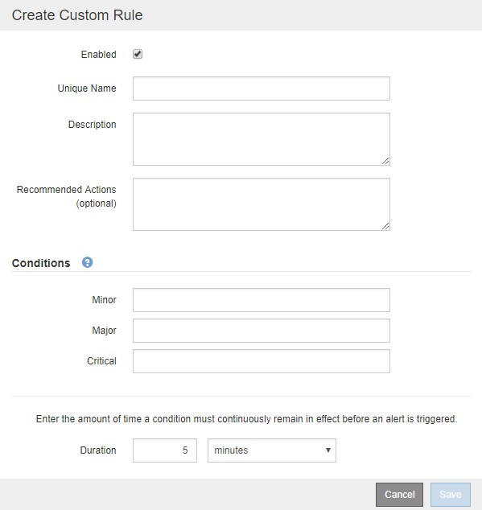

= Create custom alert rules
:icons: font
:imagesdir: ../media/

[.lead]
You can create custom alert rules to define your own conditions for triggering alerts.

.What you'll need
* You are signed in to the Grid Manager using a xref:../admin/web-browser-requirements.adoc[supported web browser]

* You have the Manage Alerts or Root Access permission

* You are familiar with the xref:commonly-used-prometheus-metrics.adoc[commonly used Prometheus metrics]

* You understand the https://prometheus.io/docs/querying/basics/[syntax of Prometheus queries^]

* Optionally, you have watched the video: https://netapp.hosted.panopto.com/Panopto/Pages/Viewer.aspx?id=b35ac3f2-957b-4e79-b82b-acc5013c98d0[Video: Using Metrics to Create Custom Alerts^]
+

.About this task
StorageGRID does not validate custom alerts. If you decide to create custom alert rules, follow these general guidelines:

* Look at the conditions for the default alert rules, and use them as examples for your custom alert rules.
* If you define more than one condition for an alert rule, use the same expression for all conditions. Then, change the threshold value for each condition.
* Carefully check each condition for typos and logic errors.
* Use only the metrics listed in the Grid Management API.
* When testing an expression using the Grid Management API, be aware that a "`successful`" response might simply be an empty response body (no alert triggered). To see if the alert is actually triggered, you can temporarily set a threshold to a value you expect to be true currently.
+
For example, to test the expression `node_memory_MemTotal_bytes < 24000000000`, first execute `node_memory_MemTotal_bytes >= 0` and ensure you get the expected results (all nodes return a value). Then, change the operator and the threshold back to the intended values and execute again. No results indicate there are no current alerts for this expression.

* Do not assume a custom alert is working unless you have validated that the alert is triggered when expected.

.Steps

. Select *ALERTS* > *Rules*.
+
The Alert Rules page appears.

. Select *Create custom rule*.
+
The Create Custom Rule dialog box appears.
+

. Select or unselect the *Enabled* check box to determine if this alert rule is currently enabled.
+
If an alert rule is disabled, its expressions are not evaluated and no alerts are triggered.

. Enter the following information:
+
[cols="1a,2a" options="header"]
|===
| Field| Description
a|
Unique Name
a|
A unique name for this rule.     The alert rule name is shown on the Alerts page and is also the subject for email notifications. Names for alert rules can be between 1 and 64 characters.
a|
Description
a|
A description of the problem that is occurring.     The description is the alert message shown on the Alerts page and in email notifications. Descriptions for alert rules can be between 1 and 128 characters.
a|
Recommended Actions
a|
Optionally, the recommended actions to take when this alert is triggered. Enter recommended actions as plain text (no formatting codes). Recommended actions for alert rules can be between 0 and 1,024 characters.
|===

. In the Conditions section, enter a Prometheus expression for one or more of the alert severity levels.
+
A basic expression is usually of the form:
+
`[metric] [operator] [value]`

+
Expressions can be any length, but appear on a single line in the user interface. At least one expression is required.
+
This expression causes an alert to be triggered if the amount of installed RAM for a node is less than 24,000,000,000 bytes (24 GB).
+

`node_memory_MemTotal_bytes < 24000000000`

+
To see available metrics and to test Prometheus expressions, select the help icon image:../media/icon_nms_question.png[question mark icon] and follow the link to the Metrics section of the Grid Management API. 

. In the *Duration* field, enter the amount of time a condition must continuously remain in effect before the alert is triggered, and select a unit of time.
+
To trigger an alert immediately when a condition becomes true, enter *0*. Increase this value to prevent temporary conditions from triggering alerts.
+
The default is 5 minutes.

. Select *Save*.
+
The dialog box closes, and the new custom alert rule appears in the Alert Rules table.

