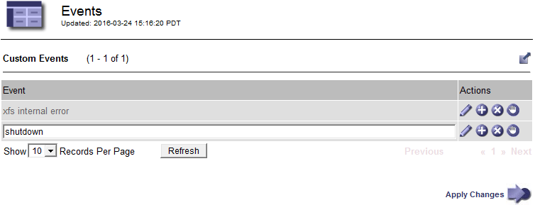
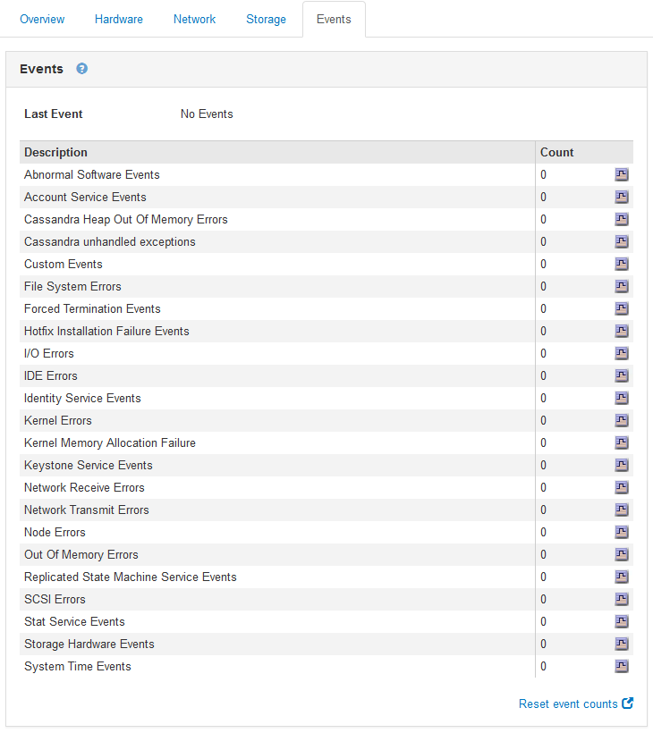

= Creating custom syslog events
:icons: font
:imagesdir: ../media/

[.lead]
Custom events allow you to track all kernel, daemon, error and critical level user events logged to the syslog server. A custom event can be useful for monitoring the occurrence of system log messages (and thus network security events and hardware faults).

.About this task
Consider creating custom events to monitor recurring problems. The following considerations apply to custom events.

* After a custom event is created, every occurrence of it is monitored. You can view a cumulative Count value for all custom events on the *Nodes* > *_grid node_* > *Events* page.
* To create a custom event based on keywords in the `/var/log/messages` or `/var/log/syslog` files, the logs in those files must be:
 ** Generated by the kernel
 ** Generated by daemon or user program at the error or critical level

*Note:* Not all entries in the `/var/log/messages` or `/var/log/syslog` files will be matched unless they satisfy the requirements stated above.

.Steps
. Select *Configuration* > *Monitoring* > *Events*.
. Click *Edit*  (or *Insert* image:../media/icon_nms_insert.gif[plus icon] if this is not the first event).
. Enter a custom event string, for example, shutdown
+

. Click *Apply Changes*.
. Select *Nodes*. Then, select *_grid node_* > *Events*.
. Locate the entry for Custom Events in the Events table, and monitor the value for *Count*.
+
If the count increases, a custom event you are monitoring is being triggered on that grid node.
+

