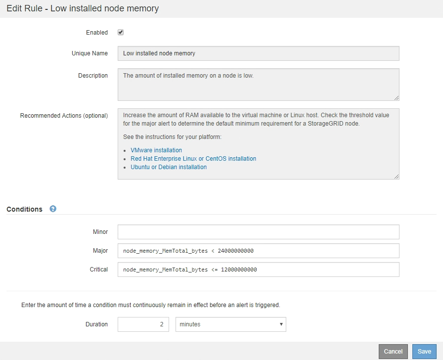
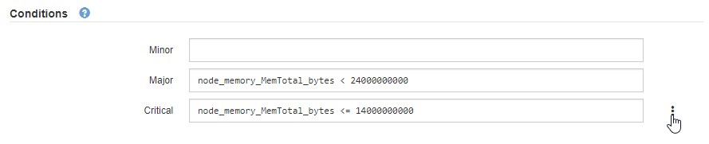

= Edit alert rules
:icons: font
:imagesdir: ../media/

[.lead]
You can edit an alert rule to change the trigger conditions, For a custom alert rule, you can also update the rule name, description, and recommended actions.

.What you'll need
* You are signed in to the Grid Manager using a xref:../admin/web-browser-requirements.adoc[supported web browser].
* You have the Manage Alerts or Root Access permission.

.About this task
When you edit a default alert rule, you can change the conditions for minor, major, and critical alerts; and the duration. When you edit a custom alert rule, you can also edit the rule's name, description, and recommended actions.

IMPORTANT: Be careful when deciding to edit an alert rule. If you change trigger values, you might not detect an underlying problem until it prevents a critical operation from completing.

.Steps
. Select *ALERTS* > *Rules*.
+
The Alert Rules page appears.

. Select the radio button for the alert rule you want to edit.
. Select *Edit rule*.
+
The Edit Rule dialog box appears. This example shows a default alert rule--the Unique Name, Description, and Recommended Actions fields are disabled and cannot be edited.
+

. Select or unselect the *Enabled* check box to determine if this alert rule is currently enabled.
+
If an alert rule is disabled, its expressions are not evaluated and no alerts are triggered.
+
NOTE: If you disable the alert rule for a current alert, you must wait a few minutes for the alert to no longer appear as an active alert.
+
IMPORTANT: In general, disabling a default alert rule is not recommended. If an alert rule is disabled, you might not detect an underlying problem until it prevents a critical operation from completing.

. For custom alert rules, update the following information as required.
+
NOTE: You cannot edit this information for default alert rules.
+
[cols="1a,2a" options="header"]
|===
| Field| Description
a|
Unique Name
a|
A unique name for this rule.     The alert rule name is shown on the Alerts page and is also the subject for email notifications. Names for alert rules can be between 1 and 64 characters.
a|
Description
a|
A description of the problem that is occurring.     The description is the alert message shown on the Alerts page and in email notifications. Descriptions for alert rules can be between 1 and 128 characters.
a|
Recommended Actions
a|
Optionally, the recommended actions to take when this alert is triggered.     Enter recommended actions as plain text (no formatting codes). Recommended actions for alert rules can be between 0 and 1,024 characters.
|===

. In the Conditions section, enter or update the Prometheus expression for one or more of the alert severity levels.
+
NOTE: If you want to restore a condition for an edited default alert rule back to its original value, select the three dots to the right of the modified condition.
+

+
NOTE: If you update the conditions for a current alert, your changes might not be implemented until the previous condition is resolved. The next time one of the conditions for the rule is met, the alert will reflect the updated values.
+
A basic expression is usually of the form:
+
`[metric] [operator] [value]`
+
Expressions can be any length, but appear on a single line in the user interface. At least one expression is required.
+
This expression causes an alert to be triggered if the amount of installed RAM for a node is less than 24,000,000,000 bytes (24 GB).
+
`node_memory_MemTotal_bytes < 24000000000`

. In the *Duration* field, enter the amount of time a condition must continuously remain in effect before the alert is triggered, and select the unit of time.
+
To trigger an alert immediately when a condition becomes true, enter *0*. Increase this value to prevent temporary conditions from triggering alerts.
+
The default is 5 minutes.

. Select *Save*.
+
If you edited a default alert rule, *Default** appears in the Type column. If you disabled a default or custom alert rule, *Disabled* appears in the *Status* column.
