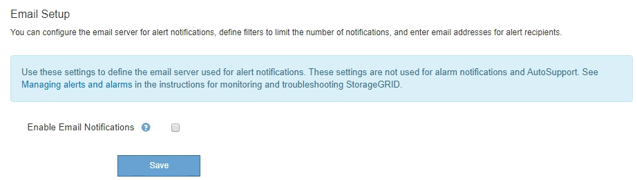
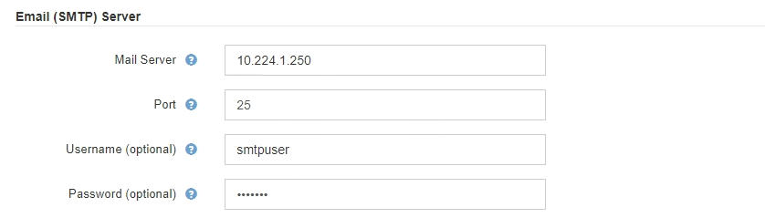
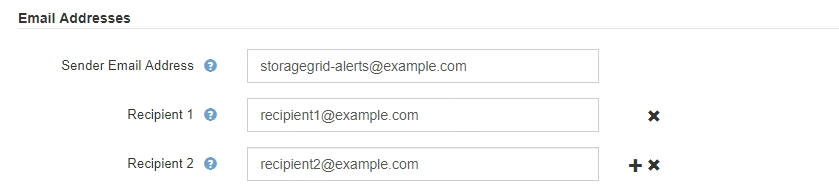
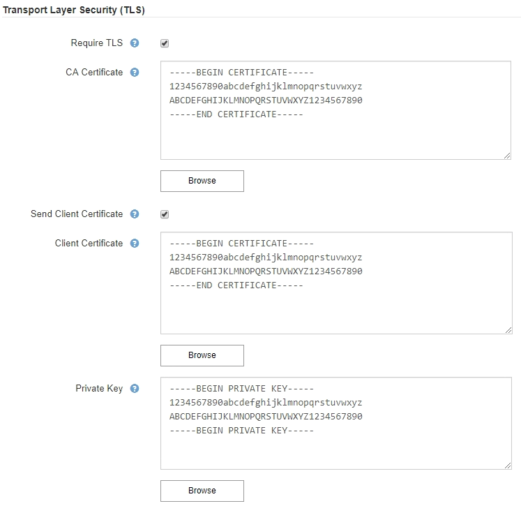
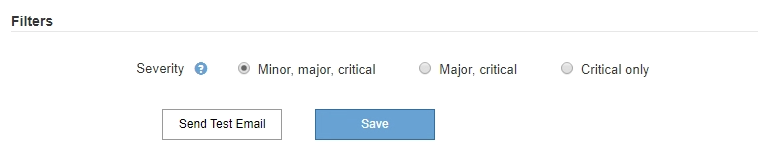
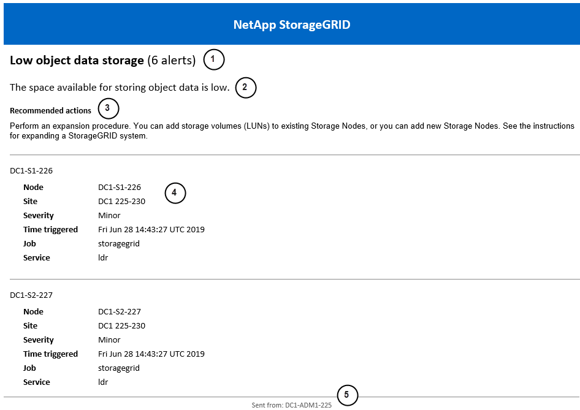

= Set up email notifications for alerts
:icons: font
:imagesdir: ../media/

[.lead]
If you want email notifications to be sent when alerts occur, you must provide information about your SMTP server. You must also enter email addresses for the recipients of alert notifications.

.What you'll need
* You are signed in to the Grid Manager using a xref:../admin/web-browser-requirements.adoc[supported web browser].
* You have the Manage Alerts or Root Access permission.

.About this task
Because alarms and alerts are independent systems, the email setup used for alert notifications is not used for alarm notifications and AutoSupport messages. However, you can use the same email server for all notifications.

If your StorageGRID deployment includes multiple Admin Nodes, you can select which Admin Node should be the preferred sender of alert notifications. The same "`preferred sender`" is also used for alarm notifications and AutoSupport messages. By default, the primary Admin Node is selected. For details, see the xref:../admin/index.adoc[instructions for administering StorageGRID]. 

.Steps
. Select *ALERTS* > *Email setup*.
+
The Email Setup page appears.
+

. Select the *Enable Email Notifications* check box to indicate that you want notification emails to be sent when alerts reach configured thresholds.
+
The Email (SMTP) Server, Transport Layer Security (TLS), Email Addresses, and Filters sections appear.

. In the Email (SMTP) Server section, enter the information StorageGRID needs to access your SMTP server.
+
If your SMTP server requires authentication, you must provide both a username and a password.
+
[cols="1a,2a" options="header"]
|===
| Field| Enter
a|
Mail Server
a|
The fully qualified domain name (FQDN) or IP address of the SMTP server.
a|
Port
a|
The port used to access the SMTP server. Must be between 1 and 65535.
a|
Username (optional)
a|
If your SMTP server requires authentication, enter the username to authenticate with.
a|
Password (optional)
a|
If your SMTP server requires authentication, enter the password to authenticate with.
|===

. In the Email Addresses section, enter email addresses for the sender and for each recipient.
 .. For the *Sender Email Address*, specify a valid email address to use as the From address for alert notifications.
+
For example: `storagegrid-alerts@example.com`

 .. In the Recipients section, enter an email address for each email list or person who should receive an email when an alert occurs.
+
Select the plus icon image:../media/icon_plus_sign_black_on_white.gif[plus icon] to add recipients.

+

. If Transport Layer Security (TLS) is required for communications with the SMTP server, select *Require TLS* in the Transport Layer Security (TLS) section.
 .. In the *CA Certificate* field, provide the CA certificate that will be used to verify the identify of the SMTP server.
+
You can copy and paste the contents into this field, or select *Browse* and select the file.
+
You must provide a single file that contains the certificates from each intermediate issuing certificate authority (CA). The file should contain each of the PEM-encoded CA certificate files, concatenated in certificate chain order.

 .. Select the *Send Client Certificate* check box if your SMTP email server requires email senders to provide client certificates for authentication.
 .. In the *Client Certificate* field, provide the PEM-encoded client certificate to send to the SMTP server.
+
You can copy and paste the contents into this field, or select *Browse* and select the file.

 .. In the *Private Key* field, enter the private key for the client certificate in unencrypted PEM encoding.
+
You can copy and paste the contents into this field, or select *Browse* and select the file.
+
NOTE: If you need to edit the email setup, select the pencil icon to update this field.
+

. In the Filters section, select which alert severity levels should result in email notifications, unless the rule for a specific alert has been silenced.
+
[cols="1a,2a" options="header"]
|===
| Severity| Description
a|
Minor, major, critical
a|
An email notification is sent when the minor, major, or critical condition for an alert rule is met.
a|
Major, critical
a|
An email notification is sent when the major or critical condition for an alert rule is met. Notifications are not sent for minor alerts.
a|
Critical only
a|
An email notification is sent only when the critical condition for an alert rule is met. Notifications are not sent for minor or major alerts.
|===

. When you are ready to test your email settings, perform these steps:
 .. Select *Send Test Email*.
+
A confirmation message appears, indicating that a test email was sent.

 .. Check the inboxes of all email recipients and confirm that a test email was received.
+
NOTE: If the email is not received within a few minutes or if the *Email notification failure* alert is triggered, check your settings and try again.

 .. Sign in to any other Admin Nodes and send a test email to verify connectivity from all sites.
+
NOTE: When you test alert notifications, you must sign in to every Admin Node to verify connectivity. This is in contrast to testing alarm notifications and AutoSupport messages, where all Admin Nodes send the test email.
. Select *Save*.
+
Sending a test email does not save your settings. You must select *Save*.
+
The email settings are saved.

== Information included in alert email notifications

After you configure the SMTP email server, email notifications are sent to the designated recipients when an alert is triggered, unless the alert rule is suppressed by a silence. See xref:silencing-alert-notifications.adoc[Silence alert notifications].

Email notifications include the following information:

[cols="1a,6a"options="header"]
|===
| Callout| Description
a|
1
a|
The name of the alert, followed by the number of active instances of this alert.
a|
2
a|
The description of the alert.
a|
3
a|
Any recommended actions for the alert.
a|
4
a|
Details about each active instance of the alert, including the node and site affected, the alert severity, the UTC time when the alert rule was triggered, and the name of the affected job and service.
a|
5
a|
The hostname of the Admin Node that sent the notification.
|===

== How alerts are grouped

To prevent an excessive number of email notifications from being sent when alerts are triggered, StorageGRID attempts to group multiple alerts in the same notification.

Refer to the following table for examples of how StorageGRID groups multiple alerts in email notifications.

[cols="1a,1a"options="header"]
|===
| Behavior| Example
a|
Each alert notification applies only to alerts that have the same name. If two alerts with different names are triggered at the same time, two email notifications are sent.
a|

* Alert A is triggered on two nodes at the same time. Only one notification is sent.
* Alert A is triggered on node 1, and Alert B is triggered on node 2 at the same time. Two notifications are sent--one for each alert.

a|
For a specific alert on a specific node, if the thresholds are reached for more than one severity, a notification is sent only for the most severe alert.
a|

* Alert A is triggered and the minor, major, and critical alert thresholds are reached. One notification is sent for the critical alert.

a|
The first time an alert is triggered, StorageGRID waits 2 minutes before sending a notification. If other alerts with the same name are triggered during that time, StorageGRID groups all of the alerts in the initial notification.​
a|

. Alert A is triggered on node 1 at 08:00. No notification is sent.
. Alert A is triggered on node 2 at 08:01. No notification is sent.
. At 08:02, a notification is sent to report both instances of the alert.

a|
If an another alert with the same name is triggered, StorageGRID waits 10 minutes before sending a new notification. The new notification reports all active alerts (current alerts that have not been silenced), even if they were reported previously.
a|

. Alert A is triggered on node 1 at 08:00. A notification is sent at 08:02.
. Alert A is triggered on node 2 at 08:05. A second notification is sent at 08:15 (10 minutes later). Both nodes are reported.

a|
If there are multiple current alerts with the same name and one of those alerts is resolved, a new notification is not sent if the alert reoccurs on the node for which the alert was resolved.
a|

. Alert A is triggered for node 1. A notification is sent.
. Alert A is triggered for node 2. A second notification is sent.
. Alert A is resolved for node 2, but it remains active for node 1.
. Alert A is triggered again for node 2. No new notification is sent because the alert is still active for node 1.

a|
StorageGRID continues to send email notifications once every 7 days until all instances of the alert are resolved or the alert rule is silenced.
a|

. Alert A is triggered for node 1 on March 8. A notification is sent.
. Alert A is not resolved or silenced. Additional notifications are sent on March 15, March 22, March 29, and so on.

|===

== Troubleshoot alert email notifications

If the *Email notification failure* alert is triggered or you are unable to receive the test alert email notification, follow these steps to resolve the issue.

.What you'll need
* You are signed in to the Grid Manager using a xref:../admin/web-browser-requirements.adoc[supported web browser].
* You have the Manage Alerts or Root Access permission.

.Steps
. Verify your settings.
 .. Select *ALERTS* > *Email setup*.
 .. Verify that the Email (SMTP) Server settings are correct.
 .. Verify that you have specified valid email addresses for the recipients.
. Check your spam filter, and make sure that the email was not sent to a junk folder.
. Ask your email administrator to confirm that emails from the sender address are not being blocked.
. Collect a log file for the Admin Node, and then contact technical support.
+
Technical support can use the information in the logs to help determine what went wrong. For example, the prometheus.log file might show an error when connecting to the server you specified.
+
See xref:collecting-log-files-and-system-data.adoc[Collect log files and system data].