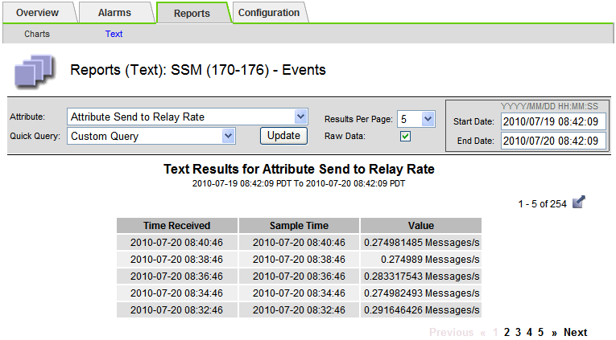
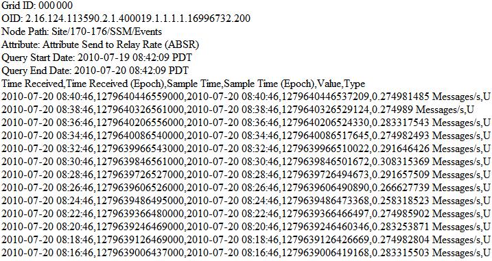

= Exporting text reports
:icons: font
:imagesdir: ../media/

[.lead]
Exported text reports open a new browser tab, which enables you to select and copy the data.

.About this task
The copied data can then be saved into a new document (for example, a spreadsheet) and used to analyze the performance of the StorageGRID system.

.Steps
. Select *Support* > *Tools* > *Grid Topology*.
. Create a text report.
. Click *Export*.
+

+
The Export Text Report window opens displaying the report.
+

. Select and copy the contents of the Export Text Report window.
+
This data can now be pasted into a third-party document such as a spreadsheet.
