= Manage alarms (legacy system)
:icons: font
:imagesdir: ../media/

[.lead]
The StorageGRID alarm system is the legacy system used to identify trouble spots that sometimes occur during normal operation.

NOTE: While the legacy alarm system continues to be supported, the alert system offers significant benefits and is easier to use.

== Alarm classes (legacy system)

A legacy alarm can belong to one of two mutually exclusive alarm classes.

* Default alarms are provided with each StorageGRID system and cannot be modified. However, you can disable Default alarms or override them by defining Global Custom alarms.

* Global Custom alarms monitor the status of all services of a given type in the StorageGRID system. You can create a Global Custom alarm to override a Default alarm. You can also create a new Global Custom alarm. This can be useful for monitoring any customized conditions of your StorageGRID system.

== Alarm triggering logic (legacy system)

A legacy alarm is triggered when a StorageGRID attribute reaches a threshold value that evaluates to true against a combination of alarm class (Default or Global Custom) and alarm severity level.

[cols="1a,1a,1a,3a" options="header"]
|===
| Icon| Color| Alarm severity| Meaning
|
|Yellow
|Notice
|The node is connected to the grid, but an unusual condition exists that does not affect normal operations.

|image:../media/icon_alert_yellow_minor.png[light orange diamond icon]
|Light Orange
|Minor
|The node is connected to the grid, but an abnormal condition exists that could affect operation in the future. You should investigate to prevent escalation.

|image:../media/icon_alert_orange_major.png[dark orange diamond icon]
|Dark Orange
|Major
|The node is connected to the grid, but an abnormal condition exists that currently affects operation. This requires prompt attention to prevent escalation.

|image:../media/icon_alert_red_critical.png[red x icon]
|Red
|Critical
|The node is connected to the grid, but an abnormal condition exists that has stopped normal operations. You should address the issue immediately.
|===

The alarm severity and corresponding threshold value can be set for every numerical attribute. The NMS service on each Admin Node continuously monitors current attribute values against configured thresholds. When an alarm is triggered, a notification is sent to all designated personnel.

Note that a severity level of Normal does not trigger an alarm.

Attribute values are evaluated against the list of enabled alarms defined for that attribute. The list of alarms is checked in the following order to find the first alarm class with a defined and enabled alarm for the attribute:

. Global Custom alarms with alarm severities from Critical down to Notice.
. Default alarms with alarm severities from Critical down to Notice.

After an enabled alarm for an attribute is found in the higher alarm class, the NMS service only evaluates within that class. The NMS service will not evaluate against the other lower priority classes. That is, if there is an enabled Global Custom alarm for an attribute, the NMS service only evaluates the attribute value against Global Custom alarms. Default alarms are not evaluated. Thus, an enabled Default alarm for an attribute can meet the criteria needed to trigger an alarm, but it will not be triggered because a Global Custom alarm (that does not meet the specified criteria) for the same attribute is enabled. No alarm is triggered and no notification is sent.

=== Alarm triggering example

You can use this example to understand how Global Custom alarms and Default alarms are triggered.

For the following example, an attribute has a Global Custom alarm and a Default alarm defined and enabled as shown in the following table.

[options="header"]
|===
| | Global Custom alarm threshold (enabled)| Default alarm threshold (enabled)
a|
Notice
a|
>= 1500
a|
>= 1000
a|
Minor
a|
>= 15,000
a|
>= 1000
a|
Major
a|
>=150,000
a|
>= 250,000
|===
If the attribute is evaluated when its value is 1000, no alarm is triggered and no notification is sent.

The Global Custom alarm takes precedence over the Default alarm. A value of 1000 does not reach the threshold value of any severity level for the Global Custom alarm. As a result, the alarm level is evaluated to be Normal.

After the above scenario, if the Global Custom alarm is disabled, nothing changes. The attribute value must be reevaluated before a new alarm level is triggered.

With the Global Custom alarm disabled, when the attribute value is reevaluated, the attribute value is evaluated against the threshold values for the Default alarm. The alarm level triggers a Notice level alarm and an email notification is sent to the designated personnel.

=== Alarms of same severity

If two Global Custom alarms for the same attribute have the same severity, the alarms are evaluated with a "`top down`" priority.

For instance, if UMEM drops to 50MB, the first alarm is triggered (= 50000000), but not the one below it (\<=100000000).

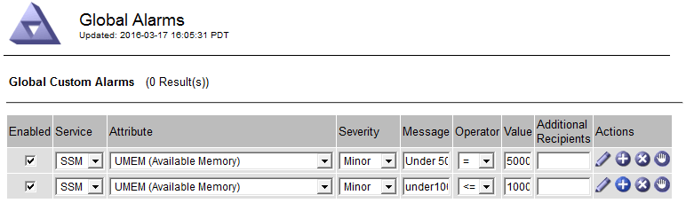

If the order is reversed, when UMEM drops to 100MB, the first alarm (\<=100000000) is triggered, but not the one below it (= 50000000).

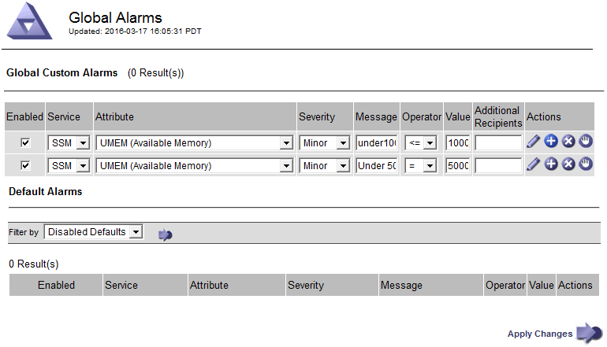

=== Notifications

A notification reports the occurrence of an alarm or the change of state for a service. Alarm notifications can be sent in email or using SNMP.

To avoid multiple alarms and notifications being sent when an alarm threshold value is reached, the alarm severity is checked against the current alarm severity for the attribute. If there is no change, then no further action is taken. This means that as the NMS service continues to monitor the system, it will only raise an alarm and send notifications the first time it notices an alarm condition for an attribute. If a new value threshold for the attribute is reached and detected, the alarm severity changes and a new notification is sent. Alarms are cleared when conditions return to the Normal level.

The trigger value shown in the notification of an alarm state is rounded to three decimal places. Therefore, an attribute value of 1.9999 triggers an alarm whose threshold is less than (<) 2.0, although the alarm notification shows the trigger value as 2.0.

=== New services

As new services are added through the addition of new grid nodes or sites, they inherit Default alarms and Global Custom alarms.

=== Alarms and tables

Alarm attributes displayed in tables can be disabled at the system level. Alarms cannot be disabled for individual rows in a table.

For example, the following table shows two critical Entries Available (VMFI) alarms. (Select *SUPPORT* > *Tools* > *Grid topology*. Then, select *_Storage Node_* > *SSM* > *Resources*.)

You can disable the VMFI alarm so that the Critical level VMFI alarm is not triggered (both currently Critical alarms would appear in the table as green); however, you cannot disable a single alarm in a table row so that one VMFI alarm displays as a Critical level alarm while the other remains green.

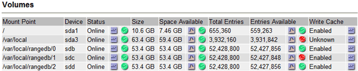

== Acknowledge current alarms (legacy system)

Legacy alarms are triggered when system attributes reach alarm threshold values. Optionally, if you want to reduce or clear the list of legacy alarms, you can acknowledge the alarms.

.What you'll need
* You must be signed in to the Grid Manager using a xref:../admin/web-browser-requirements.adoc[supported web browser].
* You must have the Acknowledge Alarms permission.

.About this task
Because the legacy alarm system continues to be supported, the list of legacy alarms on the Current Alarms page is increased whenever a new alarm occurs. You can typically ignore the alarms (since alerts provide a better view of the system), or you can acknowledge the alarms.

NOTE: Optionally, when you have completely transitioned to the alert system, you can disable each legacy alarm to prevent it from being triggered and added to the count of legacy alarms.

When you acknowledge an alarm, it is no longer listed on the Current Alarms page in the Grid Manager, unless the alarm is triggered at the next severity level or it is resolved and occurs again.

NOTE: While the legacy alarm system continues to be supported, the alert system offers significant benefits and is easier to use.

.Steps
. Select *SUPPORT* > *Alarms (legacy)* > *Current alarms*.

+
image::../media/current_alarms_page.png[Current Alarms Page]
. Select the service name in the table.
+
The Alarms tab for the selected service appears (*SUPPORT* > *Tools* > *Grid topology* > *_Grid Node_* > *_Service_* > *Alarms*).
+
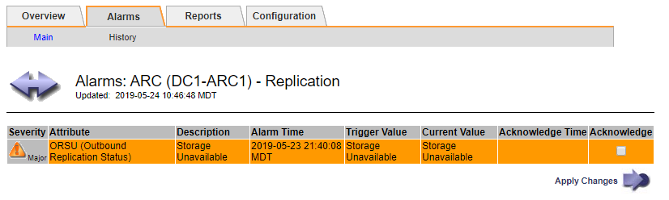

. Select the *Acknowledge* check box for the alarm, and click *Apply Changes*.
+
The alarm no longer appears on the Dashboard or the Current Alarms page.
+
NOTE: When you acknowledge an alarm, the acknowledgment is not copied to other Admin Nodes. For this reason, if you view the Dashboard from another Admin Node, you might continue to see the active alarm.

. As required, view acknowledged alarms.
 .. Select *SUPPORT* > *Alarms (legacy)* > *Current alarms*.
 .. Select *Show Acknowledged Alarms*.
+
Any acknowledged alarms are shown.
+
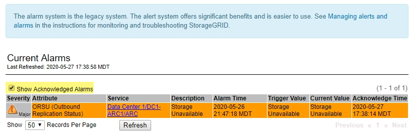

== View Default alarms (legacy system)

You can view the list of all Default legacy alarms.

.What you'll need
* You must be signed in to the Grid Manager using a xref:../admin/web-browser-requirements.adoc[supported web browser].
* You must have specific access permissions.

NOTE: While the legacy alarm system continues to be supported, the alert system offers significant benefits and is easier to use.

.Steps
. Select *SUPPORT* > *Alarms (legacy)* > *Global alarms*.
. For Filter by, select *Attribute Code* or *Attribute Name*.
. For equals, enter an asterisk: `*`
. Click the arrow  or press *Enter*.
+
All Default alarms are listed.
+
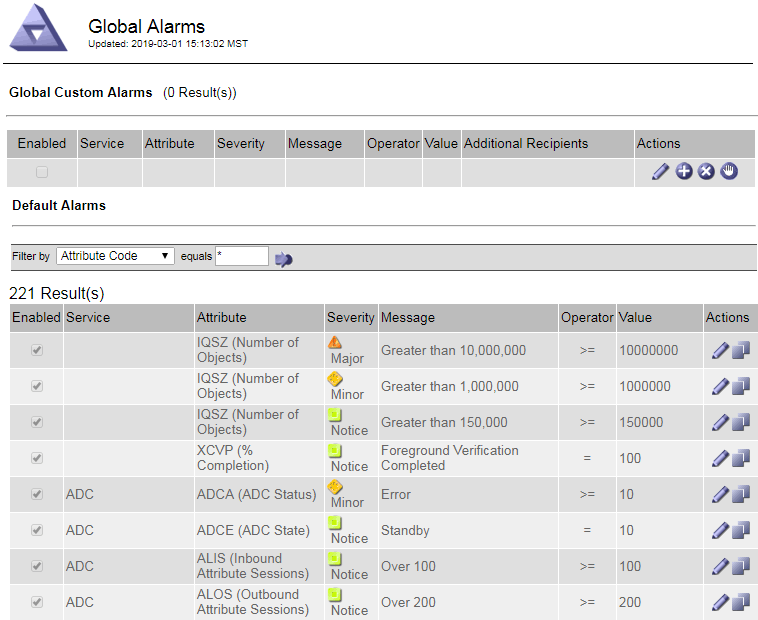

== Review historical alarms and alarm frequency (legacy system)

When troubleshooting an issue, you can review how often a legacy alarm was triggered in the past.

.What you'll need
* You must be signed in to the Grid Manager using a xref:../admin/web-browser-requirements.adoc[supported web browser].
* You must have specific access permissions.

NOTE: While the legacy alarm system continues to be supported, the alert system offers significant benefits and is easier to use.

.Steps
. Follow these steps to get a list of all alarms triggered over a period of time.
 .. Select *SUPPORT* > *Alarms (legacy)* > *Historical alarms*.
 .. Do one of the following:
  *** Click one of the time periods.
  *** Enter a custom range, and click *Custom Query*.
. Follow these steps to find out how often alarms have been triggered for a particular attribute.
 .. Select *SUPPORT* > *Tools* > *Grid topology*.
 .. Select *_grid node_* > *_service or component_* > *Alarms* > *History*.
 .. Select the attribute from the list.
 .. Do one of the following:
  *** Click one of the time periods.
  *** Enter a custom range, and click *Custom Query*.
+
The alarms are listed in reverse chronological order.
 .. To return to the alarms history request form, click *History*.

== Create Global Custom alarms (legacy system)

You might have used Global Custom alarms for the legacy system to address specific monitoring requirements. Global Custom alarms might have alarm levels that override Default alarms, or they might monitor attributes that do not have a Default alarm.

.What you'll need
* You must be signed in to the Grid Manager using a xref:../admin/web-browser-requirements.adoc[supported web browser].
* You must have specific access permissions.

NOTE: While the legacy alarm system continues to be supported, the alert system offers significant benefits and is easier to use.

Global Custom alarms override Default alarms. You should not change Default alarm values unless absolutely necessary. By changing Default alarms, you run the risk of concealing problems that might otherwise trigger an alarm.

IMPORTANT: Be very careful if you change alarm settings. For example, if you increase the threshold value for an alarm, you might not detect an underlying problem. Discuss your proposed changes with technical support before changing an alarm setting.

.Steps
. Select *SUPPORT* > *Alarms (legacy)* > *Global alarms*.
. Add a new row to the Global Custom alarms table:
 ** To add a new alarm, click *Edit* image:../media/icon_nms_edit.gif[edit icon] (if this is the first entry) or *Insert* image:../media/icon_nms_insert.gif[insert icon].
+
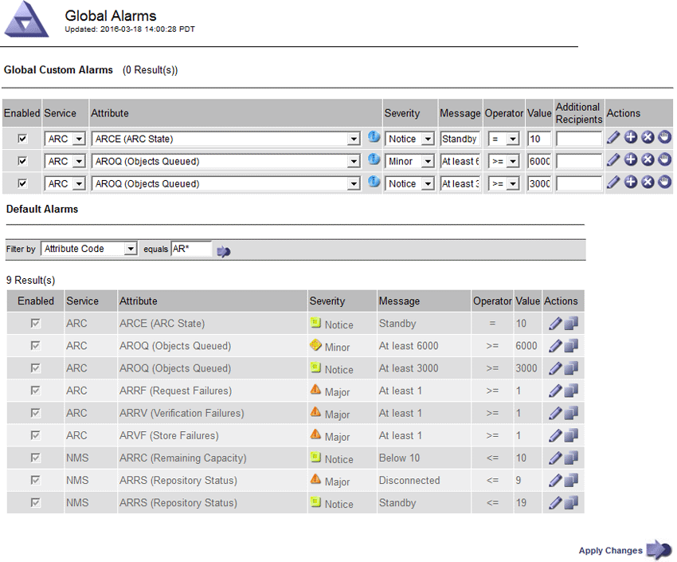

 ** To modify a Default alarm, search for the Default alarm.
  ... Under Filter by, select either *Attribute Code* or *Attribute Name*.
  ... Type a search string.
+
Specify four characters or use wildcards (for example, A??? or AB*). Asterisks (*) represent multiple characters, and question marks (?) represent a single character.

  ... Click the arrow , or press *Enter*.
  ... In the list of results, click *Copy*  next to the alarm you want to modify.
+
The Default alarm is copied to the Global Custom alarms table.
. Make any necessary changes to the Global Custom alarms settings:
+
[cols="1a,2a" options="header"]
|===
| Heading| Description
a|
Enabled
a|
Select or unselect the check box to enable or disable the alarm.
a|
Attribute
a|
Select the name and code of the attribute being monitored from the list of all attributes applicable to the selected service or component.
To display information about the attribute, click *Info*  next to the attribute's name.
a|
Severity
a|
The icon and text indicating the level of the alarm.
a|
Message
a|
The reason for the alarm (connection lost, storage space below 10%, and so on).
a|
Operator
a|
Operators for testing the current attribute value against the Value threshold:

 ** = equals
 ** > greater than
 ** < less than
 ** >= greater than or equal to
 ** \<= less than or equal to
 ** ≠ not equal to

a|
Value
a|
The alarm's threshold value used to test against the attribute's actual value using the operator.
The entry can be a single number, a range of numbers specified with a colon (1:3), or a comma-delineated list of numbers and ranges.
a|
Additional Recipients
a|
A supplementary list of email addresses to be notified when the alarm is triggered. This is in addition to the mailing list configured on the *Alarms* > *Email Setup* page. Lists are comma delineated.

*Note:* Mailing lists require SMTP server setup in order to operate. Before adding mailing lists, confirm that SMTP is configured.
Notifications for Custom alarms can override notifications from Global Custom or Default alarms.
a|
Actions
a|
Control buttons to:    image:../media/icon_nms_edit.gif[edit icon] Edit a row
+
image:../media/icon_nms_insert.gif[insert icon] Insert a row
+
image:../media/icon_nms_delete.gif[delete icon] Delete a row
+
 Drag-and-drop a row up or down
+
 Copy a row
|===

. Click *Apply Changes*.

== Disable alarms (legacy system)

The alarms in the legacy alarm system are enabled by default, but you can disable alarms that are not required. You can also disable the legacy alarms after you have completely transitioned to the new alert system.

NOTE: While the legacy alarm system continues to be supported, the alert system offers significant benefits and is easier to use.

=== Disable a Default alarm (legacy system)

You can disable one of the legacy Default alarms for the entire system.

.What you'll need
* You must be signed in to the Grid Manager using a xref:../admin/web-browser-requirements.adoc[supported web browser].
* You must have specific access permissions.

.About this task
Disabling an alarm for an attribute that currently has an alarm triggered does not clear the current alarm. The alarm will be disabled the next time the attribute crosses the alarm threshold, or you can clear the triggered alarm.

IMPORTANT: Do not disable any of the legacy alarms until you have completely transitioned to the new alert system. Otherwise, you might not detect an underlying problem until it has prevented a critical operation from completing.

.Steps
. Select *SUPPORT* > *Alarms (legacy)* > *Global alarms*.
. Search for the Default alarm to disable.
 .. In the Default Alarms section, select *Filter by* > *Attribute Code* or *Attribute Name*.
 .. Type a search string.
+
Specify four characters or use wildcards (for example, A??? or AB*). Asterisks (*) represent multiple characters, and question marks (?) represent a single character.

 .. Click the arrow , or press *Enter*.

+
NOTE: Selecting *Disabled Defaults* displays a list of all currently disabled Default alarms.
. From the search results table, click the Edit icon image:../media/icon_nms_edit.gif[edit icon] for the alarm you want to disable.
+
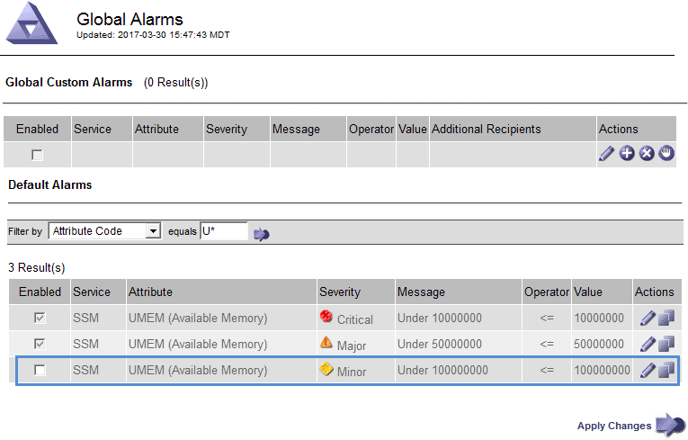
+
The *Enabled* check box for the selected alarm becomes active.

. Unselect the *Enabled* check box.
. Click *Apply Changes*.
+
The Default alarm is disabled.

=== Disable Global Custom alarms (legacy system)

You can disable a legacy Global Custom alarm for the entire system.

.What you'll need
* You must be signed in to the Grid Manager using a xref:../admin/web-browser-requirements.adoc[supported web browser].
* You must have specific access permissions.

.About this task
Disabling an alarm for an attribute that currently has an alarm triggered does not clear the current alarm. The alarm will be disabled the next time the attribute crosses the alarm threshold, or you can clear the triggered alarm.

.Steps
. Select *SUPPORT* > *Alarms (legacy)* > *Global alarms*.
. In the Global Custom Alarms table, click *Edit* image:../media/icon_nms_edit.gif[edit icon] next to the alarm you want to disable.
. Unselect the *Enabled* check box.
+
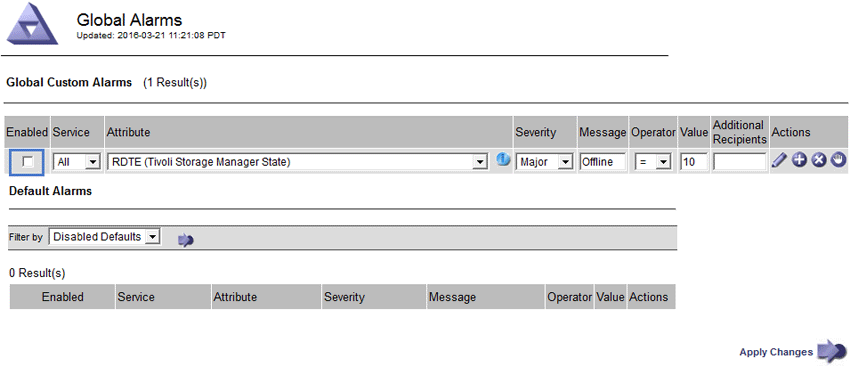

. Click *Apply Changes*.
+
The Global Custom alarm is disabled.

=== Clear triggered alarms (legacy system)

If a legacy alarm is triggered, you can clear it instead of acknowledging it.

.What you'll need
* You must have the ``Passwords.txt`` file.

Disabling an alarm for an attribute that currently has an alarm triggered against it does not clear the alarm. The alarm will be disabled the next time the attribute changes. You can acknowledge the alarm or, if you want to immediately clear the alarm rather than wait for the attribute value to change (resulting in a change to the alarm state), you can clear the triggered alarm. You might find this helpful if you want to clear an alarm immediately against an attribute whose value does not change often (for example, state attributes).

. Disable the alarm.
. Log in to the primary Admin Node:
 .. Enter the following command: `_ssh admin@primary_Admin_Node_IP_`
 .. Enter the password listed in the ``Passwords.txt`` file.
 .. Enter the following command to switch to root: `su -`
 .. Enter the password listed in the `Passwords.txt` file.
+
When you are logged in as root, the prompt changes from `$` to `#`.
. Restart the NMS service: `service nms restart`
. Log out of the Admin Node: `exit`
+
The alarm is cleared.

== Configure notifications for alarms (legacy system)

StorageGRID system can automatically send email and xref:using-snmp-monitoring.adoc[SNMP notifications] when an alarm is triggered or a service state changes.

By default, alarm email notifications are not sent. For email notifications, you must configure the email server and specify the email recipients. For SNMP notifications, you must configure the SNMP agent.

=== Types of alarm notifications (legacy system)

When a legacy alarm is triggered, the StorageGRID system sends out two types of alarm notifications: severity level and service state.

==== Severity level notifications

An alarm email notification is sent when a legacy alarm is triggered at a selected severity level:

* Notice
* Minor
* Major
* Critical

A mailing list receives all notifications related to the alarm for the selected severity. A notification is also sent when the alarm leaves the alarm level -- either by being resolved or by entering a different alarm severity level.

==== Service state notifications

A service state notification is sent when a service (for example, the LDR service or NMS service) enters the selected service state and when it leaves the selected service state. Service state notifications are send when a service enters or leaves ones of the following service states:

* Unknown
* Administratively Down

A mailing list receives all notifications related to changes in the selected state.

=== Configure email server settings for alarms (legacy system)

If you want StorageGRID to send email notifications when a legacy alarm is triggered, you must specify the SMTP mail server settings. The StorageGRID system only sends email; it cannot receive email.

.What you'll need
* You must be signed in to the Grid Manager using a xref:../admin/web-browser-requirements.adoc[supported web browser].
* You must have specific access permissions.

.About this task
Use these settings to define the SMTP server used for legacy alarm email notifications and AutoSupport email messages. These settings are not used for alert notifications.

NOTE: If you use SMTP as the protocol for AutoSupport messages, you might have already configured an SMTP mail server. The same SMTP server is used for alarm email notifications, so you can skip this procedure. See the xref:../admin/index.adoc[instructions for administering StorageGRID].

SMTP is the only protocol supported for sending email.

.Steps
. Select *SUPPORT* > *Alarms (legacy)* > *Legacy email setup*.
. From the Email menu, select *Server*.
+
The Email Server page appears. This page is also used to configure the email server for AutoSupport messages.
+
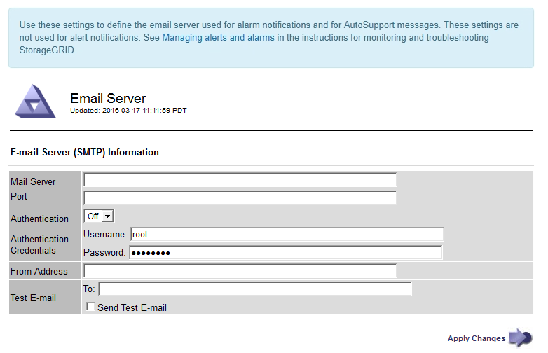

. Add the following SMTP mail server settings:
+
[cols="1a,2a" options="header"]
|===
| Item| Description
a|
Mail Server
a|
IP address of the SMTP mail server. You can enter a hostname rather than an IP address if you have previously configured DNS settings on the Admin Node.
a|
Port
a|
Port number to access the SMTP mail server.
a|
Authentication
a|
Allows for the authentication of the SMTP mail server. By default, authentication is Off.
a|
Authentication Credentials
a|
Username and password of the SMTP mail server. If Authentication is set to On, a username and password to access the SMTP mail server must be provided.
|===

. Under *From Address*, enter a valid email address that the SMTP server will recognize as the sending email address. This is the official email address from which the email message is sent.
. Optionally, send a test email to confirm that your SMTP mail server settings are correct.
 .. In the *Test E-mail* > *To* box, add one or more addresses that you can access.
+
You can enter a single email address or a comma-delineated list of email addresses. Because the NMS service does not confirm success or failure when a test email is sent, you must be able to check the test recipient's inbox.

 .. Select *Send Test E-mail*.
. Click *Apply Changes*.
+
The SMTP mail server settings are saved. If you entered information for a test email, that email is sent. Test emails are sent to the mail server immediately and are not sent through the notifications queue. In a system with multiple Admin Nodes, each Admin Node sends an email. Receipt of the test email confirms that your SMTP mail server settings are correct and that the NMS service is successfully connecting to the mail server. A connection problem between the NMS service and the mail server triggers the legacy MINS (NMS Notification Status) alarm at the Minor severity level.

=== Create alarm email templates (legacy system)

Email templates let you customize the header, footer, and subject line of a legacy alarm email notification. You can use email templates to send unique notifications that contain the same body text to different mailing lists.

.What you'll need
* You must be signed in to the Grid Manager using a xref:../admin/web-browser-requirements.adoc[supported web browser].
* You must have specific access permissions.

.About this task
Use these settings to define the email templates used for legacy alarm notifications. These settings are not used for alert notifications.

Different mailing lists might require different contact information. Templates do not include the body text of the email message.

.Steps
. Select *SUPPORT* > *Alarms (legacy)* > *Legacy email setup*.
. From the Email menu, select *Templates*.
. Click *Edit* image:../media/icon_nms_edit.gif[edit icon] (or *Insert* image:../media/icon_nms_insert.gif[insert icon] if this is not the first template).
+
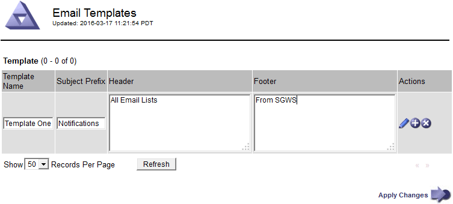

. In the new row add the following:
+
[cols="1a,2a" options="header"]
|===
| Item| Description
a|
Template Name
a|
Unique name used to identify the template. Template names cannot be duplicated.
a|
Subject Prefix
a|
Optional. Prefix that will appear at the beginning of an email's subject line. Prefixes can be used to easily configure email filters and organize notifications.
a|
Header
a|
Optional. Header text that appears at the beginning of the email message body. Header text can be used to preface the content of the email message with information such as company name and address.
a|
Footer
a|
Optional. Footer text that appears at the end of the email message body. Footer text can be used to close the email message with reminder information such as a contact phone number or a link to a web site.
|===

. Click *Apply Changes*.
+
A new template for notifications is added.

=== Create mailing lists for alarm notifications (legacy system)

Mailing lists let you notify recipients when a legacy alarm is triggered or when a service state changes. You must create at least one mailing list before any alarm email notifications can be sent. To send a notification to a single recipient, create a mailing list with one email address.

.What you'll need
* You must be signed in to the Grid Manager using a xref:../admin/web-browser-requirements.adoc[supported web browser].
* You must have specific access permissions.
* If you want to specify an email template for the mailing list (custom header, footer, and subject line), you must have already created the template.

.About this task
Use these settings to define the mailing lists used for legacy alarm email notifications. These settings are not used for alert notifications.

.Steps
. Select *SUPPORT* > *Alarms (legacy)* > *Legacy email setup*.
. From the Email menu, select *Lists*.
. Click *Edit* image:../media/icon_nms_edit.gif[edit icon] (or *Insert*image:../media/icon_nms_insert.gif[insert icon] if this is not the first mailing list).
+
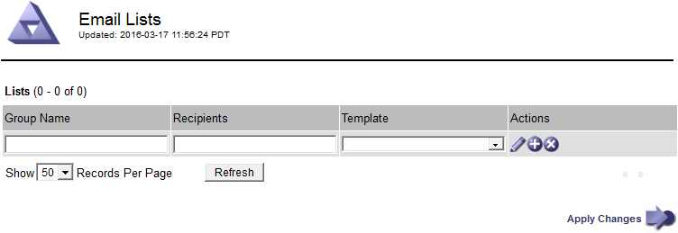

. In the new row, add the following:
+
[cols="1a,2a" options="header"]
|===
| Item| Description
a|
Group Name
a|
Unique name used to identify the mailing list. Mailing list names cannot be duplicated.

*Note:* If you change the name of a mailing list, the change is not propagated to the other locations that use the mailing list name. You must manually update all configured notifications to use the new mailing list name.
a|
Recipients
a|
Single email address, a previously configured mailing list, or a comma-delineated list of email addresses and mailing lists to which notifications will be sent.

*Note:* If an email address belongs to multiple mailing lists, only one email notification is sent when a notification triggering event occurs.
a|
Template
a|
Optionally, select an email template to add a unique header, footer, and subject line to notifications sent to all recipients of this mailing list.
|===

. Click *Apply Changes*.
+
A new mailing list is created.

=== Configure email notifications for alarms (legacy system)

In order to receive email notifications for the legacy alarm system, recipients must be a member of a mailing list and that list must be added to the Notifications page. Notifications are configured to send email to recipients only when an alarm with a specified severity level is triggered or when a service state changes. Thus, recipients only receive the notifications they need to receive.

.What you'll need
* You must be signed in to the Grid Manager using a xref:../admin/web-browser-requirements.adoc[supported web browser].
* You must have specific access permissions.
* You must have configured an email list.

.About this task
Use these settings to configure notifications for legacy alarms. These settings are not used for alert notifications.

If an email address (or list) belongs to multiple mailing lists, only one email notification is sent when a notification triggering event occurs. For example, one group of administrators within your organization can be configured to receive notifications for all alarms regardless of severity. Another group might only require notifications for alarms with a severity of critical. You can belong to both lists. If a critical alarm is triggered, you receive only one notification.

.Steps
. Select *SUPPORT* > *Alarms (legacy)* > *Legacy email setup*.
. From the Email menu, select *Notifications*.
. Click *Edit*image:../media/icon_nms_edit.gif[edit icon] (or *Insert*image:../media/icon_nms_insert.gif[insert icon] if this is not the first notification).
. Under E-mail List, select the mailing list.
. Select one or more alarm severity levels and service states.
. Click *Apply Changes*.
+
Notifications will be sent to the mailing list when alarms with the selected alarm severity level or service state are triggered or changed.

=== Suppress alarm notifications for a mailing list (legacy system)

You can suppress alarm notifications for a mailing list when you no longer want the mailing list to receive notifications about alarms. For example, you might want to suppress notifications about legacy alarms after you have transitioned to using alert email notifications.

.What you'll need
* You must be signed in to the Grid Manager using a xref:../admin/web-browser-requirements.adoc[supported web browser].
* You must have specific access permissions.

Use these settings to suppress email notifications for the legacy alarm system. These settings do not apply to alert email notifications.

NOTE: While the legacy alarm system continues to be supported, the alert system offers significant benefits and is easier to use.

.Steps
. Select *SUPPORT* > *Alarms (legacy)* > *Legacy email setup*.
. From the Email menu, select *Notifications*.
. Click *Edit* image:../media/icon_nms_edit.gif[Edit icon] next to the mailing list for which you want to suppress notifications.
. Under Suppress, select the check box next to the mailing list you want to suppress, or select *Suppress* at the top of the column to suppress all mailing lists.
. Click *Apply Changes*.
+
Legacy alarm notifications are suppressed for the selected mailing lists.

=== Suppress email notifications system wide

You can block the StorageGRID system's ability to send email notifications for legacy alarms and event-triggered AutoSupport messages.

.What you'll need
* You must be signed in to the Grid Manager using a xref:../admin/web-browser-requirements.adoc[supported web browser].
* You must have specific access permissions.

.About this task
Use this option to suppress email notifications for legacy alarms and event-triggered AutoSupport messages.

NOTE: This option does not suppress alert email notifications. It also does not suppress weekly or user-triggered AutoSupport messages.

.Steps
. Select *CONFIGURATION* > *System settings* > *Display options*.
. From the Display Options menu, select *Options*.
. Select *Notification Suppress All*.
+
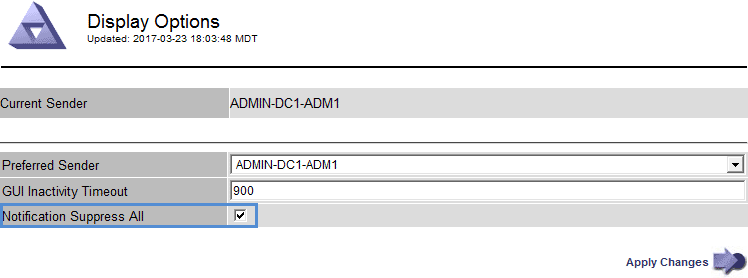

. Click *Apply Changes*.
+
The Notifications page (*Configuration* > *Notifications*) displays the following message:
+
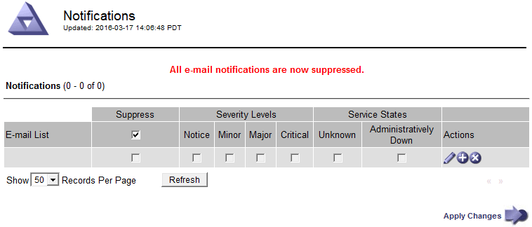