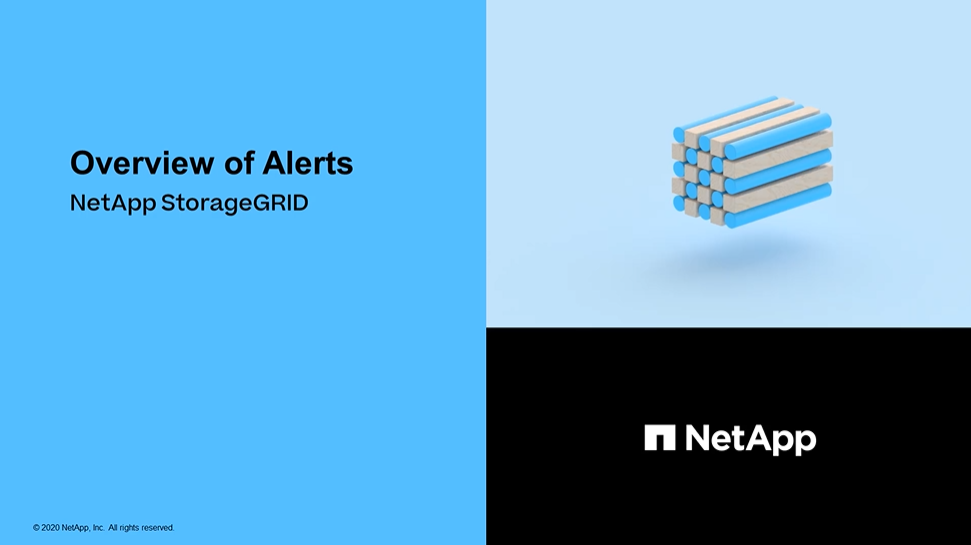

= Manage alerts: overview
:icons: font
:imagesdir: ../media/

[.lead]
Alerts allow you to monitor various events and conditions within your StorageGRID system. You can manage alerts by creating custom alerts, editing or disabling the default alerts, setting up email notifications for alerts, and silencing alert notifications.

== About StorageGRID alerts

The alert system provides an easy-to-use interface for detecting, evaluating, and resolving the issues that can occur during StorageGRID operation.

* The alert system focuses on actionable problems in the system. Alerts are triggered for events that require your immediate attention, not for events that can safely be ignored.
* The Current Alerts page provides a user-friendly interface for viewing current problems. You can sort the listing by individual alerts and alert groups. For example, you might want to sort all alerts by node/site to see which alerts are affecting a specific node. Or, you might want to sort the alerts in a group by time triggered to find the most recent instance of a specific alert.
* The Resolved Alerts page provides similar information as on the Current Alerts page, but it allows you to search and view a history of the alerts that have been resolved, including when the alert was triggered and when it was resolved.
* Multiple alerts of the same type are grouped into one email to reduce the number of notifications. In addition, multiple alerts of the same type are shown as a group on the Alerts page. You can expand and collapse alert groups to show or hide the individual alerts. For example, if several nodes report the *Unable to communicate with node* alert at about the same time, only one email is sent and the alert is shown as a group on the Alerts page.
* Alerts use intuitive names and descriptions to help you quickly understand the problem. Alert notifications include details about the node and site affected, the alert severity, the time when the alert rule was triggered, and the current value of metrics related to the alert.
* Alert emails notifications and the alert listings on the Current Alerts and Resolved Alerts pages provide recommended actions for resolving an alert. These recommended actions often include direct links to the StorageGRID documentation center to make it easier to find and access more detailed troubleshooting procedures.
* If you need to temporarily suppress the notifications for an alert at one or more severity levels, you can easily silence a specific alert rule for a specified duration and for the entire grid, a single site, or a single node. You can also silence all alert rules, for example, during a planned maintenance procedure such as a software upgrade.
* You can edit the default alert rules as required. You can disable an alert rule completely, or change its trigger conditions and duration.
* You can create custom alert rules to target the specific conditions that are relevant to your situation and to provide your own recommended actions. To define the conditions for a custom alert, you create expressions using the Prometheus metrics available from the Metrics section of the Grid Management API.

== Learn more

To learn more, review these videos:

* https://netapp.hosted.panopto.com/Panopto/Pages/Viewer.aspx?id=2680a74f-070c-41c2-bcd3-acc5013c9cdd[Video: Overview of Alerts^]
+

* https://netapp.hosted.panopto.com/Panopto/Pages/Viewer.aspx?id=b35ac3f2-957b-4e79-b82b-acc5013c98d0[Video: Using Metrics to Create Custom Alerts^]
+
image::../media/video-screenshot-alert-create-custom.png[link-"https://netapp.hosted.panopto.com/Panopto/Pages/Viewer.aspx?id=b35ac3f2-957b-4e79-b82b-acc5013c98d0" alt="Video: Using Metrics to Create Custom Alerts", window=_blank]