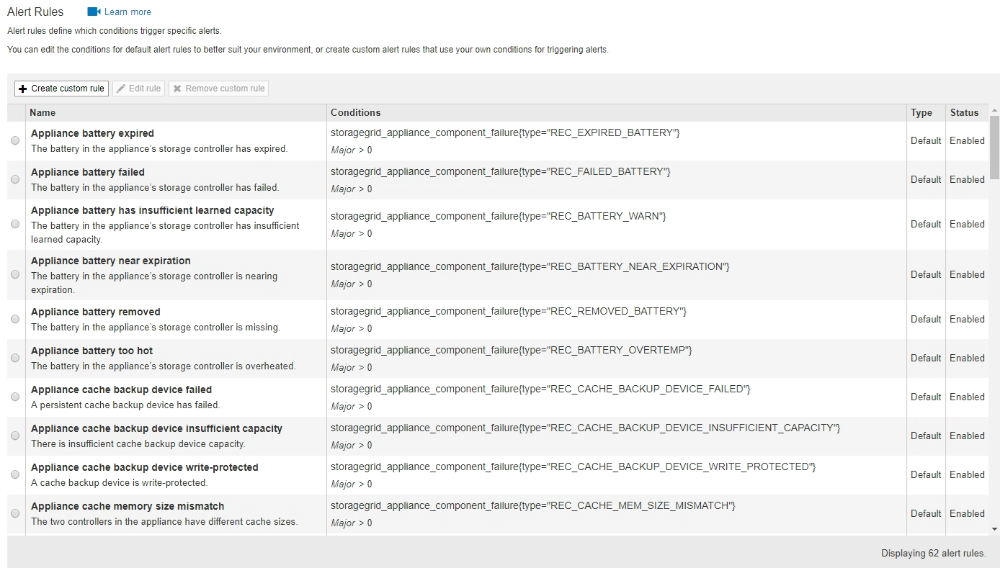

= Managing alerts
:icons: font
:imagesdir: ../media/

[.lead]
Alerts allow you to monitor various events and conditions within your StorageGRID system. You can manage alerts by creating custom alerts, editing or disabling the default alerts, setting up email notifications for alerts, and silencing alert notifications.

.Related information

xref:viewing_current_alerts.adoc[Viewing current alerts]

xref:viewing_resolved_alerts.adoc[Viewing resolved alerts]

xref:viewing_specific_alert.adoc[Viewing a specific alert]

xref:alerts_reference.adoc[Alerts reference]

== What alerts are

[.lead]
The alert system provides an easy-to-use interface for detecting, evaluating, and resolving the issues that can occur during StorageGRID operation.

* The alert system focuses on actionable problems in the system. Unlike some alarms in the legacy system, alerts are triggered for events that require your immediate attention, not for events that can safely be ignored.
* The Current Alerts page provides a user-friendly interface for viewing current problems. You can sort the listing by individual alerts and alert groups. For example, you might want to sort all alerts by node/site to see which alerts are affecting a specific node. Or, you might want to sort the alerts in a group by time triggered to find the most recent instance of a specific alert.
* The Resolved Alerts page provides similar information as on the Current Alerts page, but it allows you to search and view a history of the alerts that have been resolved, including when the alert was triggered and when it was resolved.
* Multiple alerts of the same type are grouped into one email to reduce the number of notifications. In addition, multiple alerts of the same type are shown as a group on the Alerts page. You can expand and collapse alert groups to show or hide the individual alerts. For example, if several nodes report the *Unable to communicate with node* alert at about the same time, only one email is sent and the alert is shown as a group on the Alerts page.
* Alerts use intuitive names and descriptions to help you quickly understand the problem. Alert notifications include details about the node and site affected, the alert severity, the time when the alert rule was triggered, and the current value of metrics related to the alert.
* Alert emails notifications and the alert listings on the Current Alerts and Resolved Alerts pages provide recommended actions for resolving an alert. These recommended actions often include direct links to the StorageGRID documentation center to make it easier to find and access more detailed troubleshooting procedures.
* If you need to temporarily suppress the notifications for an alert at one or more severity levels, you can easily silence a specific alert rule for a specified duration and for the entire grid, a single site, or a single node. You can also silence all alert rules, for example, during a planned maintenance procedure such as a software upgrade.
* You can edit the default alert rules as required. You can disable an alert rule completely, or change its trigger conditions and duration.
* You can create custom alert rules to target the specific conditions that are relevant to your situation and to provide your own recommended actions. To define the conditions for a custom alert, you create expressions using the Prometheus metrics available from the Metrics section of the Grid Management API.

== Managing alert rules

[.lead]
Alert rules define the conditions that trigger specific alerts. StorageGRID includes a set of default alert rules, which you can use as is or modify, or you can create custom alert rules.

=== Viewing alert rules

[.lead]
You can view the list of all default and custom alert rules to learn which conditions will trigger each alert and to see whether any alerts are disabled.

.What you'll need
* You must be signed in to the Grid Manager using a supported browser.
* You must have the Manage Alerts or Root Access permission.

.Steps
. Select *Alerts* > *Alert Rules*.
+
The Alert Rules page appears.
+

. Review the information in the alert rules table:
+
[options="header"]
|===
| Column header| Description
a|
Name
a|
The unique name and description of the alert rule. Custom alert rules are listed first, followed by default alert rules. The alert rule name is the subject for email notifications.
a|
Conditions
a|
The Prometheus expressions that determine when this alert is triggered. An alert can be triggered at one or more of the following severity levels, but a condition for each severity is not required.

 ** *Critical* image:../media/icon_alert_red_critical.png[Icon Alert Red Critical]: An abnormal condition exists that has stopped the normal operations of a StorageGRID node or service. You must address the underlying issue immediately. Service disruption and loss of data might result if the issue is not resolved.
 ** *Major* image:../media/icon_alert_orange_major.png[Icon Alert Orange Major]: An abnormal condition exists that is either affecting current operations or approaching the threshold for a critical alert. You should investigate major alerts and address any underlying issues to ensure that the abnormal condition does not stop the normal operation of a StorageGRID node or service.
 ** *Minor* : The system is operating normally, but an abnormal condition exists that could affect the system's ability to operate if it continues. You should monitor and resolve minor alerts that do not clear on their own to ensure they do not result in a more serious problem.

a|
Type
a|
The type of alert rule:

 ** *Default*: An alert rule provided with the system. You can disable a default alert rule or edit the conditions and duration for a default alert rule. You cannot remove a default alert rule.
 ** *Default**: A default alert rule that includes an edited condition or duration. As required, you can easily revert a modified condition back to the original default.
 ** *Custom*: An alert rule that you created. You can disable, edit, and remove custom alert rules.

a|
Status
a|
Whether this alert rule is currently enabled or disabled. The conditions for disabled alert rules are not evaluated, so no alerts are triggered.
|===

.Related information

xref:alerts_reference.adoc[Alerts reference]

=== Creating custom alert rules

[.lead]
You can create custom alert rules to define your own conditions for triggering alerts.

.What you'll need
* You must be signed in to the Grid Manager using a supported browser.
* You must have the Manage Alerts or Root Access permission.

.About this task
StorageGRID does not validate custom alerts. If you decide to create custom alert rules, follow these general guidelines:

* Look at the conditions for the default alert rules, and use them as examples for your custom alert rules.
* If you define more than one condition for an alert rule, use the same expression for all conditions. Then, change the threshold value for each condition.
* Carefully check each condition for typos and logic errors.
* Use only the metrics listed in the Grid Management API.
* When testing an expression using the Grid Management API, be aware that a "`successful`" response might simply be an empty response body (no alert triggered). To see if the alert is actually triggered, you can temporarily set a threshold to a value you expect to be true currently.
+
For example, to test the expression `node_memory_MemTotal_bytes < 24000000000`, first execute `node_memory_MemTotal_bytes >= 0` and ensure you get the expected results (all nodes return a value). Then, change the operator and the threshold back to the intended values and execute again. No results indicate there are no current alerts for this expression.

* Do not assume a custom alert is working unless you have validated that the alert is triggered when expected.

. Select *Alerts* > *Alert Rules*.
+
The Alert Rules page appears.

. Select *Create custom rule*.
+
The Create Custom Rule dialog box appears.
+
image::../media/alerts_create_custom_rule.png[Alerts > Create Custom Rule]

. Select or unselect the *Enabled* check box to determine if this alert rule is currently enabled.
+
If an alert rule is disabled, its expressions are not evaluated and no alerts are triggered.

. Enter the following information:
+
[options="header"]
|===
| Field| Description
a|
Unique Name
a|
A unique name for this rule.     The alert rule name is shown on the Alerts page and is also the subject for email notifications. Names for alert rules can be between 1 and 64 characters.
a|
Description
a|
A description of the problem that is occurring.     The description is the alert message shown on the Alerts page and in email notifications. Descriptions for alert rules can be between 1 and 128 characters.
a|
Recommended Actions
a|
Optionally, the recommended actions to take when this alert is triggered. Enter recommended actions as plain text (no formatting codes). Recommended actions for alert rules can be between 0 and 1,024 characters.
|===

. In the Conditions section, enter a Prometheus expression for one or more of the alert severity levels.
+
A basic expression is usually of the form:
+
----
[metric] [operator] [value]
----
+
Expressions can be any length, but appear on a single line in the user interface. At least one expression is required.
+
To see available metrics and to test Prometheus expressions, click the help icon  and follow the link to the Metrics section of the Grid Management API.
+
To learn about using the Grid Management API, see the instructions for administering StorageGRID. For details on the syntax of Prometheus queries, see the documentation for Prometheus.
+
This expression causes an alert to be triggered if the amount of installed RAM for a node is less than 24,000,000,000 bytes (24 GB).
+
----
node_memory_MemTotal_bytes < 24000000000
----

. In the *Duration* field, enter the amount of time a condition must continuously remain in effect before the alert is triggered, and select a unit of time.
+
To trigger an alert immediately when a condition becomes true, enter *0*. Increase this value to prevent temporary conditions from triggering alerts.
+
The default is 5 minutes.

. Click *Save*.
+
The dialog box closes, and the new custom alert rule appears in the Alert Rules table.

.Related information

http://docs.netapp.com/sgws-115/topic/com.netapp.doc.sg-admin/home.html[Administering StorageGRID]

xref:commonly_used_prometheus_metrics.adoc[Commonly used Prometheus metrics]

https://prometheus.io/docs/querying/basics/[Prometheus: Query basics]

=== Editing an alert rule

[.lead]
You can edit an alert rule to change the trigger conditions, For a custom alert rule, you can also update the rule name, description, and recommended actions.

.What you'll need
* You must be signed in to the Grid Manager using a supported browser.
* You must have the Manage Alerts or Root Access permission.

.About this task
When you edit a default alert rule, you can change the conditions for minor, major, and critical alerts; and the duration. When you edit a custom alert rule, you can also edit the rule's name, description, and recommended actions.

IMPORTANT: Be careful when deciding to edit an alert rule. If you change trigger values, you might not detect an underlying problem until it prevents a critical operation from completing.

.Steps
. Select *Alerts* > *Alert Rules*.
+
The Alert Rules page appears.

. Select the radio button for the alert rule you want to edit.
. Select *Edit rule*.
+
The Edit Rule dialog box appears. This example shows a default alert rule--the Unique Name, Description, and Recommended Actions fields are disabled and cannot be edited.
+
image::../media/alert_rules_edit_rule.png[Alerts > Edit Rule]

. Select or unselect the *Enabled* check box to determine if this alert rule is currently enabled.
+
If an alert rule is disabled, its expressions are not evaluated and no alerts are triggered.
+
NOTE: If you disable the alert rule for a current alert, you must wait a few minutes for the alert to no longer appear as an active alert.
+
IMPORTANT: In general, disabling a default alert rule is not recommended. If an alert rule is disabled, you might not detect an underlying problem until it prevents a critical operation from completing.

. For custom alert rules, update the following information as required.
+
NOTE: You cannot edit this information for default alert rules.
+
[options="header"]
|===
| Field| Description
a|
Unique Name
a|
A unique name for this rule.     The alert rule name is shown on the Alerts page and is also the subject for email notifications. Names for alert rules can be between 1 and 64 characters.
a|
Description
a|
A description of the problem that is occurring.     The description is the alert message shown on the Alerts page and in email notifications. Descriptions for alert rules can be between 1 and 128 characters.
a|
Recommended Actions
a|
Optionally, the recommended actions to take when this alert is triggered.     Enter recommended actions as plain text (no formatting codes). Recommended actions for alert rules can be between 0 and 1,024 characters.
|===

. In the Conditions section, enter or update the Prometheus expression for one or more of the alert severity levels.
+
NOTE: If you want to restore a condition for an edited default alert rule back to its original value, click the three dots to the right of the modified condition.
+
image::../media/alert_rules_edit_revert_to_default.png[Alert rules: reverting an edited condition to default value]
+
NOTE: If you update the conditions for a current alert, your changes might not be implemented until the previous condition is resolved. The next time one of the conditions for the rule is met, the alert will reflect the updated values.
+
A basic expression is usually of the form:
+
----
[metric] [operator] [value]
----
+
Expressions can be any length, but appear on a single line in the user interface. At least one expression is required.
+
To see available metrics and to test Prometheus expressions, click the help icon  and follow the link to the Metrics section of the Grid Management API.
+
To learn about using the Grid Management API, see the instructions for administering StorageGRID. For details on the syntax of Prometheus queries, see the documentation for Prometheus.
+
This expression causes an alert to be triggered if the amount of installed RAM for a node is less than 24,000,000,000 bytes (24 GB).
+
----
node_memory_MemTotal_bytes < 24000000000
----

. In the *Duration* field, enter the amount of time a condition must continuously remain in effect before the alert is triggered, and select the unit of time.
+
To trigger an alert immediately when a condition becomes true, enter *0*. Increase this value to prevent temporary conditions from triggering alerts.
+
The default is 5 minutes.

. Click *Save*.
+
If you edited a default alert rule, *Default** appears in the Type column. If you disabled a default or custom alert rule, *Disabled* appears in the *Status* column.

.Related information

http://docs.netapp.com/sgws-115/topic/com.netapp.doc.sg-admin/home.html[Administering StorageGRID]

xref:commonly_used_prometheus_metrics.adoc[Commonly used Prometheus metrics]

https://prometheus.io/docs/querying/basics/[Prometheus: Query basics]

=== Disabling an alert rule

[.lead]
You can change the enabled/disabled state for a default or custom alert rule.

.What you'll need
* You must be signed in to the Grid Manager using a supported browser.
* You must have the Manage Alerts or Root Access permission.

.About this task
When an alert rule is disabled, its expressions are not evaluated and no alerts are triggered.

IMPORTANT: In general, disabling a default alert rule is not recommended. If an alert rule is disabled, you might not detect an underlying problem until it prevents a critical operation from completing.

.Steps
. Select *Alerts* > *Alert Rules*.
+
The Alert Rules page appears.

. Select the radio button for the alert rule you want to disable or enable.
. Select *Edit rule*.
+
The Edit Rule dialog box appears.

. Select or unselect the *Enabled* check box to determine if this alert rule is currently enabled.
+
If an alert rule is disabled, its expressions are not evaluated and no alerts are triggered.
+
NOTE: If you disable the alert rule for a current alert, you must wait a few minutes for the alert to no longer display as an active alert.

. Click *Save*.
+
*Disabled* appears in the *Status* column.

=== Removing a custom alert rule

[.lead]
You can remove a custom alert rule if you no longer want to use it.

.What you'll need
* You must be signed in to the Grid Manager using a supported browser.
* You must have the Manage Alerts or Root Access permission.

.Steps
. Select *Alerts* > *Alert Rules*.
+
The Alert Rules page appears.

. Select the radio button for the custom alert rule you want to remove.
+
You cannot remove a default alert rule.

. Click *Remove custom rule*.
+
A confirmation dialog box appears.

. Click *OK* to remove the alert rule.
+
Any active instances of the alert will be resolved within 10 minutes.

== Managing alert notifications

[.lead]
When an alert is triggered, StorageGRID can send email notifications and Simple Network Management Protocol (SNMP) notifications (traps).

=== Setting up SNMP notifications for alerts

[.lead]
If you want StorageGRID to send SNMP notifications when alerts occur, you must enable the StorageGRID SNMP agent and configure one or more trap destinations.

.About this task
You can use the *Configuration* > *Monitoring* > *SNMP Agent* option in the Grid Manager or the SNMP endpoints for the Grid Management API to enable and configure the StorageGRID SNMP agent. The SNMP agent supports all three versions of the SNMP protocol.

To learn how to configure the SNMP agent, see the section for using SNMP monitoring.

After you configure the StorageGRID SNMP agent, two types of event-driven notifications can be sent:

* Traps are notifications sent by the SNMP agent that do not require acknowledgment by the management system. Traps serve to notify the management system that something has happened within StorageGRID, such as an alert being triggered. Traps are supported in all three versions of SNMP
* Informs are similar to traps, but they require acknowledgment by the management system. If the SNMP agent does not receive an acknowledgment within a certain amount of time, it resends the inform until an acknowledgment is received or the maximum retry value has been reached. Informs are supported in SNMPv2c and SNMPv3.

Trap and inform notifications are sent when a default or custom alert is triggered at any severity level. To suppress SNMP notifications for an alert, you must configure a silence for the alert. Alert notifications are sent by whichever Admin Node is configured to be the preferred sender. By default, the primary Admin Node is selected. For details, see the instructions for administering StorageGRID.

NOTE: Trap and inform notifications are also sent when certain alarms (legacy system) are triggered at specified severity levels or higher; however, SNMP notifications are not sent for every alarm or every alarm severity.

.Related information

xref:using_snmp_monitoring.adoc[Using SNMP monitoring]

link:managing_alerts.md#[Silencing alert notifications]

http://docs.netapp.com/sgws-115/topic/com.netapp.doc.sg-admin/home.html[Administering StorageGRID]

xref:alarms_that_generate_snmp_notifications.adoc[Alarms that generate SNMP notifications (legacy system)]

=== Setting up email notifications for alerts

[.lead]
If you want email notifications to be sent when alerts occur, you must provide information about your SMTP server. You must also enter email addresses for the recipients of alert notifications.

.What you'll need
* You must be signed in to the Grid Manager using a supported browser.
* You must have the Manage Alerts or Root Access permission.

.What you'll need
Because alarms and alerts are independent systems, the email setup used for alert notifications is not used for alarm notifications and AutoSupport messages. However, you can use the same email server for all notifications.

If your StorageGRID deployment includes multiple Admin Nodes, you can select which Admin Node should be the preferred sender of alert notifications. The same "`preferred sender`" is also used for alarm notifications and AutoSupport messages. By default, the primary Admin Node is selected. For details, see the instructions for administering StorageGRID.

.Steps
. Select *Alerts* > *Email Setup*.
+
The Email Setup page appears.
+
image::../media/alerts_email_setup_disabled.png[Alerts Email Setup Disabled]

. Select the *Enable Email Notifications* check box to indicate that you want notification emails to be sent when alerts reach configured thresholds.
+
The Email (SMTP) Server, Transport Layer Security (TLS), Email Addresses, and Filters sections appear.

. In the Email (SMTP) Server section, enter the information StorageGRID needs to access your SMTP server.
+
If your SMTP server requires authentication, you must provide both a username and a password. You must also require TLS and provide a CA certificate.
+
[options="header"]
|===
| Field| Enter
a|
Mail Server
a|
The fully qualified domain name (FQDN) or IP address of the SMTP server.
a|
Port
a|
The port used to access the SMTP server. Must be between 1 and 65535.
a|
Username (optional)
a|
If your SMTP server requires authentication, enter the username to authenticate with.
a|
Password (optional)
a|
If your SMTP server requires authentication, enter the password to authenticate with.
|===
image:../media/alerts_email_smtp_server.png[Alerts Email SMTP Server]

. In the Email Addresses section, enter email addresses for the sender and for each recipient.
 .. For the *Sender Email Address*, specify a valid email address to use as the From address for alert notifications.
+
For example: `storagegrid-alerts@example.com`

 .. In the Recipients section, enter an email address for each email list or person who should receive an email when an alert occurs.
+
Click the plus icon image:../media/icon_plus_sign_black_on_white.gif[plus icon] to add recipients.

+
image::../media/alerts_email_recipients.png[Alerts Email Recipients]
. In the Transport Layer Security (TLS) section, select the *Require TLS* check box if Transport Layer Security (TLS) is required for communications with the SMTP server.
 .. In the *CA Certificate* field, provide the CA certificate that will be used to verify the identify of the SMTP server.
+
You can copy and paste the contents into this field, or click *Browse* and select the file.
+
You must provide a single file that contains the certificates from each intermediate issuing certificate authority (CA). The file should contain each of the PEM-encoded CA certificate files, concatenated in certificate chain order.

 .. Select the *Send Client Certificate* check box if your SMTP email server requires email senders to provide client certificates for authentication.
 .. In the *Client Certificate* field, provide the PEM-encoded client certificate to send to the SMTP server.
+
You can copy and paste the contents into this field, or click *Browse* and select the file.

 .. In the *Private Key* field, enter the private key for the client certificate in unencrypted PEM encoding.
+
You can copy and paste the contents into this field, or click *Browse* and select the file.
+
NOTE: If you need to edit the email setup, click the pencil icon to update this field.
+
image::../media/alerts_email_tls.png[Alerts Email TLS]
. In the Filters section, select which alert severity levels should result in email notifications, unless the rule for a specific alert has been silenced.
+
[options="header"]
|===
| Severity| Description
a|
Minor, major, critical
a|
An email notification is sent when the minor, major, or critical condition for an alert rule is met.
a|
Major, critical
a|
An email notification is sent when the major or critical condition for an alert rule is met. Notifications are not sent for minor alerts.
a|
Critical only
a|
An email notification is sent only when the critical condition for an alert rule is met. Notifications are not sent for minor or major alerts.
|===
image:../media/alerts_email_filters.png[Alerts Email Filters]

. When you are ready to test your email settings, perform these steps:
 .. Click *Send Test Email*.
+
A confirmation message appears, indicating that a test email was sent.

 .. Check the inboxes of all email recipients and confirm that a test email was received.
+
NOTE: If the email is not received within a few minutes or if the *Email notification failure* alert is triggered, check your settings and try again.

 .. Sign in to any other Admin Nodes and send a test email to verify connectivity from all sites.
+
NOTE: When you test alert notifications, you must sign in to every Admin Node to verify connectivity. This is in contrast to testing alarm notifications and AutoSupport messages, where all Admin Nodes send the test email.
. Click *Save*.
+
Sending a test email does not save your settings. You must click *Save*.
+
The email settings are saved.

.Related information

link:managing_alerts.md#[Troubleshooting alert email notifications]

http://docs.netapp.com/sgws-115/topic/com.netapp.doc.sg-maint/home.html[Recovery and maintenance]

=== Information included in alert email notifications

[.lead]
After you configure the SMTP email server, email notifications are sent to the designated recipients when an alert is triggered, unless the alert rule is suppressed by a silence.

Email notifications include the following information:

image::../media/alerts_email_notification.png[Alerts Email Notification]

[options="header"]
|===
| Callout| Description
a|
1
a|
The name of the alert, followed by the number of active instances of this alert.
a|
2
a|
The description of the alert.
a|
3
a|
Any recommended actions for the alert.
a|
4
a|
Details about each active instance of the alert, including the node and site affected, the alert severity, the UTC time when the alert rule was triggered, and the name of the affected job and service.
a|
5
a|
The hostname of the Admin Node that sent the notification.
|===
.Related information

link:managing_alerts.md#[Silencing alert notifications]

=== How StorageGRID groups alerts in email notifications

[.lead]
To prevent an excessive number of email notifications from being sent when alerts are triggered, StorageGRID attempts to group multiple alerts in the same notification.

Refer to the following table for examples of how StorageGRID groups multiple alerts in email notifications.

[options="header"]
|===
| Behavior| Example
a|
Each alert notification applies only to alerts that have the same name. If two alerts with different names are triggered at the same time, two email notifications are sent.
a|

* Alert A is triggered on two nodes at the same time. Only one notification is sent.
* Alert A is triggered on node 1, and Alert B is triggered on node 2 at the same time. Two notifications are sent--one for each alert.

a|
For a specific alert on a specific node, if the thresholds are reached for more than one severity, a notification is sent only for the most severe alert.
a|

* Alert A is triggered and the minor, major, and critical alert thresholds are reached. One notification is sent for the critical alert.

a|
The first time an alert is triggered, StorageGRID waits 2 minutes before sending a notification. If other alerts with the same name are triggered during that time, StorageGRID groups all of the alerts in the initial notification.​
a|

. Alert A is triggered on node 1 at 08:00. No notification is sent.
. Alert A is triggered on node 2 at 08:01. No notification is sent.
. At 08:02, a notification is sent to report both instances of the alert.

a|
If an another alert with the same name is triggered, StorageGRID waits 10 minutes before sending a new notification. The new notification reports all active alerts (current alerts that have not been silenced), even if they were reported previously.
a|

. Alert A is triggered on node 1 at 08:00. A notification is sent at 08:02.
. Alert A is triggered on node 2 at 08:05. A second notification is sent at 08:15 (10 minutes later). Both nodes are reported.

a|
If there are multiple current alerts with the same name and one of those alerts is resolved, a new notification is not sent if the alert reoccurs on the node for which the alert was resolved.
a|

. Alert A is triggered for node 1. A notification is sent.
. Alert A is triggered for node 2. A second notification is sent.
. Alert A is resolved for node 2, but it remains active for node 1.
. Alert A is triggered again for node 2. No new notification is sent because the alert is still active for node 1.

a|
StorageGRID continues to send email notifications once every 7 days until all instances of the alert are resolved or the alert rule is silenced.
a|

. Alert A is triggered for node 1 on March 8. A notification is sent.
. Alert A is not resolved or silenced. Additional notifications are sent on March 15, March 22, March 29, and so on.

|===

=== Troubleshooting alert email notifications

[.lead]
If the *Email notification failure* alert is triggered or you are unable to receive the test alert email notification, follow these steps to resolve the issue.

.What you'll need
* You must be signed in to the Grid Manager using a supported browser.
* You must have the Manage Alerts or Root Access permission.

.Steps
. Verify your settings.
 .. Select *Alerts* > *Email Setup*.
 .. Verify that the Email (SMTP) Server settings are correct.
 .. Verify that you have specified valid email addresses for the recipients.
. Check your spam filter, and make sure that the email was not sent to a junk folder.
. Ask your email administrator to confirm that emails from the sender address are not being blocked.
. Collect a log file for the Admin Node, and then contact technical support.
+
Technical support can use the information in the logs to help determine what went wrong. For example, the prometheus.log file might show an error when connecting to the server you specified.

.Related information

xref:collecting_log_files_and_system_data.adoc[Collecting log files and system data]

== Silencing alert notifications

[.lead]
Optionally, you can configure silences to temporarily suppress alert notifications.

.What you'll need
* You must be signed in to the Grid Manager using a supported browser.
* You must have the Manage Alerts or Root Access permission.

.About this task
You can silence alert rules on the entire grid, a single site, or a single node and for one or more severities. Each silence suppresses all notifications for a single alert rule or for all alert rules.

If you have enabled the SNMP agent, silences also suppress SNMP traps and informs.

IMPORTANT: Be careful when deciding to silence an alert rule. If you silence an alert, you might not detect an underlying problem until it prevents a critical operation from completing.

NOTE: Because alarms and alerts are independent systems, you cannot use this functionality to suppress alarm notifications.

.Steps
. Select *Alerts* > *Silences*.
+
The Silences page appears.
+
image::../media/alerts_silences_page.png[Alerts > Silences page]

. Select *Create*.
+
The Create Silence dialog box appears.
+
image::../media/alerts_create_silence.png[Alerts > Create Silence]

. Select or enter the following information:
+
[options="header"]
|===
| Field| Description
a|
Alert Rule
a|
The name of the alert rule you want to silence. You can select any default or custom alert rule, even if the alert rule is disabled.

*Note:* Select *All rules* if you want to silence all alert rules using the criteria specified in this dialog box.
a|
Description
a|
Optionally, a description of the silence. For example, describe the purpose of this silence.
a|
Duration
a|
How long you want this silence to remain in effect, in minutes, hours, or days. A silence can be in effect from 5 minutes to 1,825 days (5 years).

*Note:* You should not silence an alert rule for an extended amount of time. If an alert rule is silenced, you might not detect an underlying problem until it prevents a critical operation from completing. However, you might need to use an extended silence if an alert is triggered by a specific, intentional configuration, such as might be the case for the *Services appliance link down* alerts and the *Storage appliance link down* alerts.
a|
Severity
a|
Which alert severity or severities should be silenced. If the alert is triggered at one of the selected severities, no notifications are sent.
a|
Nodes
a|
Which node or nodes you want this silence to apply to. You can suppress an alert rule or all rules on the entire grid, a single site, or a single node. If you select the entire grid, the silence applies to all sites and all nodes. If you select a site, the silence applies only to the nodes at that site.

*Note:* You cannot select more than one node or more than one site for each silence. You must create additional silences if you want to suppress the same alert rule on more than one node or more than one site at one time.
|===

. Click *Save*.
. If you want to modify or end a silence before it expires, you can edit or remove it.
+
[options="header"]
|===
| Option| Description
a|
Edit a silence
a|

 .. Select *Alerts* > *Silences*.
 .. From the table, select the radio button for the silence you want to edit.
 .. Click *Edit*.
 .. Change the description, the amount of time remaining, the selected severities, or the affected node.
 .. Click *Save*.

a|
Remove a silence
a|

 .. Select *Alerts* > *Silences*.
 .. From the table, select the radio button for the silence you want to remove.
 .. Click *Remove*.
 .. Click *OK* to confirm you want to remove this silence.
+
*Note*: Notifications will now be sent when this alert is triggered (unless suppressed by another silence). If this alert is currently triggered, it might take few minutes for email or SNMP notifications to be sent and for the Alerts page to update.
|===

.Related information

xref:configuring_snmp_agent.adoc[Configuring the SNMP agent]
