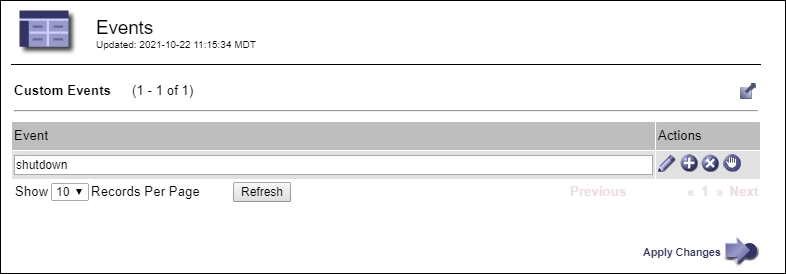

= Monitor events
:icons: font
:imagesdir: ../media/

[.lead]
You can monitor events that are detected by a grid node, including custom events that you have created to track events that are logged to the syslog server. The Last Event message shown in the Grid Manager provides more information about the most recent event.

Event messages are also listed in the `/var/local/log/bycast-err.log` log file. See the xref:logs-files-reference.adoc[Log files reference].

The SMTT (Total events) alarm can be repeatedly triggered by issues such as network problems, power outages or upgrades. This section has information on investigating events so that you can better understand why these alarms have occurred. If an event occurred because of a known issue, it is safe to reset the event counters.

.Steps

. Review the system events for each grid node:

.. Select *SUPPORT* > *Tools* > *Grid topology*.
.. Select *_site_* > *_grid node_* > *SSM* > *Events* > *Overview* > *Main*.

. Generate a list of previous event messages to help isolate issues that occurred in the past:

.. Select *SUPPORT* > *Tools* > *Grid topology*.
.. Select *_site_* > *_grid node_* > *SSM* > *Events* > *Reports*.
.. Select *Text*.
+
The *Last Event* attribute is not shown in the xref:using-charts-and-reports.adoc[charts view]. To view it:
+
.. Change *Attribute* to *Last Event*.
.. Optionally, select a time period for *Quick Query*.
.. Select *Update*.
+
image::../media/events_report.gif[Events page]

== Create custom syslog events

Custom events allow you to track all kernel, daemon, error and critical level user events logged to the syslog server. A custom event can be useful for monitoring the occurrence of system log messages (and thus network security events and hardware faults).

.About this task
Consider creating custom events to monitor recurring problems. The following considerations apply to custom events.

* After a custom event is created, every occurrence of it is monitored.

* To create a custom event based on keywords in the `/var/local/log/messages` files, the logs in those files must be:
 ** Generated by the kernel
 ** Generated by daemon or user program at the error or critical level

*Note:* Not all entries in the `/var/local/log/messages` files will be matched unless they satisfy the requirements stated above.

.Steps
. Select *SUPPORT* > *Alarms (legacy)* > *Custom events*. 
. Click *Edit* image:../media/icon_nms_edit.gif[pencil icon] (or *Insert* image:../media/icon_nms_insert.gif[plus icon] if this is not the first event).
. Enter a custom event string, for example, shutdown
+

. Select *Apply Changes*.
. Select *SUPPORT* > *Tools* > *Grid topology*.
. Select *_grid node_* > *SSM* > *Events*.
. Locate the entry for Custom Events in the Events table, and monitor the value for *Count*.
+
If the count increases, a custom event you are monitoring is being triggered on that grid node.
+
image::../media/custom_events_count.png[SSM > Events > Overview page]

== Reset the count of custom events to zero

If you want to reset the counter only for custom events, you must use the Grid Topology page in the Support menu.

.About this task
Resetting a counter causes the alarm to be triggered by the next event. In contrast, when you acknowledge an alarm, that alarm is only re-triggered if the next threshold level is reached.

. Select *SUPPORT* > *Tools* > *Grid topology*.
. Select *_grid node_* > *SSM* > *Events* > *Configuration* > *Main*.
. Select the *Reset* check box for Custom Events.
+
image::../media/custom_events_reset.gif[screenshot at SSM > Events > Configuration > Main]

. Select *Apply Changes*.