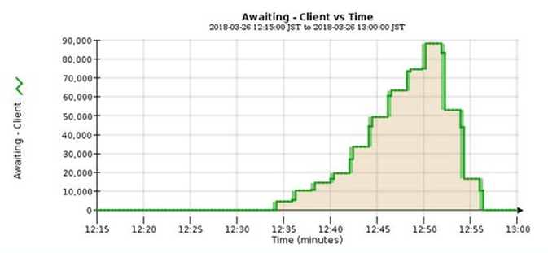

= Monitor information lifecycle management
:icons: font
:imagesdir: ../media/

[.lead]
The information lifecycle management (ILM) system provides data management for all objects stored on the grid. You must monitor ILM operations to understand if the grid can handle the current load, or if more resources are required.

.What you'll need
You must be signed in to the Grid Manager using a xref:../admin/web-browser-requirements.adoc[supported web browser].

.About this task
The StorageGRID system manages objects by applying the active ILM policy. The ILM policy and associated ILM rules determine how many copies are made, the type of copies that are created, where copies are placed, and the length of time each copy is retained.

Object ingest and other object-related activities can exceed the rate at which StorageGRID can evaluate ILM, causing the system to queue objects whose ILM placement instructions cannot be fulfilled in near real time. You can monitor whether StorageGRID is keeping up with client actions by charting the Awaiting - Client attribute.

To chart this attribute:

. Sign in to the Grid Manager.
. From the Dashboard, locate the *Awaiting - Client* entry in the Information Lifecycle Management (ILM) panel.
. Click the chart icon image:../media/icon_chart_new_for_11_5.png[Chart Icon].

The example chart shows a situation where the number of objects awaiting ILM evaluation temporarily increased in an unsustainable manner, then eventually decreased. Such a trend indicates that ILM was temporarily not fulfilled in near real time.

Temporary spikes in the chart of Awaiting - Client are to be expected. But if the value shown on the chart continues to increase and never declines, the grid requires more resources to operate efficiently: either more Storage Nodes, or, if the ILM policy places objects in remote locations, more network bandwidth.

You can further investigate ILM queues using the *NODES* page.

.Steps
. Select *NODES*.
. Select *_grid name_* > *ILM*.
. Hover your cursor over the ILM Queue graph to see the value of following attributes at a given point in time:
 ** *Objects queued (from client operations)*: The total number of objects awaiting ILM evaluation because of client operations (for example, ingest).
 ** *Objects queued (from all operations)*: The total number of objects awaiting ILM evaluation.
 ** *Scan rate (objects/sec)*: The rate at which objects in the grid are scanned and queued for ILM.
 ** *Evaluation rate (objects/sec)*: The current rate at which objects are being evaluated against the ILM policy in the grid.
. In the ILM Queue section, look at the following attributes.
+
NOTE: The ILM Queue section is included for the grid only. This information is not shown on the ILM tab for a site or Storage Node.

 ** *Scan Period - Estimated*: The estimated time to complete a full ILM scan of all objects.
+
NOTE: A full scan does not guarantee that ILM has been applied to all objects.

 ** *Repairs Attempted*: The total number of object repair operations for replicated data that have been attempted. This count increments each time a Storage Node tries to repair a high-risk object. High-risk ILM repairs are prioritized if the grid becomes busy.
+
NOTE: The same object repair might increment again if replication failed after the repair.

+
These attributes can be useful when you are monitoring the progress of Storage Node volume recovery. If the number of Repairs Attempted has stopped increasing and a full scan has been completed, the repair has probably completed.
