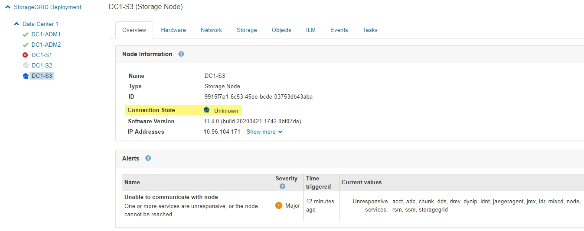

= Monitor node connection states
:icons: font
:imagesdir: ../media/

[.lead]
If one or more nodes are disconnected from the grid, critical StorageGRID operations might be affected. You must monitor node connection states and address any issues promptly.

.What you'll need
* You must be signed in to the Grid Manager using a xref:../admin/web-browser-requirements.adoc[supported web browser].

.About this task
Nodes can have one of three connection states:

* *Not connected - Unknown* image:../media/icon_alarm_blue_unknown.png[blue question mark icon]: The node is not connected to the grid for an unknown reason. For example, the network connection between nodes has been lost or the power is down. The *Unable to communicate with node* alert might also be triggered. Other alerts might be active as well. This situation requires immediate attention.
+
NOTE: A node might appear as Unknown during managed shutdown operations. You can ignore the Unknown state in these cases.

* *Not connected - Administratively down* image:../media/icon_alarm_gray_administratively_down.png[gray questionmark icon]: The node is not connected to the grid for an expected reason. For example, the node, or services on the node, has been gracefully shut down, the node is rebooting, or the software is being upgraded. One or more alerts might also be active.
* *Connected* image:../media/icon_alert_green_checkmark.png[icon alert green checkmark]: The node is connected to the grid.

.Steps
. If a blue or gray icon appears on the Health panel of the Dashboard, click the icon or click *Grid details*. (The blue or gray icons and the *Grid details* link appear only if at least one node is disconnected from the grid.)
+
The Overview page for the first blue node in the node tree appears. If there are no blue nodes, the Overview page for the first gray node in the tree appears.
+
In the example, the Storage Node named DC1-S3 has a blue icon. The *Connection State* on the Node Information panel is *Unknown*, and the *Unable to communicate with node* alert is active. The alert indicates that one or more services are unresponsive, or the node cannot be reached.
+

. If a node has a blue icon, follow these steps:
 .. Select each alert in the table, and follow the recommended actions.
+
For example, you might need to restart a service that has stopped or restart the host for the node.

 .. If you are unable to bring the node back online, contact technical support.
. If a node has a gray icon, follow these steps:
+
Gray nodes are expected during maintenance procedures and might be associated with one or more alerts. Based on the underlying issue, these "`administratively down`" nodes often go back online with no intervention.

 .. Review the Alerts section, and determine if any alerts are affecting this node.
 .. If one or more alerts are active, select each alert in the table, and follow the recommended actions.
 .. If you are unable to bring the node back online, contact technical support.

.Related information

xref:alerts-reference.adoc[Alerts reference]

xref:../maintain/index.adoc[Recover and maintain]
