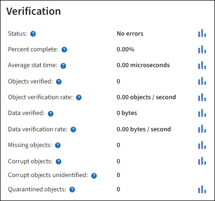

= Monitor object verification operations
:icons: font
:imagesdir: ../media/

[.lead]
The StorageGRID system can verify the integrity of object data on Storage Nodes, checking for both corrupt and missing objects.

.What you'll need
* You must be signed in to the Grid Manager using a xref:../admin/web-browser-requirements.adoc[supported web browser].
* You must have the Maintenance or Root Access permission.

.About this task
Two xref:verifying-object-integrity.adoc[verification processes] work together to ensure data integrity:

* *Background verification* runs automatically, continuously checking the correctness of object data.
+
Background verification automatically and continuously checks all Storage Nodes to determine if there are corrupt copies of replicated and erasure-coded object data. If problems are found, the StorageGRID system automatically attempts to replace the corrupt object data from copies stored elsewhere in the system. Background verification does not run on Archive Nodes or on objects in a Cloud Storage Pool.
+
NOTE: The *Unidentified corrupt object detected* alert is triggered if the system detects a corrupt object that cannot be corrected automatically.

* *Object existence check* can be triggered by a user to more quickly verify the existence (although not the correctness) of object data.
+

Object existence check verifies whether all expected replicated copies of objects and erasure-coded fragments exist on a Storage Node. Object existence check provides a way to verify the integrity of storage devices, especially if a recent hardware issue could have affected data integrity.

You should review the results from background verifications and object existence checks regularly. Investigate any instances of corrupt or missing object data immediately to determine the root cause.

.Steps
. Review the results from background verifications:
.. Select *NODES* > *_Storage Node_* > *Objects*.
.. Check the verification results:
 ** To check replicated object data verification, look at the attributes in the Verification section.
+

 ** To check erasure-coded fragment verification, select *_Storage Node_* > *ILM* and look at the attributes in the Erasure coding verification section.
+

+
Select the question mark image:../media/icon_nms_question.png[question mark] next to an attribute's name to display help text.

. Review the results from object existence check jobs:
.. Select *MAINTENANCE* > *Object existence check* > *Job history*.
.. Scan the Missing object copies detected column. If any jobs resulted in 100 or more missing object copies and the xref:alerts-reference.adoc[Objects lost alert] has been triggered, contact technical support.
+
image::../media/oec_job_history.png[Object existence check job history]