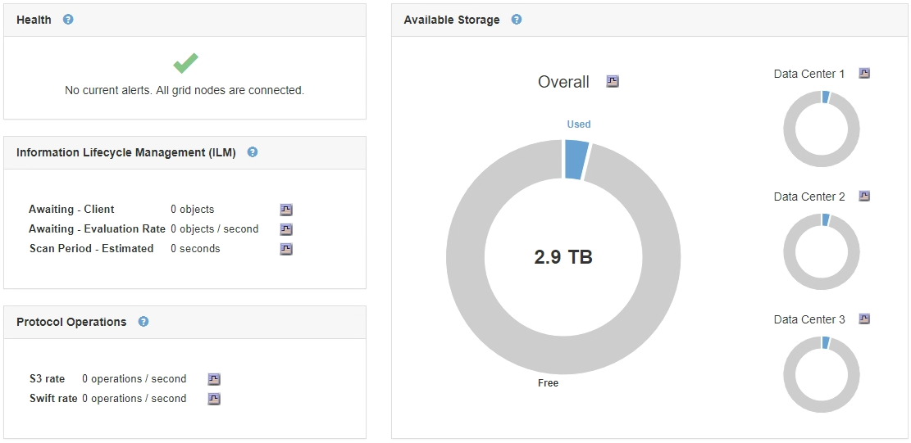
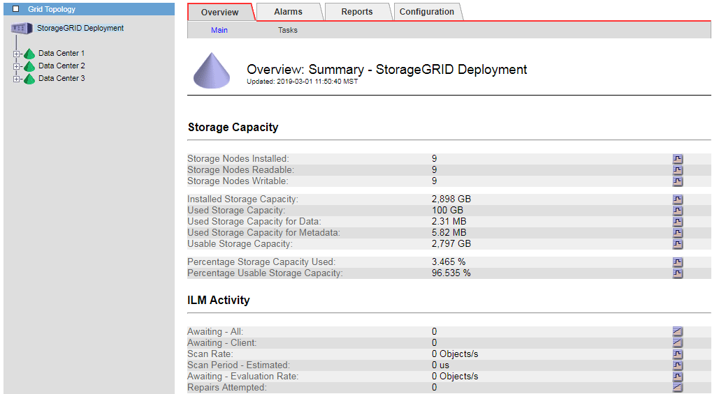

= Monitoring storage capacity for the entire grid
:icons: font
:imagesdir: ../media/

[.lead]
You must monitor the overall storage capacity for your grid to ensure that adequate free space remains for object data and object metadata. Understanding how storage capacity changes over time can help you plan to add Storage Nodes or storage volumes before the grid's usable storage capacity is consumed.

.What you'll need
You must be signed in to the Grid Manager using a xref:../admin/web-browser-requirements.adoc[supported web browser].

.About this task
The Dashboard in the Grid Manager lets you quickly assess how much storage is available for the entire grid and for each data center. The Nodes page provides more detailed values for object data and object metadata.

.Steps
. Assess how much storage is available for the entire grid and for each data center.
 .. Select *Dashboard*.
 .. In the Available Storage panel, note the overall summary of free and used storage capacity.
+
NOTE: The summary does not include archival media.
+

 .. Place your cursor over the chart's Free or Used capacity sections to see exactly how much space is free or used.
+
image::../media/storage_capacity_used.gif[Dashboard Free or Used capacity chart]

 .. For multi-site grids, review the chart for each data center.
 .. Click the chart icon image:../media/icon_chart_new_for_11_5.png[Chart Icon] for the overall chart or for an individual data center to view a graph showing capacity usage over time.
+
A graph showing Percentage Storage Capacity Used (%) vs. Time appears.
. Determine how much storage has been used and how much storage remains available for object data and object metadata.
 .. Select *Nodes*.
 .. Select *_grid_* > *Storage*.
+
image::../media/nodes_deployment_storage_tab.png[Nodes Deployment Storage tab]

 .. Hover your cursor over the Storage Used - Object Data and the Storage Used - Object Metadata charts to see how much object storage and object metadata storage is available for the entire grid, and how much has been used over time.
+
NOTE: The total values for a site or the grid do not include nodes that not have reported metrics for at least five minutes, such as offline nodes.
. As directed by technical support, view additional details about the storage capacity for your grid.
 .. Select *Support* > *Tools* > *Grid Topology*.
 .. Select *_grid_* > *Overview* > *Main*.
+

. Plan to perform an expansion to add Storage Nodes or storage volumes before the grid's usable storage capacity is consumed.
+
When planning the timing of an expansion, consider how long it will take to procure and install additional storage.
+
NOTE: If your ILM policy uses erasure coding, you might prefer to expand when existing Storage Nodes are approximately 70% full to reduce the number of nodes that must be added.
+
For more information on planning a storage expansion, see the instructions for expanding StorageGRID.

.Related information

xref:../expand/index.adoc[Expand your grid]
