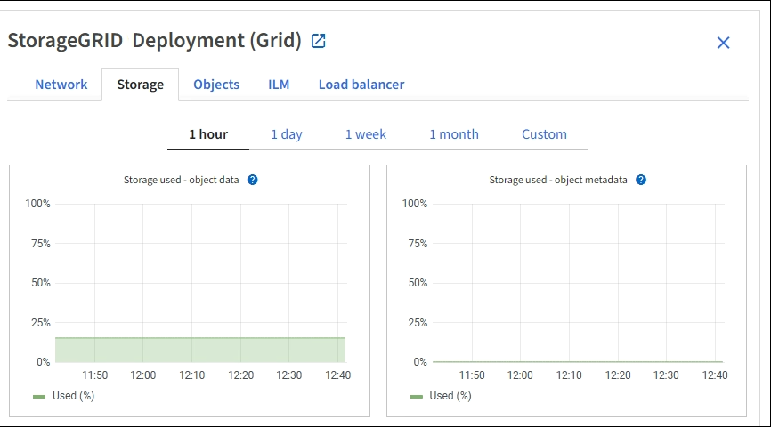
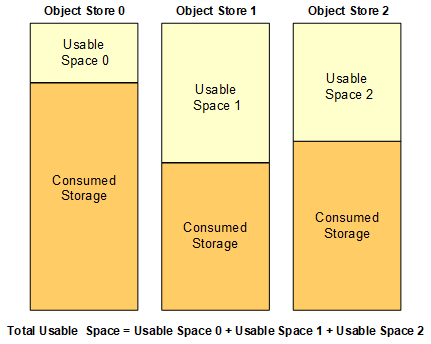

= Monitor storage capacity
:icons: font
:imagesdir: ../media/

[.lead]
Monitor the total usable space available to ensure that the StorageGRID system does not run out of storage space for objects or for object metadata.

StorageGRID stores object data and object metadata separately, and reserves a specific amount of space for a distributed Cassandra database that contains object metadata. Monitor the total amount of space consumed for objects and for object metadata, as well as trends in the amount of space consumed for each. This will enable you to plan ahead for the addition of nodes and avoid any service outages.

You can xref:viewing-storage-tab.adoc[view storage capacity information] for the entire grid, for each site, and for each Storage Node in your StorageGRID system.

== Monitor storage capacity for the entire grid

You must monitor the overall storage capacity for your grid to ensure that adequate free space remains for object data and object metadata. Understanding how storage capacity changes over time can help you plan to add Storage Nodes or storage volumes before the grid's usable storage capacity is consumed.

.What you'll need
You are signed in to the Grid Manager using a xref:../admin/web-browser-requirements.adoc[supported web browser].

.About this task
The Dashboard in the Grid Manager lets you quickly assess how much storage is available for the entire grid and for each data center. The Nodes page provides more detailed values for object data and object metadata.

.Steps
. Assess how much storage is available for the entire grid and for each data center.
 .. Select *Dashboard*.
 .. In the Available Storage panel, note the overall summary of free and used storage capacity.
+
NOTE: The summary does not include archival media.
+
image::../media/dashboard_available_storage_panel.png[Available Storage panel]

 .. Place your cursor over the chart's Free or Used capacity sections to see exactly how much space is free or used.
+
image::../media/storage_capacity_used.gif[Dashboard Free or Used capacity chart]

 .. For multi-site grids, review the chart for each data center.
 .. Click the chart icon image:../media/icon_chart_new_for_11_5.png[Chart Icon] for the overall chart or for an individual data center to view a graph showing capacity usage over time.
+
A graph showing Percentage Storage Capacity Used (%) vs. Time appears.
. Determine how much storage has been used and how much storage remains available for object data and object metadata.
 .. Select *NODES*.
 .. Select *_grid_* > *Storage*.
+

 .. Hover your cursor over the *Storage used - object data* and the *Storage used - object metadata* charts to see how much object storage and object metadata storage is available for the entire grid, and how much has been used over time.
+
NOTE: The total values for a site or the grid do not include nodes that not have reported metrics for at least five minutes, such as offline nodes.
. Plan to perform an expansion to add Storage Nodes or storage volumes before the grid's usable storage capacity is consumed.
+
When planning the timing of an expansion, consider how long it will take to procure and install additional storage.
+
NOTE: If your ILM policy uses erasure coding, you might prefer to expand when existing Storage Nodes are approximately 70% full to reduce the number of nodes that must be added.
+
For more information on planning a storage expansion, see the xref:../expand/index.adoc[instructions for expanding StorageGRID].

== Monitor storage capacity for each Storage Node

Monitor the total usable space for each Storage Node to ensure that the node has enough space for new object data.

.What you'll need
* You are signed in to the Grid Manager using a xref:../admin/web-browser-requirements.adoc[supported web browser].

.About this task
Usable space is the amount of storage space available to store objects. The total usable space for a Storage Node is calculated by adding together the available space on all object stores within the node.

.Steps
. Select *NODES* > *_Storage Node_* > *Storage*.
+
The graphs and tables for the node appear.

. Hover your cursor over the Storage used - object data graph.
+
The following values are shown:

 ** *Used (%)*: The percentage of the Total usable space that has been used for object data.
 ** *Used*: The amount of the Total usable space that has been used for object data.
 ** *Replicated data*: An estimate of the amount of replicated object data on this node, site, or grid.
 ** *Erasure-coded data*: An estimate of the amount of erasure-coded object data on this node, site, or grid.
 ** *Total*: The total amount of usable space on this node, site, or grid.
The Used value is the `storagegrid_storage_utilization_data_bytes` metric.

+
image::../media/nodes_page_storage_used_object_data.png[Nodes Page Storage Used Object Data]

. Review the Available values in the Volumes and Object stores tables, below the graphs.
+
NOTE: To view graphs of these values, click the chart icons image:../media/icon_chart_new_for_11_5.png[Chart Icon] in the Available columns.
+
image::../media/nodes_page_storage_tables.png[Object stores tables]

. Monitor the values over time to estimate the rate at which usable storage space is being consumed.
. To maintain normal system operations, add Storage Nodes, add storage volumes, or archive object data before usable space is consumed.
+
When planning the timing of an expansion, consider how long it will take to procure and install additional storage.
+
NOTE: If your ILM policy uses erasure coding, you might prefer to expand when existing Storage Nodes are approximately 70% full to reduce the number of nodes that must be added.
+
For more information on planning a storage expansion, see the xref:../expand/index.adoc[instructions for expanding StorageGRID].
+
The xref:troubleshooting-storagegrid-system.adoc[*Low object data storage*] alert is triggered when insufficient space remains for storing object data on a Storage Node.

== Monitor object metadata capacity for each Storage Node

Monitor the metadata usage for each Storage Node to ensure that adequate space remains available for essential database operations. You must add new Storage Nodes at each site before object metadata exceeds 100% of the allowed metadata space.

.What you'll need
* You are signed in to the Grid Manager using a xref:../admin/web-browser-requirements.adoc[supported web browser].

.About this task
StorageGRID maintains three copies of object metadata at each site to provide redundancy and to protect object metadata from loss. The three copies are evenly distributed across all Storage Nodes at each site using the space reserved for metadata on storage volume 0 of each Storage Node.

In some cases, the grid's object metadata capacity might be consumed faster than its object storage capacity. For example, if you typically ingest large numbers of small objects, you might need to add Storage Nodes to increase metadata capacity even though sufficient object storage capacity remains.

Some of the factors that can increase metadata usage include the size and quantity of user metadata and tags, the total number of parts in a multipart upload, and the frequency of changes to ILM storage locations.

.Steps
. Select *NODES* > *_Storage Node_* > *Storage*.
. Hover your cursor over the Storage used - object metadata graph to see the values for a specific time.
+
image::../media/storage_used_object_metadata.png[Storage Used - Object Metadata]
+
[cols="1a,3a,2a" options="header"]
|===
| Value| Description| Prometheus metric

|Used (%)
|The percentage of the allowed metadata space that has been used on this Storage Node.
|`storagegrid_storage_utilization_metadata_bytes/ storagegrid_storage_utilization_metadata_allowed_bytes`

|Used
|The bytes of the allowed metadata space that have been used on this Storage Node.
|`storagegrid_storage_utilization_metadata_bytes`

|Allowed
|The space allowed for object metadata on this Storage Node.     To learn how this value is determine for each Storage Node, see the xref:../admin/index.adoc[instructions for administering StorageGRID].
|`storagegrid_storage_utilization_metadata_allowed_bytes`

|Actual reserved
|The actual space reserved for metadata on this Storage Node. Includes the allowed space and the required space for essential metadata operations.     To learn how this value is calculated for each Storage Node, see the xref:../admin/index.adoc[instructions for administering StorageGRID].
|_Metric will be added in a future release._
//`storagegrid_storage_utilization_metadata_reserved_bytes`

|===
NOTE: The total values for a site or the grid do not include nodes that have not reported metrics for at least five minutes, such as offline nodes.

. If the *Used (%)* value is 70% or higher, expand your StorageGRID system by adding Storage Nodes to each site.
+
IMPORTANT: The *Low metadata storage* alert is triggered when the *Used (%)* value reaches certain thresholds. Undesirable results can occur if object metadata uses more than 100% of the allowed space.
+
When you add the new nodes, the system automatically rebalances object metadata across all Storage Nodes within the site. See the xref:../expand/index.adoc[instructions for expanding a StorageGRID system].
