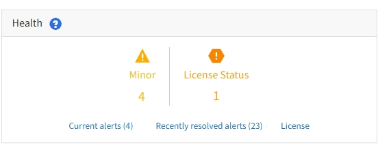

= Monitoring system health
:icons: font
:imagesdir: ../media/

[.lead]
You should monitor the overall health of your StorageGRID system on a daily basis.

The StorageGRID system is fault tolerant and can continue to operate even when parts of the grid are unavailable. The first sign of a potential issue with your StorageGRID system is likely to be an alert or an alarm (legacy system) and not necessarily an issue with system operations. Paying attention to system health can help you detect minor issues before they affect operations or grid efficiency.

The Health panel on the Grid Manager Dashboard provides a summary of issues that might be affecting your system. You should investigate any issues that are shown on the Dashboard.

NOTE: To be notified of alerts as soon as they are triggered, you can set up email notifications for alerts or configure SNMP traps.

. Sign in to the Grid Manager to view the Dashboard.
. Review the information in the Health panel.
+

+
When issues exist, links appear that allow you to view additional details:
+
[options="header"]
|===
| Link| Indicates
a|
Grid details
a|
Appears if any nodes are disconnected (connection state Unknown or Administratively Down). Click the link, or click the blue or gray icon to determine which node or nodes are affected.
a|
Current alerts
a|
Appears if any alerts are currently active. Click the link, or click *Critical*, *Major*, or *Minor* to see the details on the *Alerts* > *Current* page.
a|
Recently resolved alerts
a|
Appears if any alerts triggered in the past week are now resolved. Click the link to see the details on the *Alerts* > *Resolved* page.
a|
Legacy alarms
a|
Appears if any alarms (legacy system) are currently active. Click the link to see the details on the *Support* > *Alarms (legacy)* > *Current Alarms* page.

*Note:* While the legacy alarm system continues to be supported, the alert system offers significant benefits and is easier to use.
a|
License
a|
Appears if there is an issue with the software license for this StorageGRID system. Click the link to see the details on the *Maintenance* > *System* > *License* page.
|===

.Related information

xref:../admin/index.adoc[Administer StorageGRID]

xref:managing-alerts.adoc[Setting up email notifications for alerts]

xref:using-snmp-monitoring.adoc[Using SNMP monitoring]
