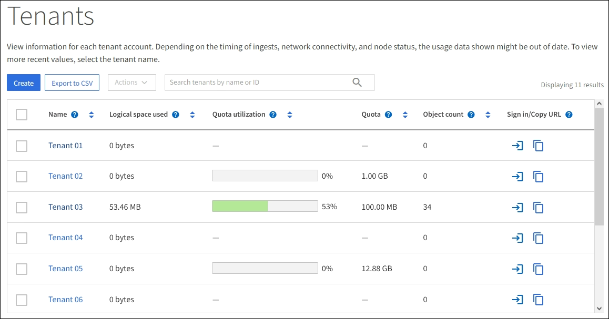
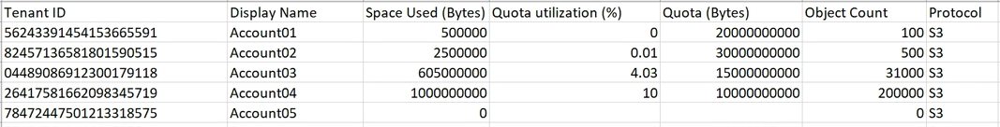
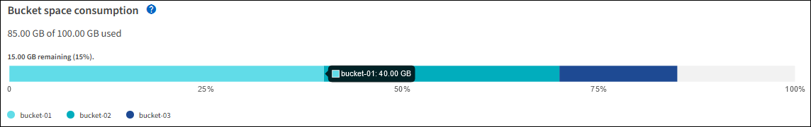
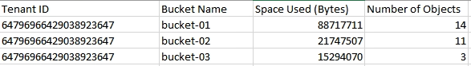

= Monitor tenant activity
:icons: font
:imagesdir: ../media/

[.lead]
All client activity is associated with a tenant account. You can use the Grid Manager to monitor a tenant's storage usage or network traffic, or you can use the audit log or Grafana dashboards to gather more detailed information about how tenants are using StorageGRID.

.What you'll need
* You are signed in to the Grid Manager using a xref:../admin/web-browser-requirements.adoc[supported web browser].
* You have the Root Access or Administrator permission.

.About this task
IMPORTANT: The space used values are estimates. These estimates are affected by the timing of ingests, network connectivity, and node status.

.Steps
. Select *TENANTS* to review the amount of storage used by all tenants.
+
The Logical space used, Quota utilization, Quota, and Object count are listed for each tenant. If a quota is not set for a tenant, the Quota utilization and Quota fields contain a dash (&#8212;).
+

+
You can sign in to a tenant account by selecting the sign-in link image:../media/icon_tenant_sign_in.png[Tenant sign-in icon] in the *Sign in/Copy URL* column of the table.
+
You can copy the URL for a tenant's sign-in page by selecting the copy URL link  in the *Sign in/Copy URL* column of the table.

. Optionally, select *Export to CSV* to view and export a .csv file containing the usage values for all tenants.
+
You are prompted to open or save the `.csv` file.
+
The contents of a .csv file look like the following example:
+

+
You can open the .csv file in a spreadsheet application or use it in automation.

. To view details for a specific tenant, including usage charts, select the tenant account name from the Tenants page.
+
image::../media/tenant_usage_modal.png[Tenant usage modal]
+
** *Tenant overview*
+
The overview area for the tenant contains values for object count, quota utilization, logical space used, and the quota setting.

 ** *Space breakdown -- Space consumption*
+
The Space breakdown tab includes values for bucket (S3) or container (Swift) total space consumption as well as space used and object count for each bucket or container.
+
If a quota was set for this tenant, the amount of quota used and remaining is displayed in text (for example, `85.00 GB of 100 GB used`). If no quota was set, the tenant has an unlimited quota, and the text includes only an amount of space used (for example, `85.00 GB used`). The bar chart shows the percentage of quota in each bucket or container. If the tenant has exceeded the storage quota by more than 1% and by at least 1 GB, the chart shows the total quota and the excess amount.
+
You can place your cursor over the bar chart to see the storage used by each bucket or container. You can place your cursor over the free space segment to see the amount of storage quota remaining.
+

+
IMPORTANT: Quota utilization is based on internal estimates and might be exceeded in some cases. For example, StorageGRID checks the quota when a tenant starts uploading objects and rejects new ingests if the tenant has exceeded the quota. However, StorageGRID does not take into account the size of the current upload when determining if the quota has been exceeded. If objects are deleted, a tenant might be temporarily prevented from uploading new objects until the quota utilization is recalculated. Quota utilization calculations can take 10 minutes or longer.
+
NOTE: A tenant's quota utilization indicates the total amount of object data the tenant has uploaded to StorageGRID (logical size). The quota utilization does not represent the space used to store copies of those objects and their metadata (physical size).
+
NOTE: You can enable the *Tenant quota usage high* alert to determine if tenants are consuming their quotas. If enabled, this alert is triggered when a tenant has used 90% of its quota. For more information, see the alerts reference.

** *Space breakdown -- Bucket or container details*
+
The *Bucket details* (S3) or *Container details* (Swift) table lists the buckets or containers for the tenant. Space used is the total amount of object data in the bucket or container. This value does not represent the storage space required for ILM copies and object metadata.

. Optionally, select *Export to CSV* to view and export a .csv file containing the usage values for each bucket or container.
+
The contents of an individual S3 tenant's .csv file look like the following example:
+

+
You can open the .csv file in a spreadsheet application or use it in automation.

. If traffic classification policies are in place for a tenant, review the network traffic for that tenant.
 .. Select *CONFIGURATION* > *Network* > *Traffic classification*.
+
The Traffic Classification Policies page appears, and the existing policies are listed in the table.
+
image::../media/traffic_classification_policies_main_screen_w_examples.png[Traffic Policy for Graph Example]

 .. Review the list of policies to identify the ones that apply to a specific tenant.
 .. To view metrics associated with a policy, select the radio button to the left of the policy, and then click *Metrics*.
 .. Analyze the graphs to determine how often the policy is limiting traffic and whether you need to adjust the policy.
+
To create, edit, or delete traffic classification policies, see the instructions for administering StorageGRID.
. Optionally, use the audit log for more granular monitoring of a tenant's activities.
+
For instance, you can monitor the following types of information:

 ** Specific client operations, such as PUT, GET, or DELETE
 ** Object sizes
 ** The ILM rule applied to objects
 ** The source IP of client requests
+
Audit logs are written to text files that you can analyze using your choice of log analysis tool. This allows you to better understand client activities, or to implement sophisticated chargeback and billing models.
+
See the instructions for understanding audit messages for more information.
+
. Optionally, use Prometheus metrics to report on tenant activity:
 ** In the Grid Manager, select *SUPPORT* > *Tools* > *Metrics*. You can use existing dashboards, such as S3 Overview, to review client activities.
+
IMPORTANT: The tools available on the Metrics page are primarily intended for use by technical support. Some features and menu items within these tools are intentionally non-functional.

 ** From the top of the Grid Manager, select the help icon and select *API Documentation*. You can use the metrics in the Metrics section of the Grid Management API to create custom alert rules and dashboards for tenant activity.

.Related information

xref:alerts-reference.adoc[Alerts reference]

xref:../audit/index.adoc[Review audit logs]

xref:../admin/index.adoc[Administer StorageGRID]

xref:reviewing-support-metrics.adoc[Review support metrics]