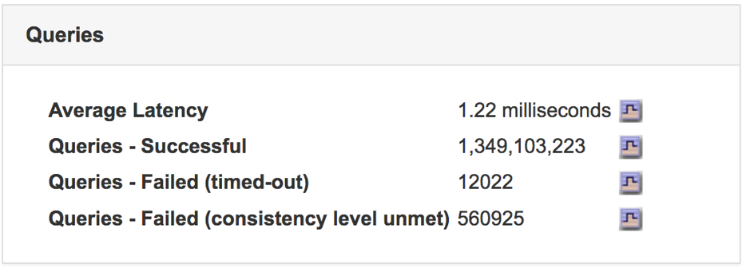
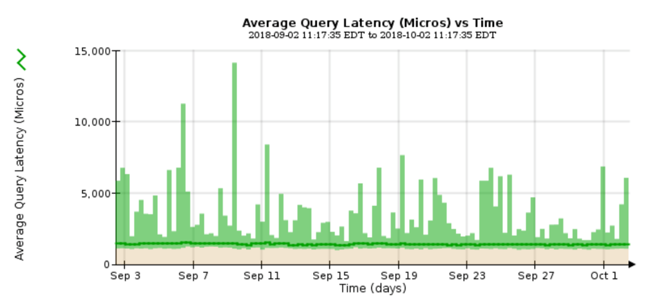

= Monitoring query latency
:icons: font
:imagesdir: ../media/

[.lead]
Client actions such as storing, retrieving, or deleting objects create queries to the grid's distributed database of object metadata. You should monitor trends in query latency to ensure that grid resources are adequate for the current load.

You must be signed in to the Grid Manager using a supported browser.

Temporary increases in query latency are normal and can be caused by a sudden increase in ingest requests. Failed queries are also normal and can result from transient network issues or nodes that are temporarily unavailable. However, if the average time to perform a query increases, overall grid performance declines.

If you notice that query latency is increasing over time, you should consider adding additional Storage Nodes in an expansion procedure to satisfy future workloads .

The *High latency for metadata queries* alert is triggered if the average time for queries is too long.

. Select *Nodes* > *Storage Node* > *Objects*.
. Scroll down to the Queries table and view the value for Average Latency.
+

. Click the chart icon image:../media/icon_chart_new.gif[Chart Icon] to chart the value over time.
+

+
The example chart shows spikes in query latency during normal grid operation.

*Related information*

http://docs.netapp.com/sgws-115/topic/com.netapp.doc.sg-expansion/home.html[Expanding a StorageGRID system]
