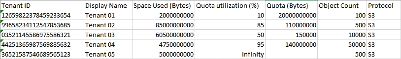

= Monitoring tenant activity
:icons: font
:imagesdir: ../media/

[.lead]
All client activity is associated with a tenant account. You can use the Grid Manager to monitor a tenant's storage usage or network traffic, or you can use the audit log or Grafana dashboards to gather more detailed information about how tenants are using StorageGRID.

* You must be signed in to the Grid Manager using a supported browser.
* You must have the Root Access or Administrator permission.

IMPORTANT: The Space used values are estimates. These estimates are affected by the timing of ingests, network connectivity, and node status.

. Select *Tenants* to review the amount of storage used by all tenants.
+
The Space Used, Quota Utilization, Quota, and Object Count are listed for each tenant. If a quota is not set for a tenant, the Quota Utilization field contains a dash (--) and the Quota field indicates "`Unlimited.`"
+
image::../media/tenant_accounts_page.png[Tenant Accounts page]
+
If your system includes more than 20 items, you can specify how many rows are shown on each page at one time. Use the search box to search for a tenant account by display name or tenant ID.
+
You can sign in to a tenant account by selecting the link in the *Sign in* column of the table.

. Optionally, select *Export to CSV* to view and export a .csv file containing the usage values for all tenants.
+
You are prompted to open or save the .csv file.
+
The contents of a .csv file look like the following example:
+

+
You can open the .csv file in a spreadsheet application or use it in automation.

. To view details for a specific tenant, including usage charts, select the tenant account from the Tenant Accounts page, and then select *View details*.
+
The Account Details page appears and shows summary information, a chart that represents the amount of quota used and remaining, and a chart that represents the amount of object data in buckets (S3) or containers (Swift).
+
image::../media/tenant_usage_modal.png[Tenant usage modal]

 ** *Quota*
+
If a quota was set for this tenant, the *Quota* chart shows how much of that quota this tenant has used and how much is still available. If no quota was set, the tenant has an unlimited quota, and an informational message is displayed. If the tenant has exceeded the storage quota by more than 1% and by at least 1 GB, the chart shows the total quota and the excess amount.
+
You can place your cursor over the Used Space segment to see the number of stored objects and the total bytes used. You can place your cursor over the Free Space segment to see how many bytes of storage quota are available.
+
IMPORTANT: Quota utilization is based on internal estimates and might be exceeded in some cases. For example, StorageGRID checks the quota when a tenant starts uploading objects and rejects new ingests if the tenant has exceeded the quota. However, StorageGRID does not take into account the size of the current upload when determining if the quota has been exceeded. If objects are deleted, a tenant might be temporarily prevented from uploading new objects until the quota utilization is recalculated. Quota utilization calculations can take 10 minutes or longer.
+
NOTE: A tenant's quota utilization indicates the total amount of object data the tenant has uploaded to StorageGRID (logical size). The quota utilization does not represent the space used to store copies of those objects and their metadata (physical size).
+
NOTE: You can enable the *Tenant quota usage high* alert to determine if tenants are consuming their quotas. If enabled, this alert is triggered when a tenant has used 90% of its quota. For more information, see the alerts reference.

 ** *Space Used*
+
The *Space Used by Buckets* (S3) or *Space Used by Containers* (Swift) chart shows the largest buckets for the tenant. Space used is the total amount of object data in the bucket. This value does not represent the storage space required for ILM copies and object metadata.
+
If the tenant has more than nine buckets or containers, they are combined into a segment called Other. Some chart segments might be too small to include a label. You can place your cursor over any of the segments to see the label and obtain more information, including the number of stored objects and total bytes for each bucket or container.
+
image::../media/tenant_dashboard_storage_usage_segment_other.png[Storage Usage Segment - Other]

. Select *Bucket Details* (S3) or *Container Details* (Swift) to view a list of the spaced used and number of objects for each of the tenant's buckets or containers.
+
image::../media/tenant_bucket_details.png[Tenant bucket details]

. Optionally, select *Export to CSV* to view and export a .csv file containing the usage values for each bucket or container.
+
You are prompted to open or save the .csv file.
+
The contents of an individual S3 tenant's .csv file look like the following example:
+
image::../media/tenant_bucket_details_csv.png[Tenant bucket details CSV example]
+
You can open the .csv file in a spreadsheet application or use it in automation.

. If traffic classification policies are in place for a tenant, review the network traffic for that tenant.
 .. Select *Configuration* > *Network Settings* > *Traffic Classification*.
+
The Traffic Classification Policies page appears, and the existing policies are listed in the table.
+
image::../media/traffic_classification_policies_main_screen_w_examples.png[Traffic Policy for Graph Example]

 .. Review the list of policies to identify the ones that apply to a specific tenant.
 .. To view metrics associated with a policy, select the radio button to the left of the policy, and then click *Metrics*.
 .. Analyze the graphs to determine how often the policy is limiting traffic and whether you need to adjust the policy.
+
To create, edit, or delete traffic classification policies, see the instructions for administering StorageGRID.
. Optionally, use the audit log for more granular monitoring of a tenant's activities.
+
For instance, you can monitor the following types of information:

 ** Specific client operations, such as PUT, GET, or DELETE
 ** Object sizes
 ** The ILM rule applied to objects
 ** The source IP of client requests
Audit logs are written to text files that you can analyze using your choice of log analysis tool. This allows you to better understand client activities, or to implement sophisticated chargeback and billing models.

+
See the instructions for understanding audit messages for more information.

. Optionally, use Prometheus metrics to report on tenant activity:
 ** In the Grid Manager, select *Support* > *Tools* > *Metrics*. You can use existing dashboards, such as S3 Overview, to review client activities.
+
IMPORTANT: The tools available on the Metrics page are primarily intended for use by technical support. Some features and menu items within these tools are intentionally non-functional.

 ** Select *Help* > *API Documentation*. You can use the metrics in the Metrics section of the Grid Management API to create custom alert rules and dashboards for tenant activity.

*Related information*

xref:alerts_reference.adoc[Alerts reference]

http://docs.netapp.com/sgws-115/topic/com.netapp.doc.sg-audit/home.html[Understanding audit messages]

http://docs.netapp.com/sgws-115/topic/com.netapp.doc.sg-admin/home.html[Administering StorageGRID]

xref:reviewing_support_metrics.adoc[Reviewing support metrics]
