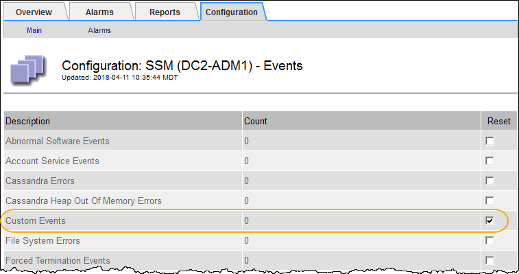

= Resetting the count of custom events to zero
:icons: font
:imagesdir: ../media/

[.lead]
If you want to reset the counter only for custom events, you must use the Grid Topology page in the Support menu.

.About this task
Resetting a counter causes the alarm to be triggered by the next event. In contrast, when you acknowledge an alarm, that alarm is only re-triggered if the next threshold level is reached.

. Select *Support* > *Tools* > *Grid Topology*.
. Select *_grid node_* > *SSM* > *Events* > *Configuration* > *Main*.
. Select the *Reset* check box for Custom Events.
+

. Click *Apply Changes*.
