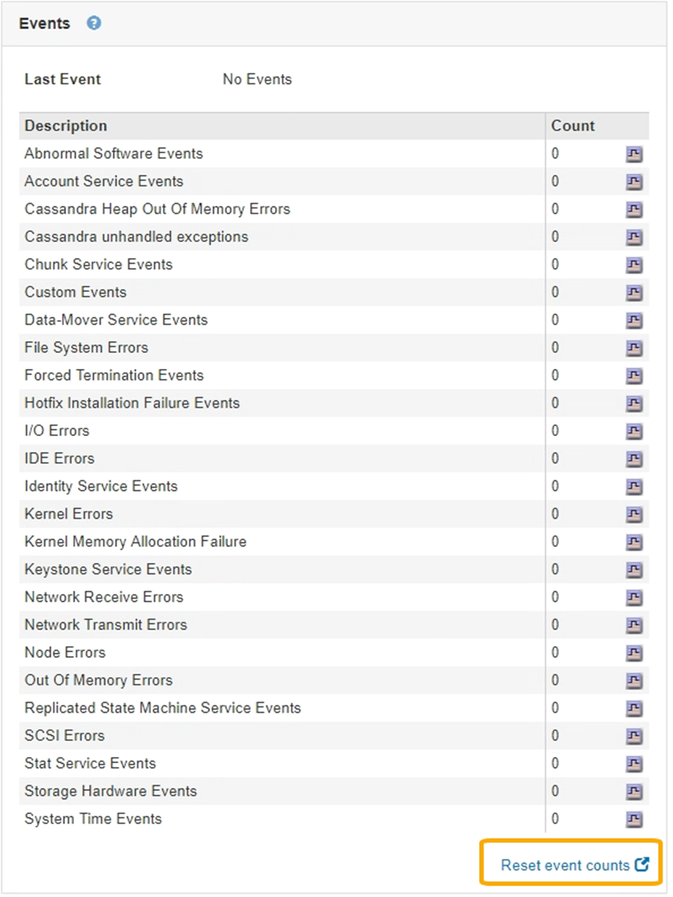

= Resetting event counts
:icons: font
:imagesdir: ../media/

[.lead]
After resolving system events, you can reset event counts to zero.

* You must be signed in to the Grid Manager using a supported browser.
* You must have the Grid Topology Page Configuration permission.

. Select *Nodes* > *Grid Node* > *Events*.
. Make sure that any event with a count greater than 0 has been resolved.
. Click *Reset event counts*.
+

