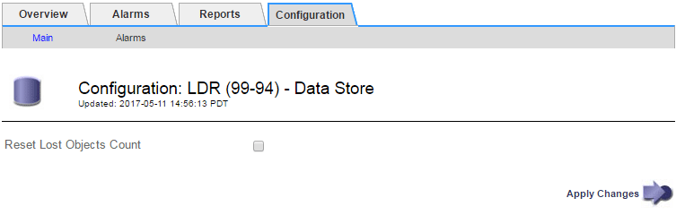

= Resetting lost and missing object counts
:experimental:
:icons: font
:imagesdir: ../media/

[.lead]
After investigating the StorageGRID system and verifying that all recorded lost objects are permanently lost or that it is a false alarm, you can reset the value of the Lost Objects attribute to zero.

.What you'll need
* You must be signed in to the Grid Manager using a supported browser.
* You must have specific access permissions.

.About this task
You can reset the Lost Objects counter from either of the following pages:

* *Support* > *Tools* > *Grid Topology* > *_site > Storage Node_* > *LDR* > *Data Store* > *Overview* > *Main*
* *Support* > *Tools* > *Grid Topology* > *_site > Storage Node_* > *DDS* > *Data Store* > *Overview* > *Main*

These instructions show resetting the counter from the *LDR* > *Data Store* page.

.Steps
. Select *Support* > *Tools* > *Grid Topology*.
. Select *_Site > Storage Node_* > *LDR* > *Data Store* > *Configuration* for the Storage Node that has the *Objects lost* alert or the LOST alarm.
. Select *Reset Lost Objects Count*.
+

. Click *Apply Changes*.
+
The Lost Objects attribute is reset to 0 and the *Objects lost* alert and the LOST alarm clear, which can take a few minutes.

. Optionally, reset other related attribute values that might have been incremented in the process of identifying the lost object.
 .. Select *_Site > Storage Node_* > *LDR* > *Erasure Coding* > *Configuration*.
 .. Select *Reset Reads Failure Count* and *Reset Corrupt Copies Detected Count*.
 .. Click *Apply Changes*.
 .. Select *_Site > Storage Node_* > *LDR* > *Verification* > *Configuration*.
 .. Select *Reset Missing Objects Count* and *Reset Corrupt Objects Count*.
 .. If you are confident that quarantined objects are not required, you can select *Delete Quarantined Objects*.
+
Quarantined objects are created when background verification identifies a corrupt replicated object copy. In most cases StorageGRID automatically replaces the corrupt object, and it is safe to delete the quarantined objects. However, if the *Objects lost* alert or the LOST alarm is triggered, technical support might want to access the quarantined objects.

 .. Click *Apply Changes*.

+
It can take a few moments for the attributes to reset after you click *Apply Changes*.

.Related information

http://docs.netapp.com/sgws-115/topic/com.netapp.doc.sg-admin/home.html[Administering StorageGRID]
