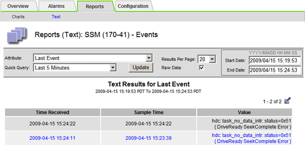

= Reviewing previous events
:icons: font
:imagesdir: ../media/

[.lead]
You can generate a list of previous event messages to help isolate issues that occurred in the past.

. Select *Support* > *Tools* > *Grid Topology*.
. Select *_site_* > *_grid node_* > *SSM* > *Events* > *Reports*.
. Select *Text*.
+
The *Last Event* attribute is not shown in the Charts view.

. Change *Attribute* to *Last Event*.
. Optionally, select a time period for *Quick Query*.
. Click *Update*.
+

.Related information

xref:using-charts-and-reports.adoc[Using charts and reports]
