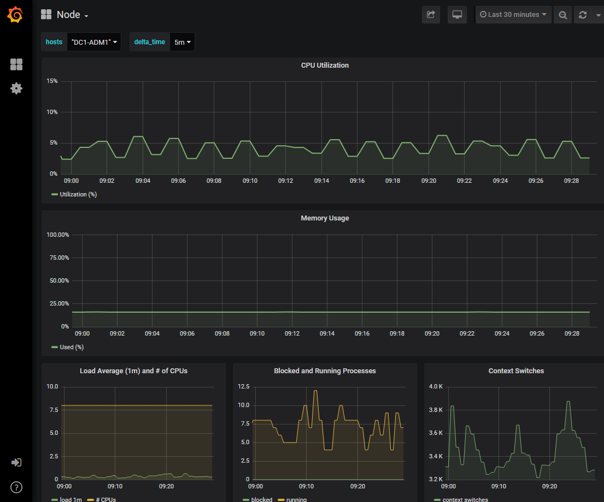
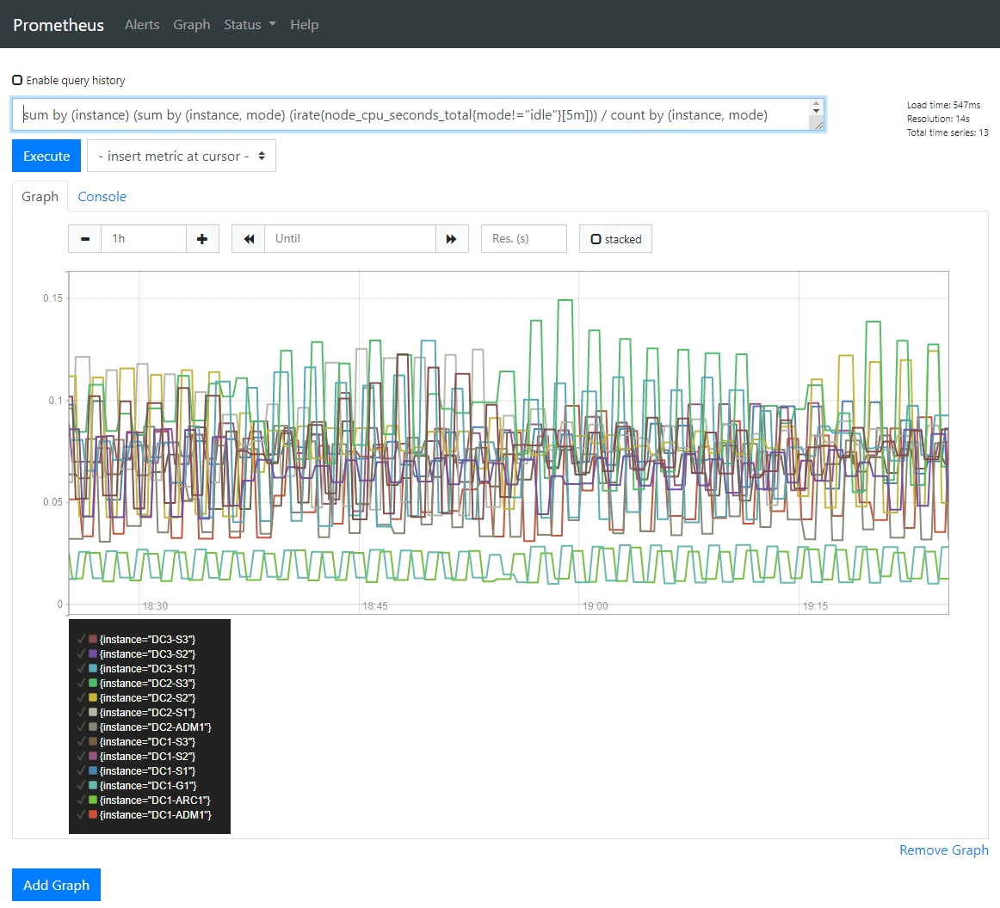

= Run diagnostics
:icons: font
:imagesdir: ../media/

[.lead]
When troubleshooting an issue, you can work with technical support to run diagnostics on your StorageGRID system and review the results.

* xref:reviewing-support-metrics.adoc[Review support metrics]

* xref:commonly-used-prometheus-metrics.adoc[Commonly used Prometheus metrics]

.What you'll need
* You are signed in to the Grid Manager using a xref:../admin/web-browser-requirements.adoc[supported web browser].
* You have specific access permissions.

.About this task
The Diagnostics page performs a set of diagnostic checks on the current state of the grid. Each diagnostic check can have one of three statuses:

* image:../media/icon_alert_green_checkmark.png[Icon Alert Green Checkmark] *Normal*: All values are within the normal range.
* image:../media/icon_alert_yellow_minor.png[Icon Alert Yellow Minor] *Attention*: One or more of the values are outside of the normal range.
* image:../media/icon_alert_red_critical.png[Icon Alert Red Critical] *Caution*: One or more of the values are significantly outside of the normal range.

Diagnostic statuses are independent of current alerts and might not indicate operational issues with the grid. For example, a diagnostic check might show Caution status even if no alert has been triggered.

.Steps
. Select *SUPPORT* > *Tools* > *Diagnostics*.
+
The Diagnostics page appears and lists the results for each diagnostic check.  The results are sorted by severity (Caution, Attention, and then Normal). Within each severity, the results are sorted alphabetically.
+
In this example, all diagnostics have a Normal status.
+
image::../media/support_diagnostics_page.png[Support Diagnostics Page]

. To learn more about a specific diagnostic, click anywhere in the row.
+
Details about the diagnostic and its current results appear. The following details are listed:

 ** *Status*: The current status of this diagnostic: Normal, Attention, or Caution.
 ** *Prometheus query*: If used for the diagnostic, the Prometheus expression that was used to generate the status values. (A Prometheus expression is not used for all diagnostics.)
 ** *Thresholds*: If available for the diagnostic, the system-defined thresholds for each abnormal diagnostic status. (Threshold values are not used for all diagnostics.)
+
NOTE: You cannot change these thresholds.

 ** *Status values*: A table showing the status and the value of the diagnostic throughout the StorageGRID system.
In this example, the current CPU utilization for every node in a StorageGRID system is shown. All node values are below the Attention and Caution thresholds, so the overall status of the diagnostic is Normal.

+
image::../media/support_diagnostics_cpu_utilization.png[Support Diagnostics CPU Utilization]

. *Optional*: To see Grafana charts related to this diagnostic, click the *Grafana dashboard* link.
+
This link is not displayed for all diagnostics.
+
The related Grafana dashboard appears. In this example, the Node dashboard appears showing CPU Utilization over time for this node as well as other Grafana charts for the node.
+
NOTE: You can also access the pre-constructed Grafana dashboards from the Grafana section of the *SUPPORT* > *Tools* > *Metrics* page.
+

. *Optional*: To see a chart of the Prometheus expression over time, click *View in Prometheus*.
+
A Prometheus graph of the expression used in the diagnostic appears.
+

