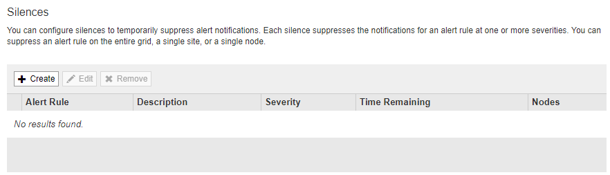
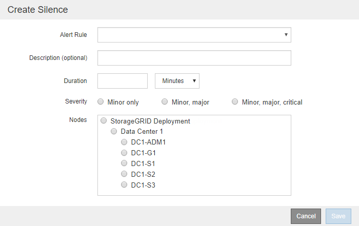

= Silence alert notifications
:icons: font
:imagesdir: ../media/

[.lead]
Optionally, you can configure silences to temporarily suppress alert notifications.

.What you'll need
* You are signed in to the Grid Manager using a xref:../admin/web-browser-requirements.adoc[supported web browser].
* You have the Manage Alerts or Root Access permission.

.About this task
You can silence alert rules on the entire grid, a single site, or a single node and for one or more severities. Each silence suppresses all notifications for a single alert rule or for all alert rules.

If you have enabled the SNMP agent, silences also suppress SNMP traps and informs.

IMPORTANT: Be careful when deciding to silence an alert rule. If you silence an alert, you might not detect an underlying problem until it prevents a critical operation from completing.

NOTE: Because alarms and alerts are independent systems, you cannot use this functionality to suppress alarm notifications.

.Steps
. Select *ALERTS* > *Silences*.
+
The Silences page appears.
+

. Select *Create*.
+
The Create Silence dialog box appears.
+

. Select or enter the following information:
+
[cols="1a,3a" options="header"]
|===
| Field| Description
a|
Alert Rule
a|
The name of the alert rule you want to silence. You can select any default or custom alert rule, even if the alert rule is disabled.

*Note:* Select *All rules* if you want to silence all alert rules using the criteria specified in this dialog box.
a|
Description
a|
Optionally, a description of the silence. For example, describe the purpose of this silence.
a|
Duration
a|
How long you want this silence to remain in effect, in minutes, hours, or days. A silence can be in effect from 5 minutes to 1,825 days (5 years).

*Note:* You should not silence an alert rule for an extended amount of time. If an alert rule is silenced, you might not detect an underlying problem until it prevents a critical operation from completing. However, you might need to use an extended silence if an alert is triggered by a specific, intentional configuration, such as might be the case for the *Services appliance link down* alerts and the *Storage appliance link down* alerts.
a|
Severity
a|
Which alert severity or severities should be silenced. If the alert is triggered at one of the selected severities, no notifications are sent.
a|
Nodes
a|
Which node or nodes you want this silence to apply to. You can suppress an alert rule or all rules on the entire grid, a single site, or a single node. If you select the entire grid, the silence applies to all sites and all nodes. If you select a site, the silence applies only to the nodes at that site.

*Note:* You cannot select more than one node or more than one site for each silence. You must create additional silences if you want to suppress the same alert rule on more than one node or more than one site at one time.
|===

. Select *Save*.
. If you want to modify or end a silence before it expires, you can edit or remove it.
+
[cols="1a,3a" options="header"]
|===
| Option| Description
a|
Edit a silence
a|

 .. Select *ALERTS* > *Silences*.
 .. From the table, select the radio button for the silence you want to edit.
 .. Select *Edit*.
 .. Change the description, the amount of time remaining, the selected severities, or the affected node.
 .. Select *Save*.

a|
Remove a silence
a|

 .. Select *ALERTS* > *Silences*.
 .. From the table, select the radio button for the silence you want to remove.
 .. Select *Remove*.
 .. Select *OK* to confirm you want to remove this silence.
+
*Note*: Notifications will now be sent when this alert is triggered (unless suppressed by another silence). If this alert is currently triggered, it might take few minutes for email or SNMP notifications to be sent and for the Alerts page to update.
|===

.Related information

* xref:configuring-snmp-agent.adoc[Configure the SNMP agent]
