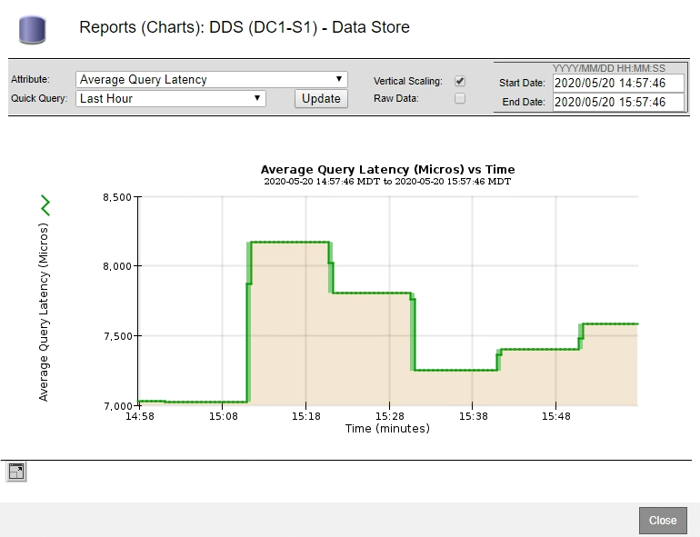

= Displaying charts and graphs
:icons: font
:imagesdir: ../media/

[.lead]
The Nodes page contains the graphs and charts you should access regularly to monitor attributes such as storage capacity and throughput. In some cases, especially when working with technical support, you can use the *Support* > *Tools* > *Grid Topology* page to access additional charts.

You must be signed in to the Grid Manager using a supported browser.

. Select *Nodes*. Then, select a node, a site, or the entire grid.
. Select the tab for which you want to view information.
+
Some tabs include one or more Grafana charts, which are used to plot the values of Prometheus metrics over time. For example, the *Nodes* > *Hardware* tab for a node includes two Grafana charts.
+
image::../media/nodes_page_hardware_tab_graphs.png[Nodes Page Hardware Tab Graphs]

. Optionally, hover your cursor over the chart to see more detailed values for a particular point in time.
+
image::../media/nodes_page_memory_usage_details.png[Nodes Page Memory Usage Details]

. As required, you can often display a chart for a specific attribute or metric. From the table on the Nodes page, click the chart icon image:../media/icon_chart_new.gif[Chart Icon] or image:../media/icon_chart_new_for_11_5.png[Chart Icon - New for 11.5] to the right of the attribute name.
+
NOTE: Charts are not available for all metrics and attributes.
+
*Example 1*: From the Objects tab for a Storage Node, you can click the chart icon image:../media/icon_chart_new.gif[Chart Icon] to see the average latency for a metadata query over time.
+
image::../media/nodes_average_latency_chart_icon.png[Nodes Average Latency Chart Icon]
+

+
*Example 2*: From the Objects tab for a Storage Node, you can click the chart icon image:../media/icon_chart_new_for_11_5.png[Chart Icon - New for 11.5] to see the Grafana graph of the count of lost objects detected over time.
+
image::../media/object_count_table.png[Object Count Table]
+
image::../media/charts_lost_object_detected.png[Charts Lost Object Detected]

. To display charts for attributes that are not shown on the Node page, select *Support* > *Tools* > *Grid Topology*.
. Select *grid node* > *component or service* > *Overview* > *Main*.
+
image::../media/nms_chart.gif[screenshot described by surrounding text]

. Click the chart icon image:../media/icon_chart_new.gif[Chart Icon] next to the attribute.
+
The display automatically changes to the *Reports* > *Charts* page. The chart displays the attribute's data over the past day.
