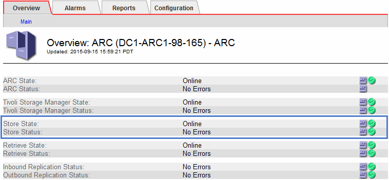

= Monitoring archival capacity
:icons: font
:imagesdir: ../media/

[.lead]
You cannot directly monitor an external archival storage system's capacity through the StorageGRID system. However, you can monitor whether the Archive Node can still send object data to the archival destination, which might indicate that an expansion of archival media is required.

* You must be signed in to the Grid Manager using a supported browser.
* You must have specific access permissions.

You can monitor the Store component to check if the Archive Node can still send object data to the targeted archival storage system. The Store Failures (ARVF) alarm might also indicate that the targeted archival storage system has reached capacity and can no longer accept object data.

. Select *Support* > *Tools* > *Grid Topology*.
. Select *Archive Node* > *ARC**> Overview**> Main*.
. Check the Store State and Store Status attributes to confirm that the Store component is Online with No Errors.
+

+
An offline Store component or one with errors might indicate that targeted archival storage system can no longer accept object data because it has reached capacity.

*Related information*

http://docs.netapp.com/sgws-115/topic/com.netapp.doc.sg-admin/home.html[Administering StorageGRID]
