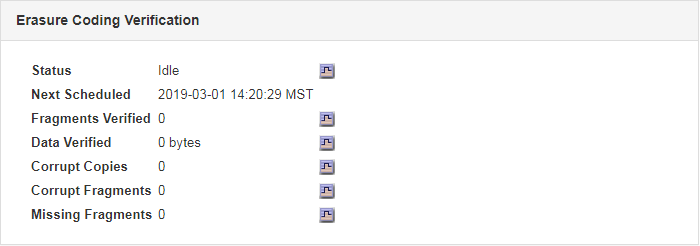

= Monitoring object verification operations
:icons: font
:imagesdir: ../media/

[.lead]
The StorageGRID system can verify the integrity of object data on Storage Nodes, checking for both corrupt and missing objects.

You must be signed in to the Grid Manager using a supported browser.

There are two verification processes that work together to ensure data integrity:

* *Background verification* runs automatically, continuously checking the correctness of object data.
+
Background verification automatically and continuously checks all Storage Nodes to determine if there are corrupt copies of replicated and erasure-coded object data. If problems are found, the StorageGRID system automatically attempts to replace the corrupt object data from copies stored elsewhere in the system. Background verification does not run on Archive Nodes or on objects in a Cloud Storage Pool.
+
NOTE: The *Unidentified corrupt object detected* alert is triggered if the system detects a corrupt object that cannot be corrected automatically.

* *Foreground verification* can be triggered by a user to more quickly verify the existence (although not the correctness) of object data.
+
Foreground verification allows you to verify the existence of replicated and erasure-coded object data on a specific Storage Node, checking that each object that is expected to be present is there. You can run foreground verification on all or some of a Storage Node's object stores to help determine if there are integrity problems with a storage device. Large numbers of missing objects might indicate that there is an issue with storage.

To review results from background and foreground verifications, such as corrupt or missing objects, you can look at the Nodes page for a Storage Node. You should investigate any instances of corrupt or missing object data immediately, to determine the root cause.

. Select *Nodes*.
. Select *Storage Node* > *Objects*.
. To check the verification results:
 ** To check replicated object data verification, look at the attributes in the Verification section.
+
image::../media/nodes_storage_node_object_verification.png[Nodes > Storage Node > Object > Verification]
+
NOTE: Click an attribute's name in the table to display help text.

 ** To check erasure-coded fragment verification, select *Storage Node* > *ILM* and look at the attributes in the Erasure Coding Verification table.
+

+
NOTE: Click an attribute's name in the table to display help text.

*Related information*

link:concept_troubleshooting_a_storagegrid_system.md#[Verifying object integrity]
