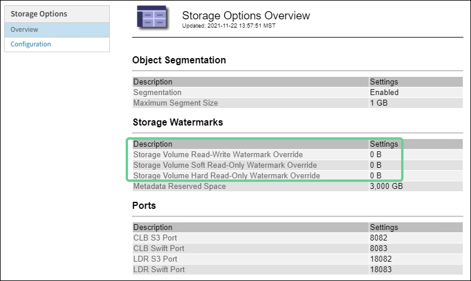

= Troubleshoot Low read-only watermark override alerts
:icons: font
:imagesdir: ../media/

[.lead]
If you use custom values for storage volume watermarks, you might need to resolve the *Low read-only watermark override* alert. If possible, you should update your system to start using the optimized values.

In previous releases, the three xref:../admin/what-storage-volume-watermarks-are.adoc[storage volume watermarks] were global settings &#8212; the same values applied to every storage volume on every Storage Node. Starting in StorageGRID 11.6, the software can optimize these watermarks for each storage volume, based on the size of the Storage Node and the relative capacity of the volume.

When you upgrade to StorageGRID 11.6, optimized read-only and read-write watermarks are automatically applied to all storage volumes, unless either of the following is true:

* Your system is close to capacity and would not be able to accept new data if optimized watermarks were applied. StorageGRID will not change watermark settings in this case.

* You previously set any of the storage volume watermarks to a custom value. StorageGRID will not override custom watermark settings with optimized values. However, StorageGRID might trigger the *Low read-only watermark override* alert if your custom value for the Storage Volume Soft Read-Only Watermark is too small.

== Understand the alert

If you use custom values for storage volume watermarks, the *Low read-only watermark override* alert might be triggered for one or more Storage Nodes. 

Each instance of the alert indicates that the custom value of the *Storage Volume Soft Read-Only Watermark* is smaller than the minimum optimized value for that Storage Node. If you continue to use the custom setting, the Storage Node might run critically low on space before it can safely transition to the read-only state. Some storage volumes might become inaccessible (automatically unmounted) when the node reaches capacity. 

For example, suppose you previously set the *Storage Volume Soft Read-Only Watermark* to 5 GB. Now suppose that StorageGRID has calculated the following optimized values for the four storage volumes in Storage Node A:

[cols="1a,1a"]
|===

|Volume 0
|12 GB

|Volume 1
|12 GB

|Volume 2
|11 GB

|Volume 3
|15 GB

|===

The *Low read-only watermark override* alert is triggered for Storage Node A because your custom watermark (5 GB) is smaller than the minimum optimized value for all volumes in that node (11 GB). If you continue using the custom setting, the node might run critically low on space before it can safely transition to the read-only state.

== Resolve the alert

Follow these steps if one or more *Low read-only watermark override* alerts have been triggered. You can also use these instructions if you currently use custom watermark settings and want to start using optimized settings even if no alerts have been triggered.

.What you'll need

* You have completed the upgrade to StorageGRID 11.6.

* You are signed in to the Grid Manager using a xref:../admin/web-browser-requirements.adoc[supported web browser].

* You have the Root access permission.

.About this task

You can resolve the *Low read-only watermark override* alert by updating custom watermark settings to the new watermark overrides. However, if one or more Storage Nodes are close to full or you have special ILM requirements, you should first view the optimized storage watermarks and determine if it is safe to use them.

=== Assess object data usage for entire grid

. Select *NODES*.

. For each site in the grid, expand the list of nodes.

. Review the percentage values shown in the *Object data used* column for each Storage Node at every site. 
+
image::../media/nodes_page_object_data_used_with_alert.png[Nodes page showing object data used for 3 SNs]

. If none of the Storage Nodes are close to full (for example, all *Object data used* values are less than 80%),  you can start using the override settings. Go to <<Use optimized watermarks>>.
+
NOTE: There are some exceptions to this general rule. For example, if ILM rules use Strict ingest behavior or if specific storage pools are close to full, you should first perform the steps in <<View optimized storage watermarks>> and <<Determine if you can use optimized watermarks>>.

. If one more more Storage Nodes are close to full, perform the steps in <<View optimized storage watermarks>> and <<Determine if you can use optimized watermarks>>.

=== View optimized storage watermarks

StorageGRID uses two Prometheus metrics to show the optimized values it has calculated for the *Storage Volume Soft Read-Only Watermark*. You can view the minimum and maximum optimized values for each Storage Node in your grid.

. Select *SUPPORT* > *Tools* > *Metrics*.

. In the Prometheus section, select the link to access the Prometheus user interface.

. To see the recommended minimum soft read-only watermark, enter the following Prometheus metric, and select *Execute*:
+
`storagegrid_storage_volume_minimum_optimized_soft_readonly_watermark`
+
The last column shows the minimum optimized value of the Soft Read-Only Watermark for all storage volumes on each Storage Node. If this value is greater than the custom setting for the *Storage Volume Soft Read-Only Watermark*, the *Low read-only watermark override* alert is triggered for the Storage Node.

. To see the recommended maximum soft read-only watermark, enter the following Prometheus metric, and select *Execute*: 
+
`storagegrid_storage_volume_maximum_optimized_soft_readonly_watermark`
+
The last column shows the maximum optimized value of the Soft Read-Only Watermark for all storage volumes on each Storage Node. 

. [[maximum_optimized_value]]Note the maximum optimized value for each Storage Node.

=== Determine if you can use optimized watermarks

. Select *NODES*.

. Repeat these steps for each online Storage Node:
.. Select *_Storage Node_* > *Storage*.
.. Scroll down to the Object Stores table.
.. Compare the *Available* value for each object store (volume) to the maximum optimized watermark you noted for that Storage Node.

. If at least one volume on every online Storage Node has more space available than maximum optimized watermark for that node, go to <<Use optimized watermarks>> to start using the optimized watermarks. 
+
Otherwise, xref:../expand/index.adoc[expand your grid] as soon as possible. Either add storage volumes to an existing node or add new Storage Nodes. Then, go to <<Use optimized watermarks>> to update watermark settings. 

. If you need to continue using custom values for the storage volume watermarks, xref:../monitor/silencing-alert-notifications.adoc[silence] or xref:../monitor/disabling-alert-rules.adoc[disable] the *Low read-only watermark override* alert.
+
NOTE: The same custom watermark values are applied to every storage volume on every Storage Node. Using smaller-than-recommended values for storage volume watermarks might cause some storage volumes to become inaccessible (automatically unmounted) when the node reaches capacity. 

=== Use optimized watermarks

. Go to *CONFIGURATION* > *System* > *Storage options*.
. Select *Configuration* from the Storage Options menu.
. Change all three Watermark Overrides to 0.
. Select *Apply Changes*.

Optimized storage volume watermark settings are now in effect for each storage volume, based on the size of the Storage Node and the relative capacity of the volume.

