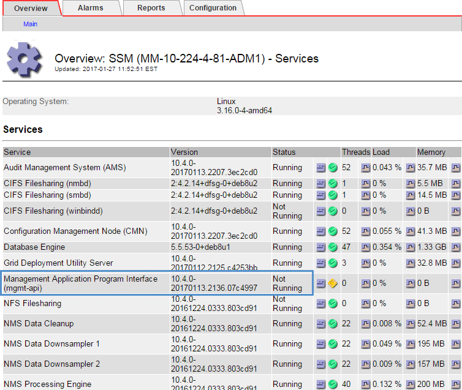

= Troubleshoot Admin Node and user interface issues
:experimental:
:icons: font
:imagesdir: ../media/

[.lead]
There are several tasks you can perform to help determine the source of issues related to Admin Nodes and the StorageGRID user interface.

== Troubleshoot sign-on errors

If you experience an error when you are signing in to a StorageGRID Admin Node, your system might have an issue with the identity federation configuration, a networking or hardware problem, an issue with Admin Node services, or an issue with the Cassandra database on connected Storage Nodes.

.What you'll need
* You must have the `Passwords.txt` file.
* You must have specific access permissions.

.About this task
Use these troubleshooting guidelines if you see any of the following error messages when attempting to sign in to an Admin Node:

* `Your credentials for this account were invalid. Please try again.`
* `Waiting for services to start...`
* `Internal server error. The server encountered an error and could not complete your request. Please try again. If the problem persists, contact Technical Support.`
* `Unable to communicate with server. Reloading page...`

.Steps
. Wait 10 minutes, and try signing in again.
+
If the error is not resolved automatically, go to the next step.

. If your StorageGRID system has more than one Admin Node, try signing in to the Grid Manager from another Admin Node.
 ** If you are able to sign in, you can use the *Dashboard*, *NODES*, *Alerts*, and *SUPPORT* options to help determine the cause of the error.
 ** If you have only one Admin Node or you still cannot sign in, go to the next step.
. Determine if the node's hardware is offline.
. If single sign-on (SSO) is enabled for your StorageGRID system, refer to the steps for configuring single sign-on, in the instructions for administering StorageGRID.
+
You might need to temporarily disable and re-enable SSO for a single Admin Node to resolve any issues.
+
NOTE: If SSO is enabled, you cannot sign on using a restricted port. You must use port 443.

. Determine if the account you are using belongs to a federated user.
+
If the federated user account is not working, try signing in to the Grid Manager as a local user, such as root.

 ** If the local user can sign in:
  ... Review any displayed alarms.
  ... Select *CONFIGURATION* > *Access Control* > *Identity federation*.
  ... Click *Test Connection* to validate your connection settings for the LDAP server.
  ... If the test fails, resolve any configuration errors.
 ** If the local user cannot sign in and you are confident that the credentials are correct, go to the next step.

. Use Secure Shell (ssh) to log in to the Admin Node:
 .. Enter the following command: `ssh admin@Admin_Node_IP`
 .. Enter the password listed in the `Passwords.txt` file.
 .. Enter the following command to switch to root: `su -`
 .. Enter the password listed in the `Passwords.txt` file.
+
When you are logged in as root, the prompt changes from `$` to `#`.
. View the status of all services running on the grid node: `storagegrid-status`
+
Make sure the nms, mi, nginx, and mgmt api services are all running.
+
The output is updated immediately if the status of a service changes.

 $ storagegrid-status
 Host Name                      99-211
 IP Address                     10.96.99.211
 Operating System Kernel        4.19.0         Verified
 Operating System Environment   Debian 10.1    Verified
 StorageGRID Webscale Release   11.4.0         Verified
 Networking                                    Verified
 Storage Subsystem                             Verified
 Database Engine                5.5.9999+default Running
 Network Monitoring             11.4.0         Running
 Time Synchronization           1:4.2.8p10+dfsg Running
 ams                            11.4.0         Running
 cmn                            11.4.0         Running
 nms                            11.4.0         Running
 ssm                            11.4.0         Running
 mi                             11.4.0         Running
 dynip                          11.4.0         Running
 nginx                          1.10.3         Running
 tomcat                         9.0.27         Running
 grafana                        6.4.3          Running
 mgmt api                       11.4.0         Running
 prometheus                     11.4.0         Running
 persistence                    11.4.0         Running
 ade exporter                   11.4.0         Running
 alertmanager                   11.4.0         Running
 attrDownPurge                  11.4.0         Running
 attrDownSamp1                  11.4.0         Running
 attrDownSamp2                  11.4.0         Running
 node exporter                  0.17.0+ds      Running
 sg snmp agent                  11.4.0         Running

. Confirm that the nginx-gw service is running `# service nginx-gw status`

. [[use_Lumberjack_to_collect_logs, start=9]]Use Lumberjack to collect logs: `# /usr/local/sbin/lumberjack.rb`
+
If the failed authentication happened in the past, you can use the --start and --end Lumberjack script options to specify the appropriate time range. Use lumberjack -h for details on these options.
+
The output to the terminal indicates where the log archive has been copied.

. [[review_logs, start=10]]Review the following logs:
 ** `/var/local/log/bycast.log`
 ** `/var/local/log/bycast-err.log`
 ** `/var/local/log/nms.log`
 ** `**/*commands.txt`

. If you could not identify any issues with the Admin Node, issue either of the following commands to determine the IP addresses of the three Storage Nodes that run the ADC service at your site. Typically, these are the first three Storage Nodes that were installed at the site.
+
----
# cat /etc/hosts
----
+
----
# vi /var/local/gpt-data/specs/grid.xml
----
+
Admin Nodes use the ADC service during the authentication process.

. From the Admin Node, log in to each of the ADC Storage Nodes, using the IP addresses you identified.
 .. Enter the following command: `ssh admin@grid_node_IP`
 .. Enter the password listed in the `Passwords.txt` file.
 .. Enter the following command to switch to root: `su -`
 .. Enter the password listed in the `Passwords.txt` file.
+
When you are logged in as root, the prompt changes from `$` to `#`.
. View the status of all services running on the grid node: `storagegrid-status`
+
Make sure the idnt, acct, nginx, and cassandra services are all running.

. Repeat steps <<use_Lumberjack_to_collect_logs,Use Lumberjack to collect logs>> and <<review_logs,Review logs>> to review the logs on the Storage Nodes.
. If you are unable to resolve the issue, contact technical support.
+
Provide the logs you collected to technical support. See also xref:logs-files-reference.adoc[Log files reference].

== Troubleshoot user interface issues

You might see issues with the Grid Manager or the Tenant Manager after upgrading to a new version of StorageGRID software.

=== Web interface does not respond as expected

The Grid Manager or the Tenant Manager might not respond as expected after StorageGRID software is upgraded.

If you experience issues with the web interface:

* Make sure you are using a xref:../admin/web-browser-requirements.adoc[supported web browser].
+
NOTE: Browser support has changed for StorageGRID 11.5. Confirm you are using a supported version.

* Clear your web browser cache.
+
Clearing the cache removes outdated resources used by the previous version of StorageGRID software, and permits the user interface to operate correctly again. For instructions, see the documentation for your web browser.

== Check the status of an unavailable Admin Node

If the StorageGRID system includes multiple Admin Nodes, you can use another Admin Node to check the status of an unavailable Admin Node.

.What you'll need
You must have specific access permissions.

.Steps
. From an available Admin Node, sign in to the Grid Manager using a xref:../admin/web-browser-requirements.adoc[supported web browser].
. Select *SUPPORT* > *Tools* > *Grid topology*.
. Select *_Site* > *unavailable Admin Node_* > *SSM* > *Services* > *Overview* > *Main*.
. Look for services that have a status of Not Running and that might also be displayed in blue.
+

. Determine if alarms have been triggered.
. Take the appropriate actions to resolve the issue.

.Related information

xref:../admin/index.adoc[Administer StorageGRID]
