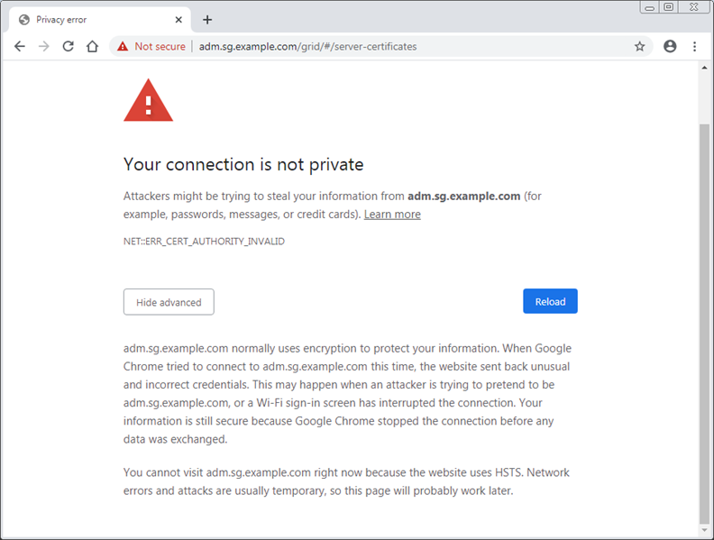

= Troubleshoot certificate errors
:experimental:
:icons: font
:imagesdir: ../media/

[.lead]
If you see a security or certificate issue when you try to connect to StorageGRID using a web browser, an S3 or Swift client, or an external monitoring tool, you should check the certificate.

.About this task
Certificate errors can cause problems when you try to connect to StorageGRID using the Grid Manager, Grid Management API, Tenant Manager, or the Tenant Management API. Certificate errors can also occur when you try to connect with an S3 or Swift client or external monitoring tool.

If you are accessing the Grid Manager or Tenant Manager using a domain name instead of an IP address, the browser shows a certificate error without an option to bypass if either of the following occurs:

* Your custom management interface certificate expires.
* You revert from a custom management interface certificate to the default server certificate.

The following example shows a certificate error when the custom management interface certificate expired:

To ensure that operations are not disrupted by a failed server certificate, the *Expiration of server certificate for Management Interface* alert is triggered when the server certificate is about to expire.

When you are using client certificates for external Prometheus integration, certificate errors can be caused by the StorageGRID management interface certificate or by client certificates. The *Expiration of client certificates configured on the Certificates page* alert is triggered when a client certificate is about to expire.

.Steps
If you received an alert notification about an expired certificate, access the certificate details:
. Select *CONFIGURATION* > *Security* > *Certificates* and then xref:../admin/using-storagegrid-security-certificates.adoc#access-security-certificates[select the appropriate certificate tab].

. Check the validity period of the certificate. +
Some web browsers and S3 or Swift clients do not accept certificates with a validity period greater than 398 days.

. If the certificate has expired or will expire soon, upload or generate a new certificate.
 ** For a server certificate, see the steps for xref:../admin/configuring-custom-server-certificate-for-grid-manager-tenant-manager.adoc#add-a-custom-management-interface-certificate[configuring a custom server certificate for the Grid Manager and the Tenant Manager].
 ** For a client certificate, see the steps for xref:../admin/configuring-administrator-client-certificates.adoc[configuring a client certificate].
. For server certificate errors, try either or both of the following options:
 ** Ensure that the Subject Alternative Name (SAN) of the certificate is populated, and that the SAN matches the IP address or host name of the node that you are connecting to.
 ** If you are attempting to connect to StorageGRID using a domain name:
  ... Enter the IP address of the Admin Node instead of the domain name to bypass the connection error and access the Grid Manager.
  ... From the Grid Manager, select *CONFIGURATION* > *Security* > *Certificates* and then xref:../admin/using-storagegrid-security-certificates.adoc#access-security-certificates[select the appropriate certificate tab] to install a new custom certificate or continue with the default certificate.
  ... In the instructions for administering StorageGRID, see the steps for xref:../admin/configuring-custom-server-certificate-for-grid-manager-tenant-manager.adoc#add-a-custom-management-interface-certificate[configuring a custom server certificate for the Grid Manager and the Tenant Manager].
