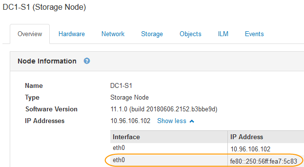

= Troubleshooting network, hardware, and platform issues
:icons: font
:imagesdir: ../media/

[.lead]
There are several tasks you can perform to help determine the source of issues related to StorageGRID network, hardware, and platform issues.

== Troubleshooting "`422: Unprocessable Entity`" errors

The error 422: Unprocessable Entity can occur in a number of circumstances. Check the error message to determine what caused your issue.

If you see one of the listed error messages, take the recommended action.

[cols="2a,2a" options="header"]
|===
| Error message
| Root cause and corrective action

|----
422: Unprocessable Entity

Validation failed. Please check
the values you entered for
errors. Test connection failed.
Please verify your
configuration. Unable to
authenticate, please verify
your username and password:
LDAP Result Code 8 "Strong
Auth Required": 00002028:
LdapErr: DSID-0C090256,
comment: The server requires
binds to turn on integrity
checking if SSL\TLS are not
already active on the
connection, data 0, v3839
----

|This message might occur if you select the *Do not use TLS* option for Transport Layer Security (TLS) when configuring identity federation using Windows Active Directory (AD).

Using the *Do not use TLS* option is not supported for use with AD servers that enforce LDAP signing. You must select either the *Use STARTTLS* option or the *Use LDAPS* option for TLS.

|----
422: Unprocessable Entity

Validation failed. Please check
the values you entered for
errors. Test connection failed.
Please verify your
configuration.Unable to
begin TLS, verify your
certificate and TLS
configuration: LDAP Result
Code 200 "Network Error":
TLS handshake failed
    (EOF)
----

|This message appears if you try to use an unsupported cipher to make a Transport Layer Security (TLS) connection from StorageGRID to an external system used for identify federation or Cloud Storage Pools.

Check the ciphers that are offered by the external system. The system must use one of the ciphers supported by StorageGRID for outgoing TLS connections, as shown in the instructions for administering StorageGRID.

|===

.Related information

xref:../admin/index.adoc[Administer StorageGRID]

== Troubleshooting the Grid Network MTU mismatch alert

The *Grid Network MTU mismatch* alert is triggered when the maximum transmission unit (MTU) setting for the Grid Network interface (eth0) differs significantly across nodes in the grid.

.About this task
The differences in MTU settings could indicate that some, but not all, eth0 networks are configured for jumbo frames. An MTU size mismatch of greater than 1000 might cause network performance problems.

.Steps
. List the MTU settings for eth0 on all nodes.
 ** Use the query provided in the Grid Manager.
 ** Navigate to `_primary Admin Node IP address_/metrics/graph` and enter the following query: `node_network_mtu_bytes{interface='eth0'}`
. Modify the MTU settings as necessary to ensure they are the same for the Grid Network interface (eth0) on all nodes.
 ** For appliance nodes, see the installation and maintenance instructions for your appliance.
 ** For Linux- and VMware-based nodes, use the following command: `+/usr/sbin/change-mtu.py [-h] [-n node] mtu network [network...]+`
+
*Example*: `change-mtu.py -n node 1500 grid admin`
+
*Note*: On Linux-based nodes, if the desired MTU value for the network in the container exceeds the value already configured on the host interface, you must first configure the host interface to have the desired MTU value, and then use the `change-mtu.py` script to change the MTU value of the network in the container.
+
Use the following arguments for modifying the MTU on Linux- or VMware-based nodes.
+
[cols="2a,2a" options="header"]
|===
|Positional arguments
|Description

|`mtu`
|The MTU to set. Must be in the range 1280 to 9216.

|`network`
|The networks to apply the MTU to. Include one or more of the following network types:

  * grid
  * admin
  * client
|===
+
[cols="2a,2a" options="header"]
|===
|Optional arguments
|Description

|`-h, – help`
|Show the help message and exit.

|`-n node, --node node`
|The node. The default is the local node.

|===

.Related information

xref:../sg100-1000/index.adoc[SG100 & SG1000 services appliances]

xref:../sg6000/index.adoc[SG6000 storage appliances]

xref:../sg5700/index.adoc[SG5700 storage appliances]

xref:../sg5600/index.adoc[SG5600 storage appliances]

== Troubleshooting the Network Receive Error (NRER) alarm

Network Receive Error (NRER) alarms can be caused by connectivity issues between StorageGRID and your network hardware. In some cases, NRER errors can clear without manual intervention. If the errors do not clear, take the recommended actions.

.About this task
NRER alarms can be caused by the following issues with networking hardware that connects to StorageGRID:

* Forward error correction (FEC) is required and not in use
* Switch port and NIC MTU mismatch
* High link error rates
* NIC ring buffer overrun

.Steps
. Follow the troubleshooting steps for all potential causes of the NRER alarm given your network configuration.
 ** If the error is caused by FEC mismatch, perform the following steps:
+
*Note*: These steps are applicable only for NRER errors caused by FEC mismatch on StorageGRID appliances.

  ... Check the FEC status of the port in the switch attached to your StorageGRID appliance.
  ... Check the physical integrity of the cables from the appliance to the switch.
  ... If you want to change FEC settings to try to resolve the NRER alarm, first ensure that the appliance is configured for *Auto* mode on the Link Configuration page of the StorageGRID Appliance Installer (see the installation and maintenance instructions for your appliance). Then, change the FEC settings on the switch ports. The StorageGRID appliance ports will adjust their FEC settings to match, if possible.
+
(You cannot configure FEC settings on StorageGRID appliances. Instead, the appliances attempt to discover and mirror the FEC settings on the switch ports they are connected to. If the links are forced to 25-GbE or 100-GbE network speeds, the switch and NIC might fail to negotiate a common FEC setting. Without a common FEC setting, the network will fall back to "`no-FEC`" mode. When FEC is not enabled, the connections are more susceptible to errors caused by electrical noise.)

+
*Note*: StorageGRID appliances support Firecode (FC) and Reed Solomon (RS) FEC, as well as no FEC.

 ** If the error is caused by a switch port and NIC MTU mismatch, check that the MTU size configured on the node is the same as the MTU setting for the switch port.
+
The MTU size configured on the node might be smaller than the setting on the switch port the node is connected to. If a StorageGRID node receives an Ethernet frame larger than its MTU, which is possible with this configuration, the NRER alarm might be reported. If you believe this is what is happening, either change the MTU of the switch port to match the StorageGRID network interface MTU, or change the MTU of the StorageGRID network interface to match the switch port, depending on your end-to-end MTU goals or requirements.
+
IMPORTANT: For the best network performance, all nodes should be configured with similar MTU values on their Grid Network interfaces. The *Grid Network MTU mismatch* alert is triggered if there is a significant difference in MTU settings for the Grid Network on individual nodes. The MTU values do not have to be the same for all network types.
+
NOTE: To change the MTU setting, see the installation and maintenance guide for your appliance.

 ** If the error is caused by high link error rates, perform the following steps:
  ... Enable FEC, if not already enabled.
  ... Verify that your network cabling is of good quality and is not damaged or improperly connected.
  ... If the cables do not appear to be the problem, contact technical support.
+
NOTE: You might notice high error rates in an environment with high electrical noise.
 ** If the error is a NIC ring buffer overrun, contact technical support.
+
The ring buffer can be overrun when the StorageGRID system is overloaded and unable to process network events in a timely manner.
. After you resolve the underlying problem, reset the error counter.
 .. Select *Support* > *Tools* > *Grid Topology*.
 .. Select *_site_* > *_grid node_* > *SSM* > *Resources* > *Configuration* > *Main*.
 .. Select *Reset Receive Error Count* and click *Apply Changes*.

.Related information

xref:troubleshooting-storagegrid-system.adoc[Troubleshooting the Grid Network MTU mismatch alert]

xref:alarms-reference.adoc[Alarms reference (legacy system)]

xref:../sg6000/index.adoc[SG6000 storage appliances]

xref:../sg5700/index.adoc[SG5700 storage appliances]

xref:../sg5600/index.adoc[SG5600 storage appliances]

xref:../sg100-1000/index.adoc[SG100 & SG1000 services appliances]

== Troubleshooting time synchronization errors

You might see issues with time synchronization in your grid.

If you encounter time synchronization problems, verify that you have specified at least four external NTP sources, each providing a Stratum 3 or better reference, and that all external NTP sources are operating normally and are accessible by your StorageGRID nodes.

NOTE: When specifying the external NTP source for a production-level StorageGRID installation, do not use the Windows Time (W32Time) service on a version of Windows earlier than Windows Server 2016. The time service on earlier versions of Windows is not sufficiently accurate and is not supported by Microsoft for use in high-accuracy environments, such as StorageGRID.

.Related information

xref:../maintain/index.adoc[Maintain & recover]

== Linux: Network connectivity issues

You might see issues with network connectivity for StorageGRID grid nodes hosted on Linux hosts.

=== MAC address cloning

In some cases, network issues can be resolved by using MAC address cloning. If you are using virtual hosts, set the value of the MAC address cloning key for each of your networks to "true" in your node configuration file. This setting causes the MAC address of the StorageGRID container to use the MAC address of the host. To create node configuration files, see the instructions in the installation guide for your platform.

IMPORTANT: Create separate virtual network interfaces for use by the Linux host OS. Using the same network interfaces for the Linux host OS and the StorageGRID container might cause the host OS to become unreachable if promiscuous mode has not been enabled on the hypervisor.

For more information on enabling MAC cloning, see the instructions in the installation guide for your platform.

=== Promiscuous mode

If you do not want to use MAC address cloning and would rather allow all interfaces to receive and transmit data for MAC addresses other than the ones assigned by the hypervisor, ensure that the security properties at the virtual switch and port group levels are set to *Accept* for Promiscuous Mode, MAC Address Changes, and Forged Transmits. The values set on the virtual switch can be overridden by the values at the port group level, so ensure that settings are the same in both places.

.Related information

xref:../rhel/index.adoc[Install Red Hat Enterprise Linux or CentOS]

xref:../ubuntu/index.adoc[Install Ubuntu or Debian]

== Linux: Node status is "`orphaned`"

A Linux node in an orphaned state usually indicates that either the storagegrid service or the StorageGRID node daemon controlling the node's container died unexpectedly.

.About this task
If a Linux node reports that it is in an orphaned state, you should:

* Check logs for errors and messages.
* Attempt to start the node again.
* If necessary, use Docker commands to stop the existing node container.
* Restart the node.

.Steps
. Check logs for both the service daemon and the orphaned node for obvious errors or messages about exiting unexpectedly.
. Log in to the host as root or using an account with sudo permission.
. Attempt to start the node again by running the following command: `$ sudo storagegrid node start node-name`

 $ sudo storagegrid node start DC1-S1-172-16-1-172
+
If the node is orphaned, the response is
+
----
Not starting ORPHANED node DC1-S1-172-16-1-172
----

. From Linux, stop the Docker container and any controlling storagegrid-node processes:``sudo docker stop --time secondscontainer-name``
+
For `seconds`, enter the number of seconds you want to wait for the container to stop (typically 15 minutes or less).
+
----
sudo docker stop --time 900 storagegrid-DC1-S1-172-16-1-172
----

. Restart the node: `storagegrid node start node-name`
+
----
storagegrid node start DC1-S1-172-16-1-172
----

== Linux: Troubleshooting IPv6 support

You might need to enable IPv6 support in the kernel if you have installed StorageGRID nodes on Linux hosts and you notice that IPv6 addresses have not been assigned to the node containers as expected.

.About this task
You can see the IPv6 address that has been assigned to a grid node in the following locations in the Grid Manager:

* Select *Nodes*, and select the node. Then, click *Show more* next to *IP Addresses* on the Overview tab.
+

* Select *Support* > *Tools* > *Grid Topology*. Then, select *_node_* > *SSM* > *Resources*. If an IPv6 address has been assigned, it is listed below the IPv4 address in the *Network Addresses* section.

If the IPv6 address is not shown and the node is installed on a Linux host, follow these steps to enable IPv6 support in the kernel.

.Steps
. Log in to the host as root or using an account with sudo permission.
. Run the following command: `sysctl net.ipv6.conf.all.disable_ipv6`
+
----
root@SG:~ # sysctl net.ipv6.conf.all.disable_ipv6
----
+
The result should be 0.
+
----
net.ipv6.conf.all.disable_ipv6 = 0
----
+
NOTE: If the result is not 0, see the documentation for your operating system for changing `sysctl` settings. Then, change the value to 0 before continuing.

. Enter the StorageGRID node container: `storagegrid node enter node-name`
. Run the following command: `sysctl net.ipv6.conf.all.disable_ipv6`
+
----
root@DC1-S1:~ # sysctl net.ipv6.conf.all.disable_ipv6
----
+
The result should be 1.
+
----
net.ipv6.conf.all.disable_ipv6 = 1
----
+
NOTE: If the result is not 1, this procedure does not apply. Contact technical support.

. Exit the container: `exit`
+
----
root@DC1-S1:~ # exit
----

. As root, edit the following file: `/var/lib/storagegrid/settings/sysctl.d/net.conf`.
+
----
sudo vi /var/lib/storagegrid/settings/sysctl.d/net.conf
----

. Locate the following two lines and remove the comment tags. Then, save and close the file.
+
----
net.ipv6.conf.all.disable_ipv6 = 0
----
+
----
net.ipv6.conf.default.disable_ipv6 = 0
----

. Run these commands to restart the StorageGRID container:
+
----
storagegrid node stop node-name
----
+
----
storagegrid node start node-name
----
