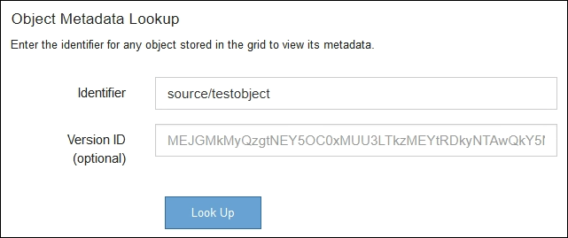

= Troubleshooting object and storage issues
:icons: font
:imagesdir: ../media/

[.lead]
There are several tasks you can perform to help determine the source of object and storage issues.

== Confirming object data locations

Depending on the problem, you might want to confirm where object data is being stored. For example, you might want to verify that the ILM policy is performing as expected and object data is being stored where intended.

.What you'll need
* You must have an object identifier, which can be one of:
 ** *UUID*: The object's Universally Unique Identifier. Enter the UUID in all uppercase.
 ** *CBID*: The object's unique identifier within StorageGRID . You can obtain an object's CBID from the audit log. Enter the CBID in all uppercase.
 ** *S3 bucket and object key*: When an object is ingested through the S3 interface, the client application uses a bucket and object key combination to store and identify the object.
 ** *Swift container and object name*: When an object is ingested through the Swift interface, the client application uses a container and object name combination to store and identify the object.

.Steps
. Select *ILM* > *Object Metadata Lookup*.
. Type the object's identifier in the *Identifier* field.
+
You can enter a UUID, CBID, S3 bucket/object-key, or Swift container/object-name.
+

. Click *Look Up*.
+
The object metadata lookup results appear. This page lists the following types of information:

 ** System metadata, including the object ID (UUID), the object name, the name of the container, the tenant account name or ID, the logical size of the object, the date and time the object was first created, and the date and time the object was last modified.
 ** Any custom user metadata key-value pairs associated with the object.
 ** For S3 objects, any object tag key-value pairs associated with the object.
 ** For replicated object copies, the current storage location of each copy.
 ** For erasure-coded object copies, the current storage location of each fragment.
 ** For object copies in a Cloud Storage Pool, the location of the object, including the name of the external bucket and the object's unique identifier.
 ** For segmented objects and multipart objects, a list of object segments including segment identifiers and data sizes. For objects with more than 100 segments, only the first 100 segments are shown.
 ** All object metadata in the unprocessed, internal storage format. This raw metadata includes internal system metadata that is not guaranteed to persist from release to release.
+
The following example shows the object metadata lookup results for an S3 test object that is stored as two replicated copies.

+
image::../media/object_lookup_results.png[Object Lookup Results]

.Related information

xref:../ilm/index.adoc[Manage objects with ILM]

xref:../s3/index.adoc[Use S3]

xref:../swift/index.adoc[Use Swift]

== Object store (storage volume) failures

The underlying storage on a Storage Node is divided into object stores. These object stores are physical partitions that act as mount points for StorageGRID system's storage. Object stores are also known as storage volumes.

You can view object store information for each Storage Node. Object stores are shown at the bottom of the *Nodes* > *_Storage Node_* > *Storage* page.

image::../media/nodes_page_storage_nodes_storage_tables.png[Nodes Page Storage Node Storage Tables]

To see more details about each Storage Node, follow these steps:

. Select *Support* > *Tools* > *Grid Topology*.
. Select *_site_* > *_Storage Node_* > *LDR* > *Storage* > *Overview* > *Main*.

image::../media/storage_node_object_stores.png[Storage Node object store]

Depending on the nature of the failure, faults with a storage volume might be reflected in an alarm on the storage status or on the health of an object store. If a storage volume fails, you should repair the failed storage volume to restore the Storage Node to full functionality as soon as possible. If necessary, you can go to the *Configuration* tab and place the Storage Node in a read‐only state so that the StorageGRID system can use it for data retrieval while you prepare for a full recovery of the server.

.Related information

xref:../maintain/index.adoc[Maintain & recover]
