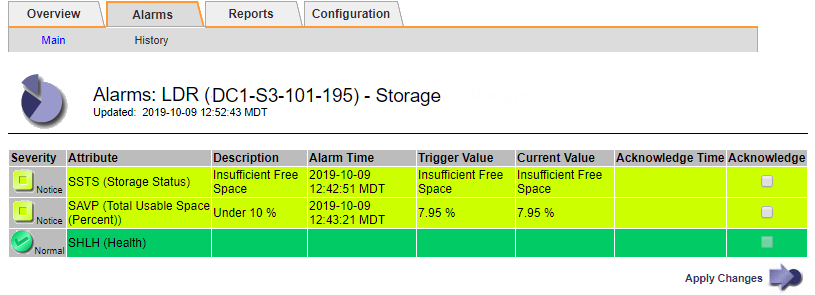
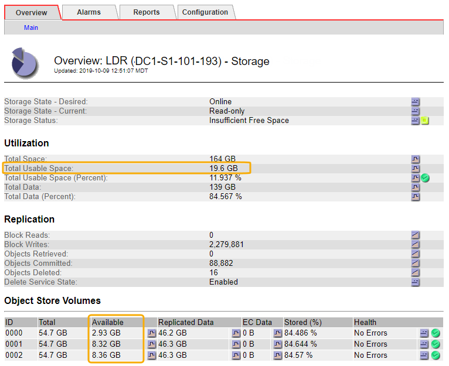
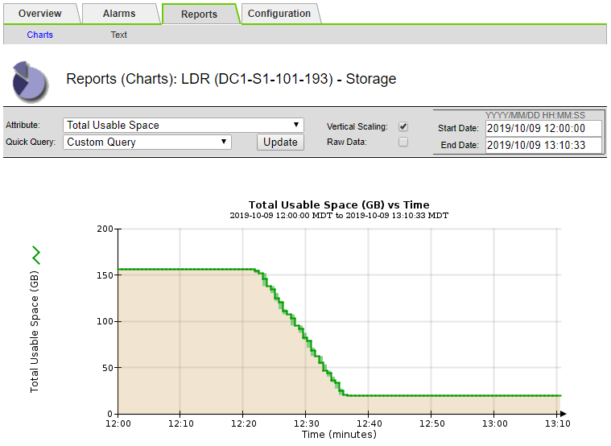
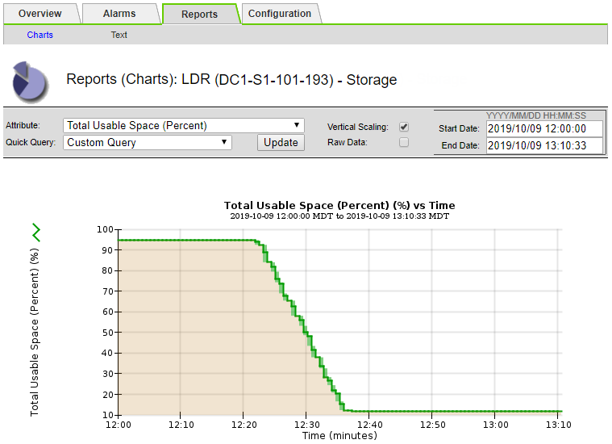

= Troubleshoot the Storage Status (SSTS) alarm
:icons: font
:imagesdir: ../media/

[.lead]
The Storage Status (SSTS) alarm is triggered if a Storage Node has insufficient free space remaining for object storage.

.What you'll need
* You must be signed in to the Grid Manager using a xref:../admin/web-browser-requirements.adoc[supported web browser].
* You must have specific access permissions.

.About this task
The SSTS (Storage Status) alarm is triggered at the Notice level when the amount of free space on every volume in a Storage Node falls below the value of the Storage Volume Soft Read Only Watermark (*CONFIGURATION* > *System* > *Storage options*).

image::../media/storage_watermarks.png[Storage Options Overview]

For example, suppose the Storage Volume Soft Read-Only Watermark is set to 10 GB, which is its default value. The SSTS alarm is triggered if less than 10 GB of usable space remains on each storage volume in the Storage Node. If any of the volumes has 10 GB or more of available space, the alarm is not triggered.

If an SSTS alarm has been triggered, you can follow these steps to better understand the issue.

.Steps
. Select *SUPPORT* > *Alarms (legacy)* > *Current alarms*.
. From the Service column, select the data center, node, and service that are associated with the SSTS alarm.
+
The Grid Topology page appears. The Alarms tab shows the active alarms for the node and service you selected.
+

+
In this example, both the SSTS (Storage Status) and SAVP (Total Usable Space (Percent)) alarms have been triggered at the Notice level.
+
NOTE: Typically, both the SSTS alarm and the SAVP alarm are triggered at about the same time; however, whether both alarms are triggered depends on the the watermark setting in GB and the SAVP alarm setting in percent.

. To determine how much usable space is actually available, select *LDR* > *Storage* > *Overview*, and find the Total Usable Space (STAS) attribute.
+

+
In this example, only 19.6 GB of the 164 GB of space on this Storage Node remains available. Note that the total value is the sum of the *Available* values for the three object store volumes. The SSTS alarm was triggered because each of the three storage volumes had less than 10 GB of available space.

. To understand how storage has been used over time, select the *Reports* tab, and plot Total Usable Space over the last few hours.
+
In this example, Total Usable Space dropped from roughly 155 GB at 12:00 to 20 GB at 12:35, which corresponds to the time at which the SSTS alarm was triggered.
+

. To understand how storage is being used as a percent of the total, plot Total Usable Space (Percent) over the last few hours.
+
In this example, the total usable space dropped from 95% to just over 10% at approximately the same time.
+

. As required, add storage capacity by xref:../expand/index.adoc[expanding the StorageGRID system].
+
For procedures on how to manage a full Storage Node, see the xref:../admin/index.adoc[instructions for administering StorageGRID].
