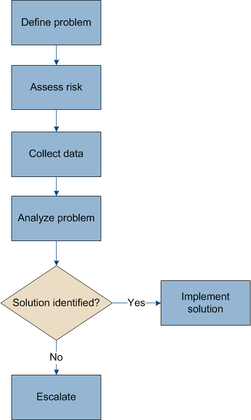

= Troubleshooting a StorageGRID system
:icons: font
:imagesdir: ../media/

[.lead]
If you encounter a problem when using a StorageGRID system, refer to the tips and guidelines in this section for help in determining and resolving the issue.

== Overview of problem determination

[.lead]
If you encounter a problem when administering a StorageGRID system, you can use the process outlined in this figure to identify and analyze the issue. In many cases, you can resolve problems on your own; however, you might need to escalate some issues to technical support.

=== Defining the problem

The first step to solving a problem is to define the problem clearly.

This table provides examples of the types of information that you might collect to define a problem:

[cols="1a,1a" options="header"]
|===
| Question| Sample response

|What is the StorageGRID system doing or not doing? What are its symptoms?
|Client applications are reporting that objects cannot be ingested into StorageGRID.

|When did the problem start?
|Object ingest was first denied at about 14:50 on January 8, 2020.

|How did you first notice the problem?
|Notified by client application. Also received alert email notifications.

|Does the problem happen consistently, or only sometimes?
|Problem is ongoing.

|If the problem happens regularly, what steps cause it to occur
|Problem happens every time a client tries to ingest an object.

|If the problem happens intermittently, when does it occur? Record the times of each incident that you are aware of.
|Problem is not intermittent.

|Have you seen this problem before? How often have you had this problem in the past?
|This is the first time I have seen this issue.
|===

=== Assessing the risk and impact on the system

After you have defined the problem, assess its risk and impact on the StorageGRID system. For example, the presence of critical alerts does not necessarily mean that the system is not delivering core services.

This table summarizes the impact the example problem is having on system operations:

[cols="1a,1a" options="header"]
|===
| Question| Sample response

|Can the StorageGRID system ingest content?
|No.

|Can client applications retrieve content?
|Some objects can be retrieved and others cannot.

|Is data at risk?
|No.

|Is the ability to conduct business severely affected?
|Yes, because client applications cannot store objects to the StorageGRID system and data cannot be retrieved consistently.
|===

=== Collecting data

After you have defined the problem and have assessed its risk and impact, collect data for analysis. The type of data that is most useful to collect depends upon the nature of the problem.

[cols="1a,2a,1a" options="header"]
|===
| Type of data to collect| Why collect this dat| Instructions
|
Create timeline of recent changes
|
Changes to your StorageGRID system, its configuration, or its environment can cause new behavior.
|

* xref:troubleshooting-storagegrid-system.adoc[Creating a timeline of recent changes]

|
Review alerts and alarms
|
Alerts and alarms can help you quickly determine the root cause of a problem by providing important clues as to the underlying issues that might be causing it.

Review the list of current alerts and alarms to see if StorageGRID has identified the root cause of a problem for you.

Review alerts and alarms triggered in the past for additional insights.

|

* xref:viewing-current-alerts.adoc[Viewing current alerts]
* xref:viewing-legacy-alarms.adoc[Viewing legacy alarms]
* xref:viewing-resolved-alerts.adoc[Viewing resolved alerts]
* xref:managing-alarms.adoc[Reviewing historical alarms and alarm frequency (legacy system)]

|
Monitor events
|
Events include any system error or fault events for a node, including errors such as network errors. Monitor events to learn more about issues or to help with troubleshooting.
|

* xref:viewing-events-tab.adoc[Viewing the Events tab]
* xref:monitoring-events.adoc[Monitoring events]

|
Identify trends, using chart and text reports
|
Trends can provide valuable clues about when issues first appeared, and can help you understand how quickly things are changing.
|

* xref:using-charts-and-reports.adoc[Using charts and reports]

|
Establish baselines
|
Collect information about the normal levels of various operational values. These baseline values, and deviations from these baselines, can provide valuable clues.
|

* xref:troubleshooting-storagegrid-system.adoc[Establishing baselines]

|
Perform ingest and retrieval tests
|
To troubleshoot performance issues with ingest and retrieval, use a workstation to store and retrieve objects. Compare results against those seen when using the client application.
|

* xref:monitoring-put-and-get-performance.adoc[Monitoring PUT and GET performance]

|
Review audit messages
|
Review audit messages to follow StorageGRID operations in detail. The details in audit messages can be useful for troubleshooting many types of issues, including performance issues.
|

* xref:reviewing-audit-messages.adoc[Reviewing audit messages]

|
Check object locations and storage integrity
|
If you are having storage problems, verify that objects are being placed where you expect. Check the integrity of object data on a Storage Node.
|

* xref:monitoring-object-verification-operations.adoc[Monitoring object verification operations]
* xref:troubleshooting-storagegrid-system.adoc[Confirming object data locations]
* xref:troubleshooting-storagegrid-system.adoc[Verifying object integrity]

|
Collect data for technical support
|
Technical support might ask you to collect data or review specific information to help troubleshoot issues.
|

* xref:collecting-log-files-and-system-data.adoc[Collecting log files and system data]
* xref:manually-triggering-autosupport-message.adoc[Manually triggering an AutoSupport message]
* xref:reviewing-support-metrics.adoc[Reviewing support metrics]

|===

==== Creating a timeline of recent changes

When a problem occurs, you should consider what has changed recently and when those changes occurred.

* Changes to your StorageGRID system, its configuration, or its environment can cause new behavior.
* A timeline of changes can help you identify which changes might be responsible for an issue, and how each change might have affected its development.

Create a table of recent changes to your system that includes information about when each change occurred and any relevant details about the change, such information about what else was happening while the change was in progress:

[cols="1a,1a,1a" options="header"]
|===
| Time of change| Type of change| Details
|
For example:

* When did you start the node recovery?
* When did the software upgrade complete?
* Did you interrupt the process?

|
What happened? What did you do?

|
Document any relevant details about the change. For example:

* Details of the network changes.
* Which hotfix was installed.
* How client workloads changed.

Make sure to note if more than one change was happening at the same time. For example, was this change made while an upgrade was in progress?

xref:troubleshooting-storagegrid-system.adoc[RECENT_CHANGES]

|===

===== Examples of significant recent changes

Here are some examples of potentially significant changes:

* Was the StorageGRID system recently installed, expanded, or recovered?
* Has the system been upgraded recently? Was a hotfix applied?
* Has any hardware been repaired or changed recently?
* Has the ILM policy been updated?
* Has the client workload changed?
* Has the client application or its behavior changed?
* Have you changed load balancers, or added or removed a high availability group of Admin Nodes or Gateway Nodes?
* Have any tasks been started that might take a long time to complete? Examples include:
 ** Recovery of a failed Storage Node
 ** Storage Node decommissioning
* Have any changes been made to user authentication, such as adding a tenant or changing LDAP configuration?
* Is data migration taking place?
* Were platform services recently enabled or changed?
* Was compliance enabled recently?
* Have Cloud Storage Pools been added or removed?
* Have any changes been made to storage compression or encryption?
* Have there been any changes to the network infrastructure? For example, VLANs, routers, or DNS.
* Have any changes been made to NTP sources?
* Have any changes been made to the Grid, Admin, or Client Network interfaces?
* Have any configuration changes been made to the Archive Node?
* Have any other changes been made to the StorageGRID system or its environment?

==== Establishing baselines

You can establish baselines for your system by recording the normal levels of various operational values. In the future, you can compare current values to these baselines to help detect and resolve abnormal values.

[cols="1a,1a,1a" options="header"]
|===
| Property| Value| How to obtain
|Average storage consumption
|GB consumed/day

Percent consumed/day

|Go to the Grid Manager. On the Nodes page, select the entire grid or a site and go to the Storage tab.

On the Storage Used - Object Data chart, find a period where the line is fairly stable. Hover your cursor over the chart to estimate how much storage is consumed each day

You can collect this information for the entire system or for a specific data center.

|Average metadata consumption
|GB consumed/day

Percent consumed/day

|Go to the Grid Manager. On the Nodes page, select the entire grid or a site and go to the Storage tab.

On the Storage Used - Object Metadata chart, find a period where the line is fairly stable. Hover your cursor over the chart to estimate how much metadata storage is consumed each day

You can collect this information for the entire system or for a specific data center.

|Rate of S3/Swift operations
|Operations/second

|Go to the Dashboard in the Grid Manager. In the Protocol Operations section, view the values for S3 rate and the Swift rate.

To see ingest and retrieval rates and counts for a specific site or node, select *Nodes* > *_site or Storage Node_* > *Objects*. Hover your cursor over the Ingest and Retrieve chart for S3 or Swift.

|Failed S3/Swift operations
|Operations

|Select *Support* > *Tools* > *Grid Topology*. On the Overview tab in the API Operations section, view the value for S3 Operations - Failed or Swift Operations - Failed.

|ILM evaluation rate
|Objects/second
|From the Nodes page, select *_grid_* > *ILM*.

On the ILM Queue chart, find a period where the line is fairly stable. Hover your cursor over the chart to estimate a baseline value for *Evaluation rate* for your system.

|ILM scan rate
|Objects/second
|Select *Nodes* > *_grid_* > *ILM*.

On the ILM Queue chart, find a period where the line is fairly stable. Hover your cursor over the chart to estimate a baseline value for *Scan rate* for your system.

|Objects queued from client operations
|Objects/second
|Select *Nodes* > *_grid_* > *ILM*.

On the ILM Queue chart, find a period where the line is fairly stable. Hover your cursor over the chart to estimate a baseline value for *Objects queued (from client operations)* for your system.

|Average query latency
|Milliseconds
|Select *Nodes* > *_Storage Node_* > *Objects*. In the Queries table, view the value for Average Latency.

|===

=== Analyzing data

Use the information that you collect to determine the cause of the problem and potential solutions.

The analysis is problem‐dependent, but in general:

* Locate points of failure and bottlenecks using the alarms.
* Reconstruct the problem history using the alarm history and charts.
* Use charts to find anomalies and compare the problem situation with normal operation.

=== Escalation information checklist

If you cannot resolve the problem on your own, contact technical support. Before contacting technical support, gather the information listed in the following table to facilitate problem resolution.

[cols="2,2,4a" options="header"]
|===
| image:../media/feature_checkmark.gif[checkmark]
| Item
| Notes

|
|Problem statement
|What are the problem symptoms? When did the problem start? Does it happen consistently or intermittently? If intermittently, what times has it occurred?

xref:troubleshooting-storagegrid-system.adoc[Defining the problem]

|
|Impact assessment
|What is the severity of the problem? What is the impact to the client application?

* Has the client connected successfully before?
* Can the client ingest, retrieve, and delete data?

|
|StorageGRID System ID
|Select *Maintenance* > *System* > *License*. The StorageGRID System ID is shown as part of the current license.

|
|Software version
|Click *Help* > *About* to see the StorageGRID version.

|
|Customization
|Summarize how your StorageGRID system is configured. For example, list the following:

* Does the grid use storage compression, storage encryption, or compliance?
* Does ILM make replicated or erasure coded objects? Does ILM ensure site redundancy? Do ILM rules use the Strict, Balanced, or Dual Commit ingest behaviors?

|
|Log files and system data
|Collect log files and system data for your system. Select *Support* > *Tools* > *Logs*.

You can collect logs for the entire grid, or for selected nodes.

If you are collecting logs only for selected nodes, be sure to include at least one Storage Node that has the ADC service. (The first three Storage Nodes at a site include the ADC service.)

xref:collecting-log-files-and-system-data.adoc[Collecting log files and system data]

|
|Baseline information
|Collect baseline information regarding ingest operations, retrieval operations, and storage consumption.

xref:troubleshooting-storagegrid-system.adoc[Establishing baselines]

|
|Timeline of recent changes
|Create a timeline that summarizes any recent changes to the system or its environment.

xref:troubleshooting-storagegrid-system.adoc[Creating a timeline of recent changes]

|
|History of efforts to diagnose the issue
|If you have taken steps to diagnose or troubleshoot the issue yourself, make sure to record the steps you took and the outcome.
|===

.Related information

xref:troubleshooting-storagegrid-system.adoc[Defining the problem]

xref:troubleshooting-storagegrid-system.adoc[Assessing the risk and impact on the system]

xref:troubleshooting-storagegrid-system.adoc[Collecting data]

xref:troubleshooting-storagegrid-system.adoc[Analyzing data]

xref:../admin/index.adoc[Administer StorageGRID]
