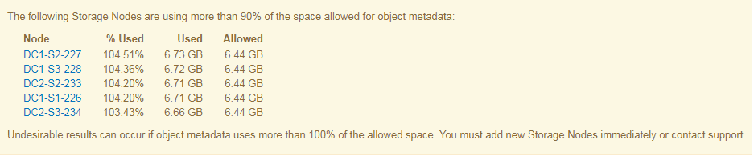
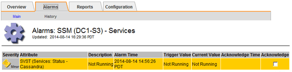
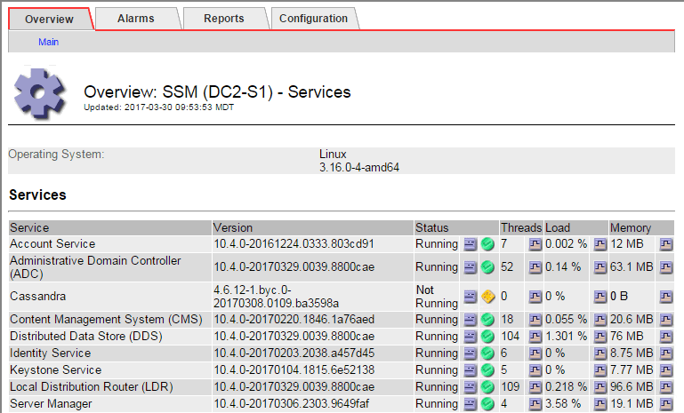
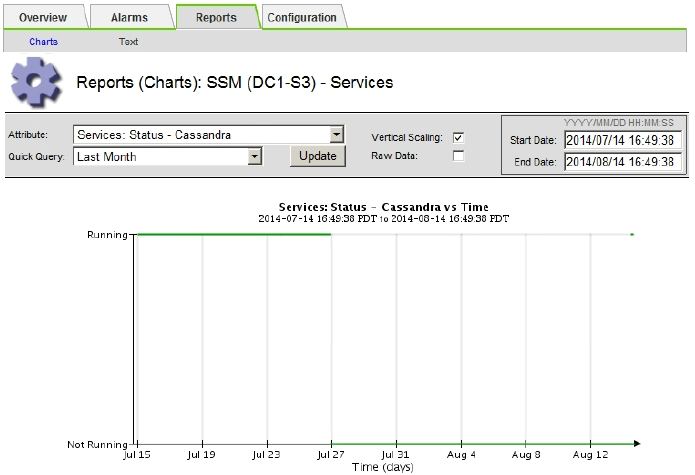

= Troubleshooting metadata issues
:experimental:
:icons: font
:imagesdir: ../media/

[.lead]
There are several tasks you can perform to help determine the source of metadata problems.

== Troubleshooting the Low metadata storage alert

If the *Low metadata storage* alert is triggered, you must add new Storage Nodes.

.What you'll need
* You must be signed in to the Grid Manager using a supported browser.

.About this task
StorageGRID reserves a certain amount of space on volume 0 of each Storage Node for object metadata. This space is known as the actual reserved space, and it is subdivided into the space allowed for object metadata (the allowed metadata space) and the space required for essential database operations, such as compaction and repair. The allowed metadata space governs overall object capacity.

image::../media/metadata_allowed_space_volume_0.png[Metadata Allowed Space Volume 0]

If object metadata consumes more than 100% of the space allowed for metadata, database operations cannot run efficiently and errors will occur.

StorageGRID uses the following Prometheus metric to measure how full the allowed metadata space is:

----
storagegrid_storage_utilization_metadata_bytes/storagegrid_storage_utilization_metadata_allowed_bytes
----

When this Prometheus expression reaches certain thresholds, the *Low metadata storage* alert is triggered.

* *Minor*: Object metadata is using 70% or more of the allowed metadata space. You should add new Storage Nodes as soon as possible.
* *Major*: Object metadata is using 90% or more of the allowed metadata space. You must add new Storage Nodes immediately.
+
IMPORTANT: When object metadata is using 90% or more of the allowed metadata space, a warning appears on the Dashboard. If this warning appears, you must add new Storage Nodes immediately. You must never allow object metadata to use more than 100% of the allowed space.

* *Critical*: Object metadata is using 100% or more of the allowed metadata space and is starting to consume the space required for essential database operations. You must stop the ingest of new objects, and you must add new Storage Nodes immediately.

In the following example, object metadata is using more than 100% of the allowed metadata space. This is a critical situation, which will result in inefficient database operation and errors.

IMPORTANT: If the size of volume 0 is smaller than the Metadata Reserved Space storage option (for example, in a non-production environment), the calculation for the *Low metadata storage* alert might be inaccurate.

.Steps
. Select *Alerts* > *Current*.
. From the table of alerts, expand the *Low metadata storage* alert group, if required, and select the specific alert you want to view.
. Review the details in the alert dialog box.
. If a major or critical *Low metadata storage* alert has been triggered, perform an expansion to add Storage Nodes immediately.
+
NOTE: Because StorageGRID keeps complete copies of all object metadata at each site, the metadata capacity of the entire grid is limited by the metadata capacity of the smallest site. If you need to add metadata capacity to one site, you should also expand any other sites by the same number of Storage Nodes.
+
After you perform the expansion, StorageGRID redistributes the existing object metadata to the new nodes, which increases the overall metadata capacity of the grid. No user action is required. The *Low metadata storage* alert is cleared.

.Related information

xref:monitoring_object_metadata_capacity_for_each_storage_node.adoc[Monitoring object metadata capacity for each Storage Node]

xref:../expand/index.adoc[Expand your grid]

== Troubleshooting the Services: Status - Cassandra (SVST) alarm

The Services: Status - Cassandra (SVST) alarm indicates that you might need to rebuild the Cassandra database for a Storage Node. Cassandra is used as the metadata store for StorageGRID.

.What you'll need
* You must be signed in to the Grid Manager using a supported browser.
* You must have specific access permissions.
* You must have the `Passwords.txt` file.

.About this task
If Cassandra is stopped for more than 15 days (for example, the Storage Node is powered off), Cassandra will not start when the node is brought back online. You must rebuild the Cassandra database for the affected DDS service.

You can use the Diagnostics page to obtain additional information on the current state of your grid.

xref:running_diagnostics.adoc[Running diagnostics]

IMPORTANT: If two or more of the Cassandra database services are down for more than 15 days, contact technical support, and do not proceed with the steps below.

.Steps
. Select *Support* > *Tools* > *Grid Topology*.
. Select *_site > Storage Node_* > *SSM* > *Services* > *Alarms* > *Main* to display alarms.
+
This example shows that the SVST alarm was triggered.
+

+
The SSM Services Main page also indicates that Cassandra is not running.
+

. Try restarting Cassandra from the Storage Node:
 .. Log in to the grid node:
  ... Enter the following command: `ssh admin@grid_node_IP`
  ... Enter the password listed in the `Passwords.txt` file.
  ... Enter the following command to switch to root: `su -`
  ... Enter the password listed in the `Passwords.txt` file.
When you are logged in as root, the prompt changes from `$` to `#`.
 .. Enter: `/etc/init.d/cassandra status`
 .. If Cassandra is not running, restart it: `/etc/init.d/cassandra restart`
. If Cassandra does not restart, determine how long Cassandra has been down. If Cassandra has been down for longer than 15 days, you must rebuild the Cassandra database.
+
IMPORTANT: If two or more of the Cassandra database services are down, contact technical support, and do not proceed with the steps below.
+
You can determine how long Cassandra has been down by charting it or by reviewing the servermanager.log file.

. To chart Cassandra:
 .. Select *Support* > *Tools* > *Grid Topology*. Then select *_site > Storage Node_* > *SSM* > *Services* > *Reports* > *Charts*.
 .. Select *Attribute* > *Service: Status - Cassandra*.
 .. For *Start Date*, enter a date that is at least 16 days before the current date. For *End Date*, enter the current date.
 .. Click *Update*.
 .. If the chart shows Cassandra as being down for more than 15 days, rebuild the Cassandra database.

The following chart example shows that Cassandra has been down for at least 17 days.

. To review the servermanager.log file on the Storage Node:
 .. Log in to the grid node:
  ... Enter the following command: `ssh admin@grid_node_IP`
  ... Enter the password listed in the `Passwords.txt` file.
  ... Enter the following command to switch to root: `su -`
  ... Enter the password listed in the `Passwords.txt` file.
When you are logged in as root, the prompt changes from `$` to `#`.
 .. Enter: `cat /var/local/log/servermanager.log`
+
The contents of the servermanager.log file are displayed.
+
If Cassandra has been down for longer than 15 days, the following message is displayed in the servermanager.log file:
+
----
"2014-08-14 21:01:35 +0000 | cassandra | cassandra not
started because it has been offline for longer than
its 15 day grace period - rebuild cassandra
----

 .. Make sure the timestamp of this message is the time when you attempted restarting Cassandra as instructed in step xref:troubleshooting_storagegrid_system.adocSTEP_6A4A25E2BE2649DAB476DB900C8B864F[3].
+
There can be more than one entry for Cassandra; you must locate the most recent entry.

 .. If Cassandra has been down for longer than 15 days, you must rebuild the Cassandra database.
+
For instructions, see "`Recovering from a single Storage Node down more than 15 days`" in the recovery and maintenance instructions.

 .. Contact technical support if alarms do not clear after Cassandra is rebuilt.

.Related information

xref:../maintain/index.adoc[Maintain & recover]

== Troubleshooting Cassandra Out of Memory errors (SMTT alarm)

A Total Events (SMTT) alarm is triggered when the Cassandra database has an out-of-memory error. If this error occurs, contact technical support to work through the issue.

.About this task
If an out-of-memory error occurs for the Cassandra database, a heap dump is created, a Total Events (SMTT) alarm is triggered, and the Cassandra Heap Out Of Memory Errors count is incremented by one.

.Steps
. To view the event, select *Nodes* > *_grid node_* > *Events*.
. Verify that the Cassandra Heap Out Of Memory Errors count is 1 or greater.
+
You can use the Diagnostics page to obtain additional information on the current state of your grid.
+
xref:running_diagnostics.adoc[Running diagnostics]

. Go to `/var/local/core/`, compress the `Cassandra.hprof` file, and send it to technical support.
. Make a backup of the `Cassandra.hprof` file, and delete it from the `/var/local/core/ directory`.
+
This file can be as large as 24 GB, so you should remove it to free up space.

. Once the issue is resolved, click *Reset event counts*.
+
NOTE: To reset event counts, you must have the Grid Topology Page Configuration permission.

.Related information

xref:resetting_event_counts.adoc[Resetting event counts]
