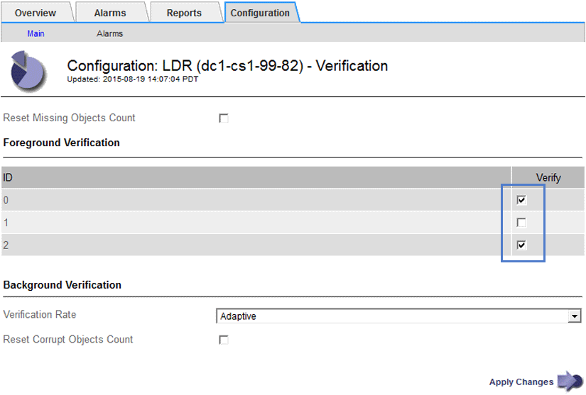

= Troubleshooting a StorageGRID system
:experimental:
:icons: font
:imagesdir: ../media/

[.lead]
If you encounter a problem when using a StorageGRID system, refer to the tips and guidelines in this section for help in determining and resolving the issue.

== Overview of problem determination

[.lead]
If you encounter a problem when administering a StorageGRID system, you can use the process outlined in this figure to identify and analyze the issue. In many cases, you can resolve problems on your own; however, you might need to escalate some issues to technical support.

image::../media/problem_determination_methodology.gif[Flowchart showing major steps in problem determination procedure]

=== Defining the problem

[.lead]
The first step to solving a problem is to define the problem clearly.

This table provides examples of the types of information that you might collect to define a problem:

|===
| Question| Sample response
a|
What is the StorageGRID system doing or not doing? What are its symptoms?
a|
Client applications are reporting that objects cannot be ingested into StorageGRID.
a|
When did the problem start?
a|
Object ingest was first denied at about 14:50 on January 8, 2020.
a|
How did you first notice the problem?
a|
Notified by client application. Also received alert email notifications.
a|
Does the problem happen consistently, or only sometimes?
a|
Problem is ongoing.
a|
If the problem happens regularly, what steps cause it to occur
a|
Problem happens every time a client tries to ingest an object.
a|
If the problem happens intermittently, when does it occur? Record the times of each incident that you are aware of.
a|
Problem is not intermittent.
a|
Have you seen this problem before? How often have you had this problem in the past?
a|
This is the first time I have seen this issue.
|===

=== Assessing the risk and impact on the system

[.lead]
After you have defined the problem, assess its risk and impact on the StorageGRID system. For example, the presence of critical alerts does not necessarily mean that the system is not delivering core services.

This table summarizes the impact the example problem is having on system operations:

|===
| Question| Sample response
a|
Can the StorageGRID system ingest content?
a|
No.
a|
Can client applications retrieve content?
a|
Some objects can be retrieved and others cannot.
a|
Is data at risk?
a|
No.
a|
Is the ability to conduct business severely affected?
a|
Yes, because client applications cannot store objects to the StorageGRID system and data cannot be retrieved consistently.
|===

=== Collecting data

[.lead]
After you have defined the problem and have assessed its risk and impact, collect data for analysis. The type of data that is most useful to collect depends upon the nature of the problem.

|===
| Type of data to collect| Why collect this data| Instructions
a|
Create timeline of recent changes
a|
Changes to your StorageGRID system, its configuration, or its environment can cause new behavior.
a|

* link:troubleshooting_storagegrid_system.md#[Creating a timeline of recent changes]

a|
Review alerts and alarms
a|
Alerts and alarms can help you quickly determine the root cause of a problem by providing important clues as to the underlying issues that might be causing it.

Review the list of current alerts and alarms to see if StorageGRID has identified the root cause of a problem for you.

Review alerts and alarms triggered in the past for additional insights.

a|

* link:viewing_current_alerts.md#[Viewing current alerts]
* link:viewing_legacy_alarms.md#[Viewing legacy alarms]
* link:viewing_resolved_alerts.md#[Viewing resolved alerts]
* link:managing_alarms.md#[Reviewing historical alarms and alarm frequency (legacy system)]

a|
Monitor events
a|
Events include any system error or fault events for a node, including errors such as network errors. Monitor events to learn more about issues or to help with troubleshooting.
a|

* link:viewing_events_tab.md#[Viewing the Events tab]
* link:monitoring_events.md#[Monitoring events]

a|
Identify trends, using chart and text reports
a|
Trends can provide valuable clues about when issues first appeared, and can help you understand how quickly things are changing.
a|

* link:using_charts_and_reports.md#[Using charts and reports]

a|
Establish baselines
a|
Collect information about the normal levels of various operational values. These baseline values, and deviations from these baselines, can provide valuable clues.
a|

* link:troubleshooting_storagegrid_system.md#[Establishing baselines]

a|
Perform ingest and retrieval tests
a|
To troubleshoot performance issues with ingest and retrieval, use a workstation to store and retrieve objects. Compare results against those seen when using the client application.
a|

* link:monitoring_put_and_get_performance.md#[Monitoring PUT and GET performance]

a|
Review audit messages
a|
Review audit messages to follow StorageGRID operations in detail. The details in audit messages can be useful for troubleshooting many types of issues, including performance issues.
a|

* link:reviewing_audit_messages.md#[Reviewing audit messages]

a|
Check object locations and storage integrity
a|
If you are having storage problems, verify that objects are being placed where you expect. Check the integrity of object data on a Storage Node.
a|

* link:monitoring_object_verification_operations.md#[Monitoring object verification operations]
* link:troubleshooting_storagegrid_system.md#[Confirming object data locations]
* link:troubleshooting_storagegrid_system.md#[Verifying object integrity]

a|
Collect data for technical support
a|
Technical support might ask you to collect data or review specific information to help troubleshoot issues.
a|

* link:collecting_log_files_and_system_data.md#[Collecting log files and system data]
* link:manually_triggering_autosupport_message.md#[Manually triggering an AutoSupport message]
* link:reviewing_support_metrics.md#[Reviewing support metrics]

|===

==== Creating a timeline of recent changes

[.lead]
When a problem occurs, you should consider what has changed recently and when those changes occurred.

* Changes to your StorageGRID system, its configuration, or its environment can cause new behavior.
* A timeline of changes can help you identify which changes might be responsible for an issue, and how each change might have affected its development.

Create a table of recent changes to your system that includes information about when each change occurred and any relevant details about the change, such information about what else was happening while the change was in progress:

|===
| Time of change| Type of change| Details
a|
For example:

* When did you start the node recovery?
* When did the software upgrade complete?
* Did you interrupt the process?

a|
What happened? What did you do?

a|
Document any relevant details about the change. For example:

* Details of the network changes.
* Which hotfix was installed.
* How client workloads changed.

Make sure to note if more than one change was happening at the same time. For example, was this change made while an upgrade was in progress?

link:troubleshooting_storagegrid_system.md#RECENT_CHANGES[troubleshooting_storagegrid_system.md#RECENT_CHANGES]

|===

===== Examples of significant recent changes

Here are some examples of potentially significant changes:

* Was the StorageGRID system recently installed, expanded, or recovered?
* Has the system been upgraded recently? Was a hotfix applied?
* Has any hardware been repaired or changed recently?
* Has the ILM policy been updated?
* Has the client workload changed?
* Has the client application or its behavior changed?
* Have you changed load balancers, or added or removed a high availability group of Admin Nodes or Gateway Nodes?
* Have any tasks been started that might take a long time to complete? Examples include:
 ** Recovery of a failed Storage Node
 ** Storage Node decommissioning
* Have any changes been made to user authentication, such as adding a tenant or changing LDAP configuration?
* Is data migration taking place?
* Were platform services recently enabled or changed?
* Was compliance enabled recently?
* Have Cloud Storage Pools been added or removed?
* Have any changes been made to storage compression or encryption?
* Have there been any changes to the network infrastructure? For example, VLANs, routers, or DNS.
* Have any changes been made to NTP sources?
* Have any changes been made to the Grid, Admin, or Client Network interfaces?
* Have any configuration changes been made to the Archive Node?
* Have any other changes been made to the StorageGRID system or its environment?

==== Establishing baselines

[.lead]
You can establish baselines for your system by recording the normal levels of various operational values. In the future, you can compare current values to these baselines to help detect and resolve abnormal values.

|===
| Property| Value| How to obtain
a|
Average storage consumption
a|
*__***__**_ GB consumed/day

*__***__**_% consumed/day

a|
Go to the Grid Manager. On the Nodes page, select the entire grid or a site and go to the Storage tab.On the Storage Used - Object Data chart, find a period where the line is fairly stable. Hover your cursor over the chart to estimate how much storage is consumed each day

You can collect this information for the entire system or for a specific data center.

a|
Average metadata consumption
a|
*__***__**_ GB consumed/day

*__***__**_ % consumed/day

a|
Go to the Grid Manager. On the Nodes page, select the entire grid or a site and go to the Storage tab.On the Storage Used - Object Metadata chart, find a period where the line is fairly stable. Hover your cursor over the chart to estimate how much metadata storage is consumed each day

You can collect this information for the entire system or for a specific data center.

a|
Rate of S3/Swift operations
a|
*__***__**_ operations/second

a|
Go to the Dashboard in the Grid Manager. In the Protocol Operations section, view the values for S3 rate and the Swift rate.To see ingest and retrieval rates and counts for a specific site or node, select *Nodes* > *site or Storage Node* > *Objects*. Hover your cursor over the Ingest and Retrieve chart for S3 or Swift.

a|
Failed S3/Swift operations
a|
*__***__**_

a|
Select *Support* > *Tools* > *Grid Topology*. On the Overview tab in the API Operations section, view the value for S3 Operations - Failed or Swift Operations - Failed.

a|
ILM evaluation rate
a|
*__***__**_ objects/second

a|
From the Nodes page, select *grid* > *ILM*.

On the ILM Queue chart, find a period where the line is fairly stable. Hover your cursor over the chart to estimate a baseline value for *Evaluation rate* for your system.

a|
ILM scan rate
a|
*__***__**_ objects/second

a|
Select *Nodes* > *grid* > *ILM*.

On the ILM Queue chart, find a period where the line is fairly stable. Hover your cursor over the chart to estimate a baseline value for *Scan rate* for your system.

a|
Objects queued from client operations
a|
*__***__**_ objects/second

a|
Select *Nodes* > *grid* > *ILM*.

On the ILM Queue chart, find a period where the line is fairly stable. Hover your cursor over the chart to estimate a baseline value for *Objects queued (from client operations)* for your system.

a|
Average query latency
a|
*__***__**_ milliseconds

a|
Select *Nodes* > *Storage Node* > *Objects*. In the Queries table, view the value for Average Latency.

|===

=== Analyzing data

[.lead]
Use the information that you collect to determine the cause of the problem and potential solutions.

The analysis is problem‐dependent, but in general:

* Locate points of failure and bottlenecks using the alarms.
* Reconstruct the problem history using the alarm history and charts.
* Use charts to find anomalies and compare the problem situation with normal operation.

=== Escalation information checklist

[.lead]
If you cannot resolve the problem on your own, contact technical support. Before contacting technical support, gather the information listed in the following table to facilitate problem resolution.

|===
| image:../media/feature_checkmark.gif[checkmark]

| Item| Notes
a|
 
a|
Problem statement
a|
What are the problem symptoms? When did the problem start? Does it happen consistently or intermittently? If intermittently, what times has it occurred?link:troubleshooting_storagegrid_system.md#[Defining the problem]

a|
 
a|
Impact assessment
a|
What is the severity of the problem? What is the impact to the client application?

* Has the client connected successfully before?
* Can the client ingest, retrieve, and delete data?

a|
 
a|
StorageGRID System ID
a|
Select *Maintenance* > *System* > *License*. The StorageGRID System ID is shown as part of the current license.
a|
 
a|
Software version
a|
Click *Help* > *About* to see the StorageGRID version.
a|
 
a|
Customization
a|
Summarize how your StorageGRID system is configured. For example, list the following:

* Does the grid use storage compression, storage encryption, or compliance?
* Does ILM make replicated or erasure coded objects? Does ILM ensure site redundancy? Do ILM rules use the Strict, Balanced, or Dual Commit ingest behaviors?

a|
 
a|
Log files and system data
a|
Collect log files and system data for your system. Select *Support* > *Tools* > *Logs*.You can collect logs for the entire grid, or for selected nodes.

If you are collecting logs only for selected nodes, be sure to include at least one Storage Node that has the ADC service. (The first three Storage Nodes at a site include the ADC service.)

xref:collecting_log_files_and_system_data.adoc[Collecting log files and system data]

a|
 
a|
Baseline information
a|
Collect baseline information regarding ingest operations, retrieval operations, and storage consumption. link:troubleshooting_storagegrid_system.md#[Establishing baselines]

a|
 
a|
Timeline of recent changes
a|
Create a timeline that summarizes any recent changes to the system or its environment.link:troubleshooting_storagegrid_system.md#[Creating a timeline of recent changes]

a|
 
a|
History of efforts to diagnose the issue
a|
If you have taken steps to diagnose or troubleshoot the issue yourself, make sure to record the steps you took and the outcome.
|===
*Related information*

link:troubleshooting_storagegrid_system.md#[Defining the problem]

link:troubleshooting_storagegrid_system.md#[Assessing the risk and impact on the system]

link:troubleshooting_storagegrid_system.md#[Collecting data]

link:troubleshooting_storagegrid_system.md#[Analyzing data]

http://docs.netapp.com/sgws-115/topic/com.netapp.doc.sg-admin/home.html[Administering StorageGRID]

== Troubleshooting object and storage issues

[.lead]
There are several tasks you can perform to help determine the source of object and storage issues.

=== Confirming object data locations

[.lead]
Depending on the problem, you might want to confirm where object data is being stored. For example, you might want to verify that the ILM policy is performing as expected and object data is being stored where intended.

* You must have an object identifier, which can be one of:
 ** *UUID*: The object's Universally Unique Identifier. Enter the UUID in all uppercase.
 ** *CBID*: The object's unique identifier within StorageGRID . You can obtain an object's CBID from the audit log. Enter the CBID in all uppercase.
 ** *S3 bucket and object key*: When an object is ingested through the S3 interface, the client application uses a bucket and object key combination to store and identify the object.
 ** *Swift container and object name*: When an object is ingested through the Swift interface, the client application uses a container and object name combination to store and identify the object.

. Select *ILM* > *Object Metadata Lookup*.
. Type the object's identifier in the *Identifier* field.
+
You can enter a UUID, CBID, S3 bucket/object-key, or Swift container/object-name.
+
image::../media/object_lookup.png[Object Lookup page]

. Click *Look Up*.
+
The object metadata lookup results appear. This page lists the following types of information:

 ** System metadata, including the object ID (UUID), the object name, the name of the container, the tenant account name or ID, the logical size of the object, the date and time the object was first created, and the date and time the object was last modified.
 ** Any custom user metadata key-value pairs associated with the object.
 ** For S3 objects, any object tag key-value pairs associated with the object.
 ** For replicated object copies, the current storage location of each copy.
 ** For erasure-coded object copies, the current storage location of each fragment.
 ** For object copies in a Cloud Storage Pool, the location of the object, including the name of the external bucket and the object's unique identifier.
 ** For segmented objects and multipart objects, a list of object segments including segment identifiers and data sizes. For objects with more than 100 segments, only the first 100 segments are shown.
 ** All object metadata in the unprocessed, internal storage format. This raw metadata includes internal system metadata that is not guaranteed to persist from release to release.
The following example shows the object metadata lookup results for an S3 test object that is stored as two replicated copies.

+
image::../media/object_lookup_results.png[Object Lookup Results]

*Related information*

http://docs.netapp.com/sgws-115/topic/com.netapp.doc.sg-ilm/home.html[Managing objects with information lifecycle management]

http://docs.netapp.com/sgws-115/topic/com.netapp.doc.sg-s3/home.html[Implementing S3 client applications]

http://docs.netapp.com/sgws-115/topic/com.netapp.doc.sg-swift/home.html[Implementing Swift client applications]

=== Object store (storage volume) failures

[.lead]
The underlying storage on a Storage Node is divided into object stores. These object stores are physical partitions that act as mount points for StorageGRID system's storage. Object stores are also known as storage volumes.

You can view object store information for each Storage Node. Object stores are shown at the bottom of the *Nodes* > *Storage Node* > *Storage* page.

image::../media/nodes_page_storage_nodes_storage_tables.png[Nodes Page Storage Node Storage Tables]

To see more details about each Storage Node, follow these steps:

. Select *Support* > *Tools* > *Grid Topology*.
. Select *site* > *Storage Node* > *LDR* > *Storage* > *Overview* > *Main*.

image::../media/storage_node_object_stores.png[Storage Node object store]

Depending on the nature of the failure, faults with a storage volume might be reflected in an alarm on the storage status or on the health of an object store. If a storage volume fails, you should repair the failed storage volume to restore the Storage Node to full functionality as soon as possible. If necessary, you can go to the *Configuration* tab and place the Storage Node in a read‐only state so that the StorageGRID system can use it for data retrieval while you prepare for a full recovery of the server.

*Related information*

http://docs.netapp.com/sgws-115/topic/com.netapp.doc.sg-maint/home.html[Recovery and maintenance]

=== Verifying object integrity

[.lead]
The StorageGRID system verifies the integrity of object data on Storage Nodes, checking for both corrupt and missing objects.

There are two verification processes: background verification and foreground verification. They work together to ensure data integrity. Background verification runs automatically, and continuously checks the correctness of object data. Foreground verification can be triggered by a user, to more quickly verify the existence (although not the correctness) of objects.

*Related information*

link:troubleshooting_storagegrid_system.md#[What background verification is]

link:troubleshooting_storagegrid_system.md#[What foreground verification is]

==== What background verification is

[.lead]
The background verification process automatically and continuously checks Storage Nodes for corrupt copies of object data, and automatically attempts to repair any issues that it finds.

Background verification checks the integrity of replicated objects and erasure-coded objects, as follows:

* *Replicated objects*: If the background verification process finds a replicated object that is corrupt, the corrupt copy is removed from its location and quarantined elsewhere on the Storage Node. Then, a new uncorrupted copy is generated and placed to satisfy the active ILM policy. The new copy might not be placed on the Storage Node that was used for the original copy.
+
NOTE: Corrupt object data is quarantined rather than deleted from the system, so that it can still be accessed. For more information on accessing quarantined object data, contact technical support.

* *Erasure-coded objects*: If the background verification process detects that a fragment of an erasure-coded object is corrupt, StorageGRID automatically attempts to rebuild the missing fragment in place on the same Storage Node, using the remaining data and parity fragments. If the corrupted fragment cannot be rebuilt, the Corrupt Copies Detected (ECOR) attribute is incremented by one, and an attempt is made to retrieve another copy of the object. If retrieval is successful, an ILM evaluation is performed to create a replacement copy of the erasure-coded object.

The background verification process checks objects on Storage Nodes only. It does not check objects on Archive Nodes or in a Cloud Storage Pool. Objects must be older than four days to qualify for background verification.

Background verification runs at a continuous rate that is designed not to interfere with ordinary system activities. Background verification cannot be stopped. However you can increase the background verification rate to more quickly verify the contents of a Storage Node if you suspect a problem.

===== Alerts and alarms (legacy) related to background verification

If the system detects a corrupt object that it cannot correct automatically (because the corruption prevents the object from being identified), the *Unidentified corrupt object detected* alert is triggered.

If background verification cannot replace a corrupted object because it cannot locate another copy, the *Objects lost* alert and the LOST (Lost Objects) legacy alarm are triggered.

==== Changing the background verification rate

[.lead]
You can change the rate at which background verification checks replicated object data on a Storage Node if you have concerns about data integrity.

* You must be signed in to the Grid Manager using a supported browser.
* You must have specific access permissions.

You can change the Verification Rate for background verification on a Storage Node:

* Adaptive: Default setting. The task is designed to verify at a maximum of 4 MB/s or 10 objects/s (whichever is exceeded first).
* High: Storage verification proceeds quickly, at a rate that can slow ordinary system activities.

Use the High verification rate only when you suspect that a hardware or software fault might have corrupted object data. After the High priority background verification completes, the Verification Rate automatically resets to Adaptive.

. Select *Support* > *Tools* > *Grid Topology*.
. Select *Storage Node* > *LDR* > *Verification*.
. Select *Configuration* > *Main*.
. Go to *LDR* > *Verification* > *Configuration* > *Main*.
. Under Background Verification, select *Verification Rate* > *High* or *Verification Rate* > *Adaptive*.
+
image::../media/background_verification_rate.png[setting Verification Rate]
+
NOTE: Setting the Verification Rate to High triggers the VPRI (Verification Rate) legacy alarm at the Notice level.

. Click *Apply Changes*.
. Monitor the results of background verification for replicated objects.
 .. Go to *Nodes* > *Storage Node* > *Objects*.
 .. In the Verification section, monitor the values for *Corrupt Objects* and *Corrupt Objects Unidentified*.
+
If background verification finds corrupt replicated object data, the *Corrupt Objects* metric is incremented, and StorageGRID attempts to extract the object identifier from the data, as follows:

  *** If the object identifier can be extracted, StorageGRID automatically creates a new copy of the object data. The new copy can be made anywhere in the StorageGRID system that satisfies the active ILM policy.
  *** If the object identifier cannot be extracted (because it has been corrupted), the *Corrupt Objects Unidentified* metric is incremented, and the *Unidentified corrupt object detected* alert is triggered.

 .. If corrupt replicated object data is found, contact technical support to determine the root cause of the corruption.
. Monitor the results of background verification for erasure-coded objects.
+
If background verification finds corrupt fragments of erasure-coded object data, the Corrupt Fragments Detected attribute is incremented. StorageGRID recovers by rebuilding the corrupt fragment in place on the same Storage Node.

 .. Select *Support* > *Tools* > *Grid Topology*.
 .. Select *Storage Node* > *LDR* > *Erasure Coding*.
 .. In the Verification Results table, monitor the Corrupt Fragments Detected (ECCD) attribute.

. After corrupt objects have been automatically restored by the StorageGRID system, reset the count of corrupt objects.
 .. Select *Support* > *Tools* > *Grid Topology*.
 .. Select *Storage Node* > *LDR* > *Verification* > *Configuration*.
 .. Select *Reset Corrupt Object Count*.
 .. Click *Apply Changes*.
. If you are confident that quarantined objects are not required, you can delete them.
+
NOTE: If the *Objects lost* alert or the LOST (Lost Objects) legacy alarm was triggered, technical support might want to access quarantined objects to help debug the underlying issue or to attempt data recovery.

 .. Select *Support* > *Tools* > *Grid Topology*.
 .. Select *Storage Node* > *LDR* > *Verification* > *Configuration*.
 .. Select *Delete Quarantined Objects*.
 .. Click *Apply Changes*.

==== What foreground verification is

[.lead]
Foreground verification is a user-initiated process that checks if all expected object data exists on a Storage Node. Foreground verification is used to verify the integrity of a storage device.

Foreground verification is a faster alternative to background verification that checks the existence, but not the integrity, of object data on a Storage Node. If foreground verification finds that many items are missing, there might be an issue with all or part of a storage device associated with the Storage Node.

Foreground verification checks both replicated object data and erasure-coded object data, as follows:

* *Replicated objects*: If a copy of replicated object data is found to be missing, StorageGRID automatically attempts to replace the copy from copies stored elsewhere in the system. The Storage Node runs an existing copy through an ILM evaluation, which will determine that the current ILM policy is no longer being met for this object because the missing copy no longer exists at the expected location. A new copy is generated and placed to satisfy the system's active ILM policy. This new copy might not be placed in the same location that the missing copy was stored.
* *Erasure-coded objects*: If a fragment of an erasure-coded object is found to be missing, StorageGRID automatically attempts to rebuild the missing fragment in place on the same Storage Node using the remaining fragments. If the missing fragment cannot be rebuilt (because too many fragments have been lost), the Corrupt Copies Detected (ECOR) attribute is incremented by one. ILM then attempts to find another copy of the object, which it can use to generate a new erasure-coded copy.
+
If foreground verification identifies an issue with erasure coding on a storage volume, the foreground verification task pauses with an error message that identifies the affected volume. You must perform a recovery procedure for any affected storage volumes.

If no other copies of a missing replicated object or a corrupted erasure-coded object can be found in the grid, the *Objects lost* alert and the LOST (Lost Objects) legacy alarm are triggered.

==== Running foreground verification

[.lead]
Foreground verification enables you to verify the existence of data on a Storage Node. Missing object data might indicate that an issue exists with the underlying storage device.

* You have ensured that the following grid tasks are not running:
 ** Grid Expansion: Add Server (GEXP), when adding a Storage Node
 ** Storage Node Decommissioning (LDCM) on the same Storage Node
If these grid tasks are running, wait for them to complete or release their lock.
* You have ensured that the storage is online. (Select *Support* > *Tools* > *Grid Topology*. Then, select *Storage Node* > *LDR* > *Storage* > *Overview* > *Main*. Ensure that *Storage State - Current* is Online.)
* You have ensured that the following recovery procedures are not running on the same Storage Node:
 ** Recovery of a failed storage volume
 ** Recovery of a Storage Node with a failed system drive
Foreground verification does not provide useful information while recovery procedures are in progress.

Foreground verification checks for both missing replicated object data and missing erasure-coded object data:

* If foreground verification finds large amounts of missing object data, there is likely an issue with the Storage Node's storage that needs to be investigated and addressed.
* If foreground verification finds a serious storage error associated with erasure-coded data, it will notify you. You must perform storage volume recovery to repair the error.

You can configure foreground verification to check all of a Storage Node's object stores or only specific object stores.

If foreground verification finds missing object data, the StorageGRID system attempts to replace it. If a replacement copy cannot be made, the LOST (Lost Objects) alarm might be triggered.

Foreground verification generates an LDR Foreground Verification grid task that, depending on the number of objects stored on a Storage Node, can take days or weeks to complete. It is possible to select multiple Storage Nodes at the same time; however, these grid tasks are not run simultaneously. Instead, they are queued and run one after the other until completion. When foreground verification is in progress on a Storage Node, you cannot start another foreground verification task on that same Storage Node even though the option to verify additional volumes might appear to be available for the Storage Node.

If a Storage Node other than the one where foreground verification is being run goes offline, the grid task continues to run until the *% Complete* attribute reaches 99.99 percent. The *% Complete* attribute then falls back to 50 percent and waits for the Storage Node to return to online status. When the Storage Node's state returns to online, the LDR Foreground Verification grid task continues until it completes.

. Select *Storage Node* > *LDR* > *Verification*.
. Select *Configuration* > *Main*.
. Under *Foreground Verification*, select the check box for each storage volume ID you want to verify.
+

. Click *Apply Changes*.
+
Wait until the page auto-refreshes and reloads before you leave the page. Once refreshed, object stores become unavailable for selection on that Storage Node.
+
An LDR Foreground Verification grid task is generated and runs until it completes, pauses, or is aborted.

. Monitor missing objects or missing fragments:
 .. Select *Storage Node* > *LDR* > *Verification*.
 .. On the Overview tab under *Verification Results*, note the value of *Missing Objects Detected*.
+
NOTE: The same value is reported as *Lost Objects* on the Nodes page. Go to *Nodes* > *Storage Node*, and select the *Objects* tab.
+
If the number of *Missing Objects Detected* is large (if there are a hundreds of missing objects), there is likely an issue with the Storage Node's storage. Contact technical support.

 .. Select *Storage Node* > *LDR* > *Erasure Coding*.
 .. On the Overview tab under *Verification Results*, note the value of *Missing Fragments Detected*.
+
If the number of *Missing Fragments Detected* is large (if there are a hundreds of missing fragments), there is likely an issue with the Storage Node's storage. Contact technical support.

+
If foreground verification does not detect a significant number of missing replicated object copies or a significant number of missing fragments, then the storage is operating normally.
. Monitor the completion of the foreground verification grid task:
 .. Select *Support* > *Tools* > *Grid Topology*. Then select *site* > menu:Admin Node[CMN] > *Grid Task* > *Overview* > *Main*.
 .. Verify that the foreground verification grid task is progressing without errors.
+
NOTE: A notice-level alarm is triggered on grid task status (SCAS) if the foreground verification grid task pauses.

 .. If the grid task pauses with a critical storage error, recover the affected volume and then run foreground verification on the remaining volumes to check for additional errors.
+
IMPORTANT: If the foreground verification grid task pauses with the message Encountered a critical storage error in volume volID, you must perform the procedure for recovering a failed storage volume. See the recovery and maintenance instructions.

If you still have concerns about data integrity, go to *LDR* > *Verification* > *Configuration* > *Main* and increase the background Verification Rate. Background verification checks the correctness of all stored object data and repairs any issues that it finds. Finding and repairing potential issues as quickly as possible reduces the risk of data loss.

*Related information*

http://docs.netapp.com/sgws-115/topic/com.netapp.doc.sg-maint/home.html[Recovery and maintenance]

=== Troubleshooting lost and missing object data

[.lead]
Objects can be retrieved for several reasons, including read requests from a client application, background verifications of replicated object data, ILM re-evaluations, and the restoration of object data during the recovery of a Storage Node.

The StorageGRID system uses location information in an object's metadata to determine from which location to retrieve the object. If a copy of the object is not found in the expected location, the system attempts to retrieve another copy of the object from elsewhere in the system, assuming that the ILM policy contains a rule to make two or more copies of the object.

If this retrieval is successful, the StorageGRID system replaces the missing copy of the object. Otherwise, the *Objects lost* alert and the legacy LOST (Lost Objects) alarm are triggered, as follows:

* For replicated copies, if another copy cannot be retrieved, the object is considered lost, and the alert and alarm are triggered.
* For erasure coded copies, if a copy cannot be retrieved from the expected location, the Corrupt Copies Detected (ECOR) attribute is incremented by one before an attempt is made to retrieve a copy from another location. If no other copy is found, the alert and alarm are triggered.

You should investigate all *Objects lost* alerts immediately to determine the root cause of the loss and to determine if the object might still exist in an offline, or otherwise currently unavailable, Storage Node or Archive Node.

In the case where object data without copies is lost, there is no recovery solution. However, you must reset the Lost Object counter to prevent known lost objects from masking any new lost objects.

*Related information*

link:troubleshooting_storagegrid_system.md#[Investigating lost objects]

link:troubleshooting_storagegrid_system.md#[Resetting lost and missing object counts]

==== Investigating lost objects

[.lead]
When the *Objects lost* alert and the legacy LOST (Lost Objects) alarm are triggered, you must investigate immediately. Collect information about the affected objects and contact technical support.

* You must be signed in to the Grid Manager using a supported browser.
* You must have specific access permissions.
* You must have the Passwords.txt file.

The *Objects lost* alert and the LOST alarm indicate that StorageGRID believes that there are no copies of an object in the grid. Data might have been permanently lost.

Investigate lost object alarms or alerts immediately. You might need to take action to prevent further data loss. In some cases, you might be able to restore a lost object if you take prompt action.

The number of Lost Objects can be seen in the Grid Manager.

. Select *Nodes*.
. Select *Storage Node* > *Objects*.
. Review the number of Lost Objects shown in the Object Counts table.
+
This number indicates the total number of objects this grid node detects as missing from the entire StorageGRID system. The value is the sum of the Lost Objects counters of the Data Store component within the LDR and DDS services.
+
image::../media/nodes_storage_nodes_objects_page_lost_object.png[Nodes Storage Nodes Object Page lost object]

. From an Admin Node, access the audit log to determine the unique identifier (UUID) of the object that triggered the *Objects lost* alert and the LOST alarm:
 .. Log in to the grid node:
  ... Enter the following command: `ssh admin@grid_node_IP`
  ... Enter the password listed in the Passwords.txt file.
  ... Enter the following command to switch to root: `su -`
  ... Enter the password listed in the Passwords.txt file.
When you are logged in as root, the prompt changes from `$` to `#`.
 .. Change to the directory where the audit logs are located. Enter: `cd /var/local/audit/export/`
 .. Use grep to extract the Object Lost (OLST) audit messages. Enter: `grep OLST audit_file_name`
 .. Note the UUID value included in the message.
+
----
>Admin: # grep OLST audit.log
2020-02-12T19:18:54.780426 [AUDT:[CBID(UI64):0x38186FE53E3C49A5][UUID(CSTR):"**926026C4-00A4-449B-AC72-BCCA72DD1311**"]
[PATH(CSTR):"source/cats"][NOID(UI32):12288733][VOLI(UI64):3222345986][RSLT(FC32):NONE][AVER(UI32):10]
[ATIM(UI64):1581535134780426][ATYP(FC32):OLST][ANID(UI32):12448208][AMID(FC32):ILMX][ATID(UI64):7729403978647354233]]
----
. Use the ObjectByUUID command to find the object by its identifier (UUID), and then determine if data is at risk.
 .. Telnet to localhost 1402 to access the LDR console.
 .. Enter: `/proc/OBRP/ObjectByUUID UUID_value`
+
In this first example, the object with UUID 926026C4-00A4-449B-AC72-BCCA72DD1311 has two locations listed.
+
----
ade 12448208: /proc/OBRP > ObjectByUUID 926026C4-00A4-449B-AC72-BCCA72DD1311

{
    "TYPE(Object Type)": "Data object",
    "CHND(Content handle)": "**926026C4-00A4-449B-AC72-BCCA72DD1311**",
    "NAME": "cats",
    "CBID": "0x38186FE53E3C49A5",
    "PHND(Parent handle, UUID)": "221CABD0-4D9D-11EA-89C3-ACBB00BB82DD",
    "PPTH(Parent path)": "source",
    "META": {
        "BASE(Protocol metadata)": {
            "PAWS(S3 protocol version)": "2",
            "ACCT(S3 account ID)": "44084621669730638018",
            "*ctp(HTTP content MIME type)": "binary/octet-stream"
        },
        "BYCB(System metadata)": {
            "CSIZ(Plaintext object size)": "5242880",
            "SHSH(Supplementary Plaintext hash)": "MD5D 0xBAC2A2617C1DFF7E959A76731E6EAF5E",
            "BSIZ(Content block size)": "5252084",
            "CVER(Content block version)": "196612",
            "CTME(Object store begin timestamp)": "2020-02-12T19:16:10.983000",
            "MTME(Object store modified timestamp)": "2020-02-12T19:16:10.983000",
            "ITME": "1581534970983000"
        },
        "CMSM": {
            "LATM(Object last access time)": "2020-02-12T19:16:10.983000"
        },
        "AWS3": {
            "LOCC": "us-east-1"
        }
    },
    **"CLCO\(Locations\)": \[
        \{
            "Location Type": "CLDI\(Location online\)",
            "NOID\(Node ID\)": "12448208",
            "VOLI\(Volume ID\)": "3222345473",
            "Object File Path": "/var/local/rangedb/1/p/17/11/00rH0%DkRt78Ila\#3udu",
            "LTIM\(Location timestamp\)": "2020-02-12T19:36:17.880569"
        \},
        \{
            "Location Type": "CLDI\(Location online\)",
            "NOID\(Node ID\)": "12288733",
            "VOLI\(Volume ID\)": "3222345984",
            "Object File Path": "/var/local/rangedb/0/p/19/11/00rH0%DkRt78Rrb\#3s;L",
            "LTIM\(Location timestamp\)": "2020-02-12T19:36:17.934425"**
        }
    ]
}
----
+
In the second example, the object with UUID 926026C4-00A4-449B-AC72-BCCA72DD1311 has no locations listed.
+
----
ade 12448208: / > /proc/OBRP/ObjectByUUID 926026C4-00A4-449B-AC72-BCCA72DD1311

{
    "TYPE(Object Type)": "Data object",
    "CHND(Content handle)": "**926026C4-00A4-449B-AC72-BCCA72DD1311**",
    "NAME": "cats",
    "CBID": "0x38186FE53E3C49A5",
    "PHND(Parent handle, UUID)": "221CABD0-4D9D-11EA-89C3-ACBB00BB82DD",
    "PPTH(Parent path)": "source",
    "META": {
        "BASE(Protocol metadata)": {
            "PAWS(S3 protocol version)": "2",
            "ACCT(S3 account ID)": "44084621669730638018",
            "*ctp(HTTP content MIME type)": "binary/octet-stream"
        },
        "BYCB(System metadata)": {
            "CSIZ(Plaintext object size)": "5242880",
            "SHSH(Supplementary Plaintext hash)": "MD5D 0xBAC2A2617C1DFF7E959A76731E6EAF5E",
            "BSIZ(Content block size)": "5252084",
            "CVER(Content block version)": "196612",
            "CTME(Object store begin timestamp)": "2020-02-12T19:16:10.983000",
            "MTME(Object store modified timestamp)": "2020-02-12T19:16:10.983000",
            "ITME": "1581534970983000"
        },
        "CMSM": {
            "LATM(Object last access time)": "2020-02-12T19:16:10.983000"
        },
        "AWS3": {
            "LOCC": "us-east-1"
        }
    }
}
----

 .. Review the output of /proc/OBRP/ObjectByUUID, and take the appropriate action:
+
|===
| Metadata| Conclusion
a|
No object found ("ERROR":"" )
a|
If the object is not found, the message "ERROR":"" is returned.        If the object is not found, it is safe to ignore the alarm. The lack of an object indicates that the object was intentionally deleted.
a|
Locations > 0
a|
If there are locations listed in the output, the Lost Objects alarm might be a false positive.         Confirm that the objects exist. Use the Node ID and filepath listed in the output to confirm that the object file is in the listed location.
+
(The procedure for finding potentially lost objects explains how to use the Node ID to find the correct Storage Node.)
+
link:troubleshooting_storagegrid_system.md#[Searching for and restoring potentially lost objects]

If the objects exist, you can reset the count of Lost Objects to clear the alarm and the alert.
        a|
        Locations = 0
        a|
        If there are no locations listed in the output, the object is potentially missing.         You can try to find and restore the object yourself, or you can contact technical support.

....
    [Searching for and restoring potentially lost objects](troubleshooting_storagegrid_system.md#)

    Technical support might ask you to determine if there is a storage recovery procedure in progress. That is, has a repair-data command been issued on any Storage Node, and is the recovery still in progress? See the information about restoring object data to a storage volume in the recovery and maintenance instructions.

    |===
....

*Related information*

http://docs.netapp.com/sgws-115/topic/com.netapp.doc.sg-maint/home.html[Recovery and maintenance]

http://docs.netapp.com/sgws-115/topic/com.netapp.doc.sg-audit/home.html[Understanding audit messages]

==== Searching for and restoring potentially lost objects

[.lead]
It might be possible to find and restore objects that have triggered a Lost Objects (LOST) alarm and a *Object lost* alert and that you have identified as potentially lost.

* You must have the UUID of any lost object, as identified in "`Investigating lost objects.`"
* You must have the Passwords.txt file.

You can follow this procedure to look for replicated copies of the lost object elsewhere in the grid. In most cases, the lost object will not be found. However, in some cases, you might be able to find and restore a lost replicated object if you take prompt action.

IMPORTANT: Contact technical support for assistance with this procedure.

. From an Admin Node, search the audit logs for possible object locations:
 .. Log in to the grid node:
  ... Enter the following command: `ssh admin@grid_node_IP`
  ... Enter the password listed in the Passwords.txt file.
  ... Enter the following command to switch to root: `su -`
  ... Enter the password listed in the Passwords.txt file.
When you are logged in as root, the prompt changes from `$` to `#`.
 .. Change to the directory where the audit logs are located: `cd /var/local/audit/export/`
 .. Use grep to extract the audit messages associated with the potentially lost object and send them to an output file. Enter: `grep uuid-valueaudit_file_name > output_file_name`
+
For example:
+
----
Admin: # grep 926026C4-00A4-449B-AC72-BCCA72DD1311 audit.log > messages_about_lost_object.txt
----

 .. Use grep to extract the Location Lost (LLST) audit messages from this output file. Enter: `grep LLST output_file_name`
+
For example:
+
----
Admin: # grep LLST messages_about_lost_objects.txt
----
+
An LLST audit message looks like this sample message.
+
----
[AUDT:**\[NOID\(UI32\):12448208\]**[CBIL(UI64):0x38186FE53E3C49A5]
[UUID(CSTR):"926026C4-00A4-449B-AC72-BCCA72DD1311"][LTYP(FC32):CLDI]
**\[PCLD\(CSTR\):"/var/local/rangedb/1/p/17/11/00rH0%DkRs&LgA%\#3tN6"\]**
[TSRC(FC32):SYST][RSLT(FC32):NONE][AVER(UI32):10][ATIM(UI64):
1581535134379225][ATYP(FC32):LLST][ANID(UI32):12448208][AMID(FC32):CLSM]
[ATID(UI64):7086871083190743409]]
----

 .. Find the PCLD field and the NOID field in the LLST message.
+
If present, the value of PCLD is the complete path on disk to the missing replicated object copy. The value of NOID is the node id of the LDR where a copy of the object might be found.
+
If you find an object location, you might be able to restore the object.

 .. Find the Storage Node for this LDR node ID.
+
There are two ways to use the node ID to find the Storage Node:

  *** In the Grid Manager, select *Support* > *Tools* > *Grid Topology*. Then select *Data Center* > *Storage Node* > *LDR*. The LDR node ID is in the Node Information table. Review the information for each Storage Node until you find the one that hosts this LDR.
  *** Download and unzip the Recovery Package for the grid. There is a \docs directory in the SAID package. If you open the index.html file, the Servers Summary shows all node IDs for all grid nodes.
. Determine if the object exists on the Storage Node indicated in the audit message:
 .. Log in to the grid node:
  ... Enter the following command: `ssh admin@grid_node_IP`
  ... Enter the password listed in the Passwords.txt file.
  ... Enter the following command to switch to root: `su -`
  ... Enter the password listed in the Passwords.txt file.
When you are logged in as root, the prompt changes from `$` to `#`.
 .. Determine if the file path for the object exists.
+
For the file path of the object, use the value of PCLD from the LLST audit message.
+
For example, enter:
+
----
ls '/var/local/rangedb/1/p/17/11/00rH0%DkRs&LgA%#3tN6'
----
+
NOTE: Always enclose the object file path in single quotes in commands to escape any special characters.

  *** If the object path is not found, the object is lost and cannot be restored using this procedure. Contact technical support.
  *** If the object path is found, continue with step link:troubleshooting_storagegrid_system.md#STEP_RESTORE[troubleshooting_storagegrid_system.md#STEP_RESTORE]. You can attempt to restore the found object back to StorageGRID.
. If the object path was found, attempt to restore the object to StorageGRID:
 .. From the same Storage Node, change the ownership of the object file so that it can be managed by StorageGRID. Enter: `chown ldr-user:bycast 'file_path_of_object'`
 .. Telnet to localhost 1402 to access the LDR console. Enter: `telnet 0 1402`
 .. Enter: `cd /proc/STOR`
 .. Enter: `Object_Found 'file_path_of_object'`
+
For example, enter:
+
----
Object_Found '/var/local/rangedb/1/p/17/11/00rH0%DkRs&LgA%#3tN6'
----
+
Issuing the Object_Found command notifies the grid of the object's location. It also triggers the active ILM policy, which makes additional copies as specified in the policy.

+
NOTE: If the Storage Node where you found the object is offline, you can copy the object to any Storage Node that is online. Place the object in any /var/local/rangedb directory of the online Storage Node. Then, issue the Object_Found command using that file path to the object.
 ** If the object cannot be restored, the Object_Found command fails. Contact technical support.
 ** If the object was successfully restored to StorageGRID, a success message appears. For example:
+
----
ade 12448208: /proc/STOR > Object_Found '/var/local/rangedb/1/p/17/11/00rH0%DkRs&LgA%#3tN6'

ade 12448208: /proc/STOR > Object found succeeded.
First packet of file was valid. Extracted key: 38186FE53E3C49A5
Renamed '/var/local/rangedb/1/p/17/11/00rH0%DkRs&LgA%#3tN6' to '/var/local/rangedb/1/p/17/11/00rH0%DkRt78Ila#3udu'
----
+
Continue with step link:troubleshooting_storagegrid_system.md#STEP_VERIFY[troubleshooting_storagegrid_system.md#STEP_VERIFY].
. If the object was successfully restored to StorageGRID, verify that new locations were created.
 .. Enter: `cd /proc/OBRP`
 .. Enter: `ObjectByUUID UUID_value`
+
The following example shows that there are two locations for the object with UUID 926026C4-00A4-449B-AC72-BCCA72DD1311.
+
----
ade 12448208: /proc/OBRP > ObjectByUUID 926026C4-00A4-449B-AC72-BCCA72DD1311

{
    "TYPE(Object Type)": "Data object",
    "CHND(Content handle)": "**926026C4-00A4-449B-AC72-BCCA72DD1311**",
    "NAME": "cats",
    "CBID": "0x38186FE53E3C49A5",
    "PHND(Parent handle, UUID)": "221CABD0-4D9D-11EA-89C3-ACBB00BB82DD",
    "PPTH(Parent path)": "source",
    "META": {
        "BASE(Protocol metadata)": {
            "PAWS(S3 protocol version)": "2",
            "ACCT(S3 account ID)": "44084621669730638018",
            "*ctp(HTTP content MIME type)": "binary/octet-stream"
        },
        "BYCB(System metadata)": {
            "CSIZ(Plaintext object size)": "5242880",
            "SHSH(Supplementary Plaintext hash)": "MD5D 0xBAC2A2617C1DFF7E959A76731E6EAF5E",
            "BSIZ(Content block size)": "5252084",
            "CVER(Content block version)": "196612",
            "CTME(Object store begin timestamp)": "2020-02-12T19:16:10.983000",
            "MTME(Object store modified timestamp)": "2020-02-12T19:16:10.983000",
            "ITME": "1581534970983000"
        },
        "CMSM": {
            "LATM(Object last access time)": "2020-02-12T19:16:10.983000"
        },
        "AWS3": {
            "LOCC": "us-east-1"
        }
    },
    **"CLCO\(Locations\)": \[
        \{
            "Location Type": "CLDI\(Location online\)",
            "NOID\(Node ID\)": "12448208",
            "VOLI\(Volume ID\)": "3222345473",
            "Object File Path": "/var/local/rangedb/1/p/17/11/00rH0%DkRt78Ila\#3udu",
            "LTIM\(Location timestamp\)": "2020-02-12T19:36:17.880569"
        \},
        \{
            "Location Type": "CLDI\(Location online\)",
            "NOID\(Node ID\)": "12288733",
            "VOLI\(Volume ID\)": "3222345984",
            "Object File Path": "/var/local/rangedb/0/p/19/11/00rH0%DkRt78Rrb\#3s;L",
            "LTIM\(Location timestamp\)": "2020-02-12T19:36:17.934425"**
        }
    ]
}
----

 .. Sign out of the LDR console. Enter: `exit`
. From an Admin Node, search the audit logs for the ORLM audit message for this object to confirm that information lifecycle management (ILM) has placed copies as required.
 .. Log in to the grid node:
  ... Enter the following command: `ssh admin@grid_node_IP`
  ... Enter the password listed in the Passwords.txt file.
  ... Enter the following command to switch to root: `su -`
  ... Enter the password listed in the Passwords.txt file.
When you are logged in as root, the prompt changes from `$` to `#`.
 .. Change to the directory where the audit logs are located: `cd /var/local/audit/export/`
 .. Use grep to extract the audit messages associated with the object to an output file. Enter: `grep uuid-valueaudit_file_name > output_file_name`
+
For example:
+
----
Admin: # grep 926026C4-00A4-449B-AC72-BCCA72DD1311 audit.log > messages_about_restored_object.txt
----

 .. Use grep to extract the Object Rules Met (ORLM) audit messages from this output file. Enter: `grep ORLM output_file_name`
+
For example:
+
----
Admin: # grep ORLM messages_about_restored_object.txt
----
+
An ORLM audit message looks like this sample message.
+
----
[AUDT:[CBID(UI64):0x38186FE53E3C49A5][RULE(CSTR):"Make 2 Copies"]
[STAT(FC32):DONE][CSIZ(UI64):0][UUID(CSTR):"926026C4-00A4-449B-AC72-BCCA72DD1311"]
[LOCS(CSTR):"**CLDI 12828634 2148730112**, **CLDI 12745543 2147552014**"]
[RSLT(FC32):SUCS][AVER(UI32):10][ATYP(FC32):ORLM][ATIM(UI64):1563398230669]
[ATID(UI64):15494889725796157557][ANID(UI32):13100453][AMID(FC32):BCMS]]
----

 .. Find the LOCS field in the audit message.
+
If present, the value of CLDI in LOCS is the node ID and the volume ID where an object copy has been created. This message shows that the ILM has been applied and that two object copies have been created in two locations in the grid.
. Reset the count of lost objects in the Grid Manager.

*Related information*

link:troubleshooting_storagegrid_system.md#[Investigating lost objects]

link:troubleshooting_storagegrid_system.md#[Confirming object data locations]

link:troubleshooting_storagegrid_system.md#[Resetting lost and missing object counts]

http://docs.netapp.com/sgws-115/topic/com.netapp.doc.sg-audit/home.html[Understanding audit messages]

==== Resetting lost and missing object counts

[.lead]
After investigating the StorageGRID system and verifying that all recorded lost objects are permanently lost or that it is a false alarm, you can reset the value of the Lost Objects attribute to zero.

* You must be signed in to the Grid Manager using a supported browser.
* You must have specific access permissions.

You can reset the Lost Objects counter from either of the following pages:

* *Support* > *Tools* > *Grid Topology* > *site* > *Storage Node* > *LDR* > *Data Store* > *Overview* > *Main*
* *Support* > *Tools* > *Grid Topology* > *site* > *Storage Node* > *DDS* > *Data Store* > *Overview* > *Main*

These instructions show resetting the counter from the *LDR* > *Data Store* page.

. Select *Support* > *Tools* > *Grid Topology*.
. Select *Site* > *Storage Node* > *LDR* > *Data Store* > *Configuration* for the Storage Node that has the *Objects lost* alert or the LOST alarm.
. Select *Reset Lost Objects Count*.
+
image::../media/reset_ldr_lost_object_count.gif[Screenshot of LDR Reset Lost Object count]

. Click *Apply Changes*.
+
The Lost Objects attribute is reset to 0 and the *Objects lost* alert and the LOST alarm clear, which can take a few minutes.

. Optionally, reset other related attribute values that might have been incremented in the process of identifying the lost object.
 .. Select *Site* > *Storage Node* > *LDR* > *Erasure Coding* > *Configuration*.
 .. Select *Reset Reads Failure Count* and *Reset Corrupt Copies Detected Count*.
 .. Click *Apply Changes*.
 .. Select *Site* > *Storage Node* > *LDR* > *Verification* > *Configuration*.
 .. Select *Reset Missing Objects Count* and *Reset Corrupt Objects Count*.
 .. If you are confident that quarantined objects are not required, you can select *Delete Quarantined Objects*.
+
Quarantined objects are created when background verification identifies a corrupt replicated object copy. In most cases StorageGRID automatically replaces the corrupt object, and it is safe to delete the quarantined objects. However, if the *Objects lost* alert or the LOST alarm is triggered, technical support might want to access the quarantined objects.

 .. Click *Apply Changes*.

+
It can take a few moments for the attributes to reset after you click *Apply Changes*.

*Related information*

http://docs.netapp.com/sgws-115/topic/com.netapp.doc.sg-admin/home.html[Administering StorageGRID]

=== Troubleshooting the Low object data storage alert

[.lead]
The *Low object data storage* alert monitors how much space is available for storing object data on each Storage Node.

* You must be signed in to the Grid Manager using a supported browser.
* You must have specific access permissions.

The *Low object data storage* is triggered when the total amount of replicated and erasure coded object data on a Storage Node meets one of the conditions configured in the alert rule.

By default, a major alert is triggered when this condition evaluates as true:

----
(storagegrid_storage_utilization_data_bytes/
(storagegrid_storage_utilization_data_bytes + storagegrid_storage_utilization_usable_space_bytes)) >=0.90
----

In this condition:

* `storagegrid_storage_utilization_data_bytes` is an estimate of the total size of replicated and erasure coded object data for a Storage Node.
* `storagegrid_storage_utilization_usable_space_bytes` is the total amount of object storage space remaining for a Storage Node.

If a major or minor *Low object data storage* alert is triggered, you should perform an expansion procedure as soon as possible.

. Select *Alerts* > *Current*.
+
The Alerts page appears.

. From the table of alerts, expand the *Low object data storage* alert group, if required, and select the alert you want to view.
+
NOTE: Select the alert, not the heading for a group of alerts.

. Review the details in the dialog box, and note the following:
 ** Time triggered
 ** The name of the site and node
 ** The current values of the metrics for this alert
. Select *Nodes* > *Storage_Node or Site* > *Storage*.
. Hover your cursor over the Storage Used - Object Data graph.
+
The following values are shown:

 ** *Used (%)*: The percentage of the Total usable space that has been used for object data.
 ** *Used*: The amount of the Total usable space that has been used for object data.
 ** *Replicated data*: An estimate of the amount of replicated object data on this node, site, or grid.
 ** *Erasure-coded data*: An estimate of the amount of erasure-coded object data on this node, site, or grid.
 ** *Total*: The total amount of usable space on this node, site, or grid.
The Used value is the `storagegrid_storage_utilization_data_bytes` metric.

+
image::../media/nodes_page_storage_used_object_data.png[Nodes Page Storage Used Object Data]

. Select the time controls above the graph to view storage use over different time periods.
+
Looking at storage use over time can help you understand how much storage was used before and after the alert was triggered and can help you estimate how long it might take for the node's remaining space to become full.

. As soon as possible, perform an expansion procedure to add storage capacity.
+
You can add storage volumes (LUNs) to existing Storage Nodes, or you can add new Storage Nodes.
+
NOTE: To manage a full Storage Node, see the instructions for administering StorageGRID.

*Related information*

link:troubleshooting_storagegrid_system.md#[Troubleshooting the Storage Status (SSTS) alarm]

http://docs.netapp.com/sgws-115/topic/com.netapp.doc.sg-expansion/home.html[Expanding a StorageGRID system]

http://docs.netapp.com/sgws-115/topic/com.netapp.doc.sg-admin/home.html[Administering StorageGRID]

=== Troubleshooting the Storage Status (SSTS) alarm

[.lead]
The Storage Status (SSTS) alarm is triggered if a Storage Node has insufficient free space remaining for object storage.

* You must be signed in to the Grid Manager using a supported browser.
* You must have specific access permissions.

The SSTS (Storage Status) alarm is triggered at the Notice level when the amount of free space on every volume in a Storage Node falls below the value of the Storage Volume Soft Read Only Watermark (*Configuration* > *Storage Options* > *Overview*).

image::../media/storage_watermarks.png[Storage Options Overview]

For example, suppose the Storage Volume Soft Read-Only Watermark is set to 10 GB, which is its default value. The SSTS alarm is triggered if less than 10 GB of usable space remains on each storage volume in the Storage Node. If any of the volumes has 10 GB or more of available space, the alarm is not triggered.

If an SSTS alarm has been triggered, you can follow these steps to better understand the issue.

. Select *Support* > *Alarms (legacy)* > *Current Alarms*.
. From the Service column, select the data center, node, and service that are associated with the SSTS alarm.
+
The Grid Topology page appears. The Alarms tab shows the active alarms for the node and service you selected.
+
image::../media/ssts_alarm.png[Storage Node > LDR > Storage > Alarms tab]
+
In this example, both the SSTS (Storage Status) and SAVP (Total Usable Space (Percent)) alarms have been triggered at the Notice level.
+
NOTE: Typically, both the SSTS alarm and the SAVP alarm are triggered at about the same time; however, whether both alarms are triggered depends on the the watermark setting in GB and the SAVP alarm setting in percent.

. To determine how much usable space is actually available, select *LDR* > *Storage* > *Overview*, and find the Total Usable Space (STAS) attribute.
+
image::../media/storage_node_total_usable_space.png[Total Usable Space]
+
In this example, only 19.6 GB of the 164 GB of space on this Storage Node remains available. Note that the total value is the sum of the *Available* values for the three object store volumes. The SSTS alarm was triggered because each of the three storage volumes had less than 10 GB of available space.

. To understand how storage has been used over time, select the *Reports* tab, and plot Total Usable Space over the last few hours.
+
In this example, Total Usable Space dropped from roughly 155 GB at 12:00 to 20 GB at 12:35, which corresponds to the time at which the SSTS alarm was triggered.
+
image::../media/total_usable_space_chart.png[Total Usable Space - Chart]

. To understand how storage is being used as a percent of the total, plot Total Usable Space (Percent) over the last few hours.
+
In this example, the total usable space dropped from 95% to just over 10% at approximately the same time.
+
image::../media/total_usable_storage_percent_chart.png[Total Usable Space (Percent) - Chart]

. As required, add storage capacity by expanding the StorageGRID system.
+
For procedures on how to manage a full Storage Node, see the instructions for administering StorageGRID.

*Related information*

http://docs.netapp.com/sgws-115/topic/com.netapp.doc.sg-expansion/home.html[Expanding a StorageGRID system]

http://docs.netapp.com/sgws-115/topic/com.netapp.doc.sg-admin/home.html[Administering StorageGRID]

=== Troubleshooting delivery of platform services messages (SMTT alarm)

[.lead]
The Total Events (SMTT) alarm is triggered in the Grid Manager if a platform service message is delivered to an destination that cannot accept the data.

For example, an S3 multipart upload can succeed even though the associated replication or notification message cannot be delivered to the configured endpoint. Or, a message for CloudMirror replication can fail to be delivered if the metadata is too long.

The SMTT alarm contains a Last Event message that says, Failed to publish notifications for bucket-nameobject key for the last object whose notification failed.

For additional information about troubleshooting platform services, see the instructions for administering StorageGRID. You might need to access the tenant from the Tenant Manager to debug a platform service error.

. To view the alarm, select *Nodes* > *site* > *grid node* > *Events*.
. View Last Event at the top of the table.
+
Event messages are also listed in /var/local/log/bycast-err.log.

. Follow the guidance provided in the SMTT alarm contents to correct the issue.
. Click *Reset event counts*.
. Notify the tenant of the objects whose platform services messages have not been delivered.
. Instruct the tenant to trigger the failed replication or notification by updating the object's metadata or tags.

*Related information*

http://docs.netapp.com/sgws-115/topic/com.netapp.doc.sg-admin/home.html[Administering StorageGRID]

http://docs.netapp.com/sgws-115/topic/com.netapp.doc.sg-tenant-admin/home.html[Using tenant accounts]

xref:logs_files_reference.adoc[Log files reference]

xref:resetting_event_counts.adoc[Resetting event counts]

== Troubleshooting metadata issues

[.lead]
There are several tasks you can perform to help determine the source of metadata problems.

=== Troubleshooting the Low metadata storage alert

[.lead]
If the *Low metadata storage* alert is triggered, you must add new Storage Nodes.

* You must be signed in to the Grid Manager using a supported browser.

StorageGRID reserves a certain amount of space on volume 0 of each Storage Node for object metadata. This space is known as the actual reserved space, and it is subdivided into the space allowed for object metadata (the allowed metadata space) and the space required for essential database operations, such as compaction and repair. The allowed metadata space governs overall object capacity.

image::../media/metadata_allowed_space_volume_0.png[Metadata Allowed Space Volume 0]

If object metadata consumes more than 100% of the space allowed for metadata, database operations cannot run efficiently and errors will occur.

StorageGRID uses the following Prometheus metric to measure how full the allowed metadata space is:

----
storagegrid_storage_utilization_metadata_bytes/storagegrid_storage_utilization_metadata_allowed_bytes
----

When this Prometheus expression reaches certain thresholds, the *Low metadata storage* alert is triggered.

* *Minor*: Object metadata is using 70% or more of the allowed metadata space. You should add new Storage Nodes as soon as possible.
* *Major*: Object metadata is using 90% or more of the allowed metadata space. You must add new Storage Nodes immediately.
+
IMPORTANT: When object metadata is using 90% or more of the allowed metadata space, a warning appears on the Dashboard. If this warning appears, you must add new Storage Nodes immediately. You must never allow object metadata to use more than 100% of the allowed space.

* *Critical*: Object metadata is using 100% or more of the allowed metadata space and is starting to consume the space required for essential database operations. You must stop the ingest of new objects, and you must add new Storage Nodes immediately.

In the following example, object metadata is using more than 100% of the allowed metadata space. This is a critical situation, which will result in inefficient database operation and errors.

image::../media/cdlp_dashboard_alarm.gif[Metadata Dashboard Alarm]

IMPORTANT: If the size of volume 0 is smaller than the Metadata Reserved Space storage option (for example, in a non-production environment), the calculation for the *Low metadata storage* alert might be inaccurate.

. Select *Alerts* > *Current*.
. From the table of alerts, expand the *Low metadata storage* alert group, if required, and select the specific alert you want to view.
. Review the details in the alert dialog box.
. If a major or critical *Low metadata storage* alert has been triggered, perform an expansion to add Storage Nodes immediately.
+
NOTE: Because StorageGRID keeps complete copies of all object metadata at each site, the metadata capacity of the entire grid is limited by the metadata capacity of the smallest site. If you need to add metadata capacity to one site, you should also expand any other sites by the same number of Storage Nodes.
+
After you perform the expansion, StorageGRID redistributes the existing object metadata to the new nodes, which increases the overall metadata capacity of the grid. No user action is required. The *Low metadata storage* alert is cleared.

*Related information*

xref:monitoring_object_metadata_capacity_for_each_storage_node.adoc[Monitoring object metadata capacity for each Storage Node]

http://docs.netapp.com/sgws-115/topic/com.netapp.doc.sg-expansion/home.html[Expanding a StorageGRID system]

=== Troubleshooting the Services: Status - Cassandra (SVST) alarm

[.lead]
The Services: Status - Cassandra (SVST) alarm indicates that you might need to rebuild the Cassandra database for a Storage Node. Cassandra is used as the metadata store for StorageGRID.

* You must be signed in to the Grid Manager using a supported browser.
* You must have specific access permissions.
* You must have the Passwords.txt file.

If Cassandra is stopped for more than 15 days (for example, the Storage Node is powered off), Cassandra will not start when the node is brought back online. You must rebuild the Cassandra database for the affected DDS service.

You can use the Diagnostics page to obtain additional information on the current state of your grid.

xref:running_diagnostics.adoc[Running diagnostics]

IMPORTANT: If two or more of the Cassandra database services are down for more than 15 days, contact technical support, and do not proceed with the steps below.

. Select *Support* > *Tools* > *Grid Topology*.
. Select *site* > *Storage Node* > *SSM* > *Services* > *Alarms* > *Main* to display alarms.
+
This example shows that the SVST alarm was triggered.
+
image::../media/svst_alarm.gif[Alarms: SSM: Services page]
+
The SSM Services Main page also indicates that Cassandra is not running.
+
image::../media/cassandra_not_running.gif[Overview: SSM: Services page]

. Try restarting Cassandra from the Storage Node:
 .. Log in to the grid node:
  ... Enter the following command: `ssh admin@grid_node_IP`
  ... Enter the password listed in the Passwords.txt file.
  ... Enter the following command to switch to root: `su -`
  ... Enter the password listed in the Passwords.txt file.
When you are logged in as root, the prompt changes from `$` to `#`.
 .. Enter: `/etc/init.d/cassandra status`
 .. If Cassandra is not running, restart it: `/etc/init.d/cassandra restart`
. If Cassandra does not restart, determine how long Cassandra has been down. If Cassandra has been down for longer than 15 days, you must rebuild the Cassandra database.
+
IMPORTANT: If two or more of the Cassandra database services are down, contact technical support, and do not proceed with the steps below.
+
You can determine how long Cassandra has been down by charting it or by reviewing the servermanager.log file.

. To chart Cassandra:
 .. Select *Support* > *Tools* > *Grid Topology*. Then select *site* > *Storage Node* > *SSM* > *Services* > *Reports* > *Charts*.
 .. Select *Attribute* > *Service: Status - Cassandra*.
 .. For *Start Date*, enter a date that is at least 16 days before the current date. For *End Date*, enter the current date.
 .. Click *Update*.
 .. If the chart shows Cassandra as being down for more than 15 days, rebuild the Cassandra database.

+
The following chart example shows that Cassandra has been down for at least 17 days.
+
image::../media/cassandra_not_running_chart.png[Overview: SSM: Services page]
. To review the servermanager.log file on the Storage Node:
 .. Log in to the grid node:
  ... Enter the following command: `ssh admin@grid_node_IP`
  ... Enter the password listed in the Passwords.txt file.
  ... Enter the following command to switch to root: `su -`
  ... Enter the password listed in the Passwords.txt file.
When you are logged in as root, the prompt changes from `$` to `#`.
 .. Enter: `cat /var/local/log/servermanager.log`
+
The contents of the servermanager.log file are displayed.
+
If Cassandra has been down for longer than 15 days, the following message is displayed in the servermanager.log file:
+
----
"2014-08-14 21:01:35 +0000 | cassandra | cassandra not
started because it has been offline for longer than
its 15 day grace period - rebuild cassandra
----

 .. Make sure the timestamp of this message is the time when you attempted restarting Cassandra as instructed in step link:troubleshooting_storagegrid_system.md#STEP_6A4A25E2BE2649DAB476DB900C8B864F[3].
+
There can be more than one entry for Cassandra; you must locate the most recent entry.

 .. If Cassandra has been down for longer than 15 days, you must rebuild the Cassandra database.
+
For instructions, see "`Recovering from a single Storage Node down more than 15 days`" in the recovery and maintenance instructions.

 .. Contact technical support if alarms do not clear after Cassandra is rebuilt.

*Related information*

http://docs.netapp.com/sgws-115/topic/com.netapp.doc.sg-maint/home.html[Recovery and maintenance]

=== Troubleshooting Cassandra Out of Memory errors (SMTT alarm)

[.lead]
A Total Events (SMTT) alarm is triggered when the Cassandra database has an out-of-memory error. If this error occurs, contact technical support to work through the issue.

If an out-of-memory error occurs for the Cassandra database, a heap dump is created, a Total Events (SMTT) alarm is triggered, and the Cassandra Heap Out Of Memory Errors count is incremented by one.

. To view the event, select *Nodes* > *grid node* > *Events*.
. Verify that the Cassandra Heap Out Of Memory Errors count is 1 or greater.
+
You can use the Diagnostics page to obtain additional information on the current state of your grid.
+
xref:running_diagnostics.adoc[Running diagnostics]

. Go to /var/local/core/, compress the Cassandra.hprof file, and send it to technical support.
. Make a backup of the Cassandra.hprof file, and delete it from the /var/local/core/ directory.
+
This file can be as large as 24 GB, so you should remove it to free up space.

. Once the issue is resolved, click *Reset event counts*.
+
NOTE: To reset event counts, you must have the Grid Topology Page Configuration permission.

*Related information*

xref:resetting_event_counts.adoc[Resetting event counts]

== Troubleshooting certificate errors

[.lead]
If you see a security or certificate issue when you try to connect to StorageGRID using a web browser, an S3 or Swift client, or an external monitoring tool, you should check the certificate.

Certificate errors can cause problems when you try to connect to StorageGRID using the Grid Manager, Grid Management API, Tenant Manager, or the Tenant Management API. Certificate errors can also occur when you try to connect with an S3 or Swift client or external monitoring tool.

If you are accessing the Grid Manager or Tenant Manager using a domain name instead of an IP address, the browser shows a certificate error without an option to bypass if either of the following occurs:

* Your custom management interface server certificate expires.
* You revert from a custom management interface server certificate to the default server certificate.

The following example shows a certificate error when the custom management interface server certificate expired:

image::../media/certificate_error.png[Example certificate error]

To ensure that operations are not disrupted by a failed server certificate, the *Expiration of server certificate for Management Interface* alert is triggered when the server certificate is about to expire.

When you are using client certificates for external Prometheus integration, certificate errors can be caused by the StorageGRID management interface server certificate or by client certificates. The *Expiration of certificates configured on Client Certificates page* alert is triggered when a client certificate is about to expire.

. If you received an alert notification about an expired certificate, access the certificate details:
 ** For a server certificate, select *Configuration* > *Network Settings* > *Server Certificates*.
 ** For a client certificate, select *Configuration* > *Access Control* > *Client Certificates*.
. Check the validity period of the certificate.
+
Some web browsers and S3 or Swift clients do not accept certificates with a validity period greater than 398 days.

. If the certificate has expired or will expire soon, upload or generate a new certificate.
 ** For a server certificate, see the steps for configuring a custom server certificate for the Grid Manager and the Tenant Manager in the instructions for administering StorageGRID.
 ** For a client certificate, see the steps for configuring a client certificate in the instructions for administering StorageGRID.
. For server certificate errors, try either or both of the following options:
 ** Ensure that the Subject Alternative Name (SAN) of the certificate is populated, and that the SAN matches the IP address or host name of the node that you are connecting to.
 ** If you are attempting to connect to StorageGRID using a domain name:
  ... Enter the IP address of the Admin Node instead of the domain name to bypass the connection error and access the Grid Manager.
  ... From the Grid Manager, select *Configuration* > *Network Settings* > *Server Certificates* to install a new custom certificate or continue with the default certificate.
  ... In the instructions for administering StorageGRID, see the steps for configuring a custom server certificate for the Grid Manager and the Tenant Manager.

*Related information*

http://docs.netapp.com/sgws-115/topic/com.netapp.doc.sg-admin/home.html[Administering StorageGRID]

== Troubleshooting Admin Node and user interface issues

[.lead]
There are several tasks you can perform to help determine the source of issues related to Admin Nodes and the StorageGRID user interface.

=== Troubleshooting sign-on errors

[.lead]
If you experience an error when you are signing in to a StorageGRID Admin Node, your system might have an issue with the identity federation configuration, a networking or hardware problem, an issue with Admin Node services, or an issue with the Cassandra database on connected Storage Nodes.

* You must have the Passwords.txt file.
* You must have specific access permissions.

Use these troubleshooting guidelines if you see any of the following error messages when attempting to sign in to an Admin Node:

* Your credentials for this account were invalid. Please try again.
* Waiting for services to start...
* Internal server error. The server encountered an error and could not complete your request. Please try again. If the problem persists, contact Technical Support.
* Unable to communicate with server. Reloading page...

. Wait 10 minutes, and try signing in again.
+
If the error is not resolved automatically, go to the next step.

. If your StorageGRID system has more than one Admin Node, try signing in to the Grid Manager from another Admin Node.
 ** If you are able to sign in, you can use the *Dashboard*, *Nodes*, *Alerts*, and *Support* options to help determine the cause of the error.
 ** If you have only one Admin Node or you still cannot sign in, go to the next step.
. Determine if the node's hardware is offline.
. If single sign-on (SSO) is enabled for your StorageGRID system, refer to the steps for configuring single sign-on, in the instructions for administering StorageGRID.
+
You might need to temporarily disable and re-enable SSO for a single Admin Node to resolve any issues.
+
NOTE: If SSO is enabled, you cannot sign on using a restricted port. You must use port 443.

. Determine if the account you are using belongs to a federated user.
+
If the federated user account is not working, try signing in to the Grid Manager as a local user, such as root.

 ** If the local user can sign in:
  ... Review any displayed alarms.
  ... Select *Configuration* > *Identity Federation*.
  ... Click *Test Connection* to validate your connection settings for the LDAP server.
  ... If the test fails, resolve any configuration errors.
 ** If the local user cannot sign in and you are confident that the credentials are correct, go to the next step.

. Use Secure Shell (ssh) to log in to the Admin Node:
 .. Enter the following command: `ssh admin@Admin_Node_IP`
 .. Enter the password listed in the Passwords.txt file.
 .. Enter the following command to switch to root: `su -`
 .. Enter the password listed in the Passwords.txt file.
+
When you are logged in as root, the prompt changes from `$` to `#`.
. View the status of all services running on the grid node: `storagegrid-status`
+
Make sure the nms, mi, nginx, and mgmt api services are all running.
+
The output is updated immediately if the status of a service changes.

 $ storagegrid-status
 Host Name                      99-211
 IP Address                     10.96.99.211
 Operating System Kernel        4.19.0         Verified
 Operating System Environment   Debian 10.1    Verified
 StorageGRID Webscale Release   11.4.0         Verified
 Networking                                    Verified
 Storage Subsystem                             Verified
 Database Engine                5.5.9999+default Running
 Network Monitoring             11.4.0         Running
 Time Synchronization           1:4.2.8p10+dfsg Running
 ams                            11.4.0         Running
 cmn                            11.4.0         Running
 nms                            11.4.0         Running
 ssm                            11.4.0         Running
 mi                             11.4.0         Running
 dynip                          11.4.0         Running
 nginx                          1.10.3         Running
 tomcat                         9.0.27         Running
 grafana                        6.4.3          Running
 mgmt api                       11.4.0         Running
 prometheus                     11.4.0         Running
 persistence                    11.4.0         Running
 ade exporter                   11.4.0         Running
 alertmanager                   11.4.0         Running
 attrDownPurge                  11.4.0         Running
 attrDownSamp1                  11.4.0         Running
 attrDownSamp2                  11.4.0         Running
 node exporter                  0.17.0+ds      Running
 sg snmp agent                  11.4.0         Running

. Confirm that the Apache web server is running: `# service apache2 status`
. Use Lumberjack to collect logs: `# /usr/local/sbin/lumberjack.rb`
+
If the failed authentication happened in the past, you can use the --start and --end Lumberjack script options to specify the appropriate time range. Use lumberjack -h for details on these options.
+
The output to the terminal indicates where the log archive has been copied.

. Review the following logs:
 ** /var/local/log/bycast.log
 ** /var/local/log/bycast-err.log
 ** /var/local/log/nms.log
 ** **/*commands.txt
. If you could not identify any issues with the Admin Node, issue either of the following commands to determine the IP addresses of the three Storage Nodes that run the ADC service at your site. Typically, these are the first three Storage Nodes that were installed at the site.
+
----
# cat /etc/hosts
----
+
----
# vi /var/local/gpt-data/specs/grid.xml
----
+
Admin Nodes use the ADC service during the authentication process.

. From the Admin Node, log in to each of the ADC Storage Nodes, using the IP addresses you identified.
 .. Enter the following command: `ssh admin@grid_node_IP`
 .. Enter the password listed in the Passwords.txt file.
 .. Enter the following command to switch to root: `su -`
 .. Enter the password listed in the Passwords.txt file.
+
When you are logged in as root, the prompt changes from `$` to `#`.
. View the status of all services running on the grid node: `storagegrid-status`
+
Make sure the idnt, acct, nginx, and cassandra services are all running.

. Repeat steps link:troubleshooting_storagegrid_system.md#STEP_711E539DD37B4B67B1007A52C9E16410[troubleshooting_storagegrid_system.md#STEP_711E539DD37B4B67B1007A52C9E16410] and link:troubleshooting_storagegrid_system.md#STEP_E8986AC5D5004199BAC0553A2C005F9F[troubleshooting_storagegrid_system.md#STEP_E8986AC5D5004199BAC0553A2C005F9F] to review the logs on the Storage Nodes.
. If you are unable to resolve the issue, contact technical support.
+
Provide the logs you collected to technical support.

*Related information*

http://docs.netapp.com/sgws-115/topic/com.netapp.doc.sg-admin/home.html[Administering StorageGRID]

xref:logs_files_reference.adoc[Log files reference]

=== Troubleshooting user interface issues

[.lead]
You might see issues with the Grid Manager or the Tenant Manager after upgrading to a new version of StorageGRID software.

==== Web interface does not respond as expected

The Grid Manager or the Tenant Manager might not respond as expected after StorageGRID software is upgraded.

If you experience issues with the web interface:

* Make sure you are using a supported browser.
+
NOTE: Browser support has changed for StorageGRID 11.5. Confirm you are using a supported version.

* Clear your web browser cache.
+
Clearing the cache removes outdated resources used by the previous version of StorageGRID software, and permits the user interface to operate correctly again. For instructions, see the documentation for your web browser.

*Related information*

xref:web_browser_requirements.adoc[Web browser requirements]

http://docs.netapp.com/sgws-115/topic/com.netapp.doc.sg-admin/home.html[Administering StorageGRID]

=== Checking the status of an unavailable Admin Node

[.lead]
If the StorageGRID system includes multiple Admin Nodes, you can use another Admin Node to check the status of an unavailable Admin Node.

You must have specific access permissions.

. From an available Admin Node, sign in to the Grid Manager using a supported browser.
. Select *Support* > *Tools* > *Grid Topology*.
. Select *Site* > *unavailable Admin Node* > *SSM* > *Services* > *Overview* > *Main*.
. Look for services that have a status of Not Running and that might also be displayed in blue.
+
image::../media/unavailable_admin_node_troubleshooting.gif[screenshot described by surrounding text]

. Determine if alarms have been triggered.
. Take the appropriate actions to resolve the issue.

*Related information*

http://docs.netapp.com/sgws-115/topic/com.netapp.doc.sg-admin/home.html[Administering StorageGRID]

== Troubleshooting network, hardware, and platform issues

[.lead]
There are several tasks you can perform to help determine the source of issues related to StorageGRID network, hardware, and platform issues.

=== Troubleshooting "`422: Unprocessable Entity`" errors

[.lead]
The error 422: Unprocessable Entity can occur in a number of circumstances. Check the error message to determine what caused your issue.

If you see one of the listed error messages, take the recommended action.

|===
| Error message| Root cause and corrective action
a|

----
422: Unprocessable Entity

Validation failed. Please check
the values you entered for
errors. Test connection failed.
Please verify your
configuration. Unable to
authenticate, please verify
your username and password:
LDAP Result Code 8 "Strong
Auth Required": 00002028:
LdapErr: DSID-0C090256,
comment: The server requires
binds to turn on integrity
checking if SSL\TLS are not
already active on the
connection, data 0, v3839
----

a|
This message might occur if you select the *Do not use TLS* option for Transport Layer Security (TLS) when configuring identity federation using Windows Active Directory (AD).

Using the *Do not use TLS* option is not supported for use with AD servers that enforce LDAP signing. You must select either the *Use STARTTLS* option or the *Use LDAPS* option for TLS.

a|

----
422: Unprocessable Entity

Validation failed. Please check
the values you entered for
errors. Test connection failed.
Please verify your
configuration.Unable to
begin TLS, verify your
certificate and TLS
configuration: LDAP Result
Code 200 "Network Error":
TLS handshake failed
    (EOF)
----

a|
This message appears if you try to use an unsupported cipher to make a Transport Layer Security (TLS) connection from StorageGRID to an external system used for identify federation or Cloud Storage Pools.

Check the ciphers that are offered by the external system. The system must use one of the ciphers supported by StorageGRID for outgoing TLS connections, as shown in the instructions for administering StorageGRID.

|===
*Related information*

http://docs.netapp.com/sgws-115/topic/com.netapp.doc.sg-admin/home.html[Administering StorageGRID]

=== Troubleshooting the Grid Network MTU mismatch alert

[.lead]
The *Grid Network MTU mismatch* alert is triggered when the maximum transmission unit (MTU) setting for the Grid Network interface (eth0) differs significantly across nodes in the grid.

The differences in MTU settings could indicate that some, but not all, eth0 networks are configured for jumbo frames. An MTU size mismatch of greater than 1000 might cause network performance problems.

. List the MTU settings for eth0 on all nodes.
 ** Use the query provided in the Grid Manager.
 ** Navigate to *<primary Admin Node IP address>/metrics/graph* and enter the following query: `node_network_mtu_bytes{interface='eth0'}`
. Modify the MTU settings as necessary to ensure they are the same for the Grid Network interface (eth0) on all nodes.
 ** For appliance nodes, see the installation and maintenance instructions for your appliance.
 ** For Linux- and VMware-based nodes, use the following command: `+/usr/sbin/change-mtu.py [-h] [-n node] mtu network [network...]+`
+
*Example*: `change-mtu.py -n node 1500 grid admin`
+
NOTE: On Linux-based nodes, if the desired MTU value for the network in the container exceeds the value already configured on the host interface, you must first configure the host interface to have the desired MTU value, and then use the `change-mtu.py` script to change the MTU value of the network in the container.
+
Use the following arguments for modifying the MTU on Linux- or VMware-based nodes.
+
|===
a|
*Positional arguments*
a|
*Description*
a|
`mtu`
a|
The MTU to set. Must be in the range 1280 to 9216.
a|
`network`
a|
The networks to apply the MTU to. Include one or more of the following network types:

  *** grid
  *** admin
  *** client

a|
*Optional arguments*
a|
*Description*
a|
`-h, – help`
a|
Show the help message and exit.
a|
`-n node, --node node`
a|
The node. The default is the local node.
|===

*Related information*

http://docs.netapp.com/sgws-115/topic/com.netapp.doc.sga-install-sg1000/home.html[SG100 and SG1000 appliance installation and maintenance]

http://docs.netapp.com/sgws-115/topic/com.netapp.doc.sga-install-sg6000/home.html[SG6000 appliance installation and maintenance]

http://docs.netapp.com/sgws-115/topic/com.netapp.doc.sga-install-sg5700/home.html[SG5700 appliance installation and maintenance]

http://docs.netapp.com/sgws-115/topic/com.netapp.doc.sg-app-install/home.html[SG5600 appliance installation and maintenance]

=== Troubleshooting the Network Receive Error (NRER) alarm

[.lead]
Network Receive Error (NRER) alarms can be caused by connectivity issues between StorageGRID and your network hardware. In some cases, NRER errors can clear without manual intervention. If the errors do not clear, take the recommended actions.

NRER alarms can be caused by the following issues with networking hardware that connects to StorageGRID:

* Forward error correction (FEC) is required and not in use
* Switch port and NIC MTU mismatch
* High link error rates
* NIC ring buffer overrun

. Follow the troubleshooting steps for all potential causes of the NRER alarm given your network configuration.
 ** If the error is caused by FEC mismatch, perform the following steps:
+
NOTE: These steps are applicable only for NRER errors caused by FEC mismatch on StorageGRID appliances.

  ... Check the FEC status of the port in the switch attached to your StorageGRID appliance.
  ... Check the physical integrity of the cables from the appliance to the switch.
  ... If you want to change FEC settings to try to resolve the NRER alarm, first ensure that the appliance is configured for *Auto* mode on the Link Configuration page of the StorageGRID Appliance Installer (see the installation and maintenance instructions for your appliance). Then, change the FEC settings on the switch ports. The StorageGRID appliance ports will adjust their FEC settings to match, if possible.
+
(You cannot configure FEC settings on StorageGRID appliances. Instead, the appliances attempt to discover and mirror the FEC settings on the switch ports they are connected to. If the links are forced to 25-GbE or 100-GbE network speeds, the switch and NIC might fail to negotiate a common FEC setting. Without a common FEC setting, the network will fall back to "`no-FEC`" mode. When FEC is not enabled, the connections are more susceptible to errors caused by electrical noise.)

+
NOTE: StorageGRID appliances support Firecode (FC) and Reed Solomon (RS) FEC, as well as no FEC.

 ** If the error is caused by a switch port and NIC MTU mismatch, check that the MTU size configured on the node is the same as the MTU setting for the switch port.
+
The MTU size configured on the node might be smaller than the setting on the switch port the node is connected to. If a StorageGRID node receives an Ethernet frame larger than its MTU, which is possible with this configuration, the NRER alarm might be reported. If you believe this is what is happening, either change the MTU of the switch port to match the StorageGRID network interface MTU, or change the MTU of the StorageGRID network interface to match the switch port, depending on your end-to-end MTU goals or requirements.
+
IMPORTANT: For the best network performance, all nodes should be configured with similar MTU values on their Grid Network interfaces. The *Grid Network MTU mismatch* alert is triggered if there is a significant difference in MTU settings for the Grid Network on individual nodes. The MTU values do not have to be the same for all network types.
+
NOTE: To change the MTU setting, see the installation and maintenance guide for your appliance.

 ** If the error is caused by high link error rates, perform the following steps:
  ... Enable FEC, if not already enabled.
  ... Verify that your network cabling is of good quality and is not damaged or improperly connected.
  ... If the cables do not appear to be the problem, contact technical support.
*Note:* You might notice high error rates in an environment with high electrical noise.
 ** If the error is a NIC ring buffer overrun, contact technical support.
+
The ring buffer can be overrun when the StorageGRID system is overloaded and unable to process network events in a timely manner.
. After you resolve the underlying problem, reset the error counter.
 .. Select *Support* > *Tools* > *Grid Topology*.
 .. Select *site* > *grid node* > *SSM* > *Resources* > *Configuration* > *Main*.
 .. Select *Reset Receive Error Count* and click *Apply Changes*.

*Related information*

link:troubleshooting_storagegrid_system.md#[Troubleshooting the Grid Network MTU mismatch alert]

xref:alarms_reference.adoc[Alarms reference (legacy system)]

http://docs.netapp.com/sgws-115/topic/com.netapp.doc.sga-install-sg6000/home.html[SG6000 appliance installation and maintenance]

http://docs.netapp.com/sgws-115/topic/com.netapp.doc.sga-install-sg5700/home.html[SG5700 appliance installation and maintenance]

http://docs.netapp.com/sgws-115/topic/com.netapp.doc.sg-app-install/home.html[SG5600 appliance installation and maintenance]

http://docs.netapp.com/sgws-115/topic/com.netapp.doc.sga-install-sg1000/home.html[SG100 and SG1000 appliance installation and maintenance]

=== Troubleshooting time synchronization errors

[.lead]
You might see issues with time synchronization in your grid.

If you encounter time synchronization problems, verify that you have specified at least four external NTP sources, each providing a Stratum 3 or better reference, and that all external NTP sources are operating normally and are accessible by your StorageGRID nodes.

NOTE: When specifying the external NTP source for a production-level StorageGRID installation, do not use the Windows Time (W32Time) service on a version of Windows earlier than Windows Server 2016. The time service on earlier versions of Windows is not sufficiently accurate and is not supported by Microsoft for use in high-accuracy environments, such as StorageGRID.

*Related information*

http://docs.netapp.com/sgws-115/topic/com.netapp.doc.sg-maint/home.html[Recovery and maintenance]

=== Linux: Network connectivity issues

[.lead]
You might see issues with network connectivity for StorageGRID grid nodes hosted on Linux hosts.

==== MAC address cloning

In some cases, network issues can be resolved by using MAC address cloning. If you are using virtual hosts, set the value of the MAC address cloning key for each of your networks to "true" in your node configuration file. This setting causes the MAC address of the StorageGRID container to use the MAC address of the host. To create node configuration files, see the instructions in the installation guide for your platform.

IMPORTANT: Create separate virtual network interfaces for use by the Linux host OS. Using the same network interfaces for the Linux host OS and the StorageGRID container might cause the host OS to become unreachable if promiscuous mode has not been enabled on the hypervisor.

For more information on enabling MAC cloning, see the instructions in the installation guide for your platform.

==== Promiscuous mode

If you do not want to use MAC address cloning and would rather allow all interfaces to receive and transmit data for MAC addresses other than the ones assigned by the hypervisor, ensure that the security properties at the virtual switch and port group levels are set to *Accept* for Promiscuous Mode, MAC Address Changes, and Forged Transmits. The values set on the virtual switch can be overridden by the values at the port group level, so ensure that settings are the same in both places.

*Related information*

http://docs.netapp.com/sgws-115/topic/com.netapp.doc.sg-install-rhel/home.html[Red Hat Enterprise Linux or CentOS installation]

http://docs.netapp.com/sgws-115/topic/com.netapp.doc.sg-install-ub/home.html[Ubuntu or Debian installation]

=== Linux: Node status is "`orphaned`"

[.lead]
A Linux node in an orphaned state usually indicates that either the storagegrid service or the StorageGRID node daemon controlling the node's container died unexpectedly.

If a Linux node reports that it is in an orphaned state, you should:

* Check logs for errors and messages.
* Attempt to start the node again.
* If necessary, use Docker commands to stop the existing node container.
* Restart the node.

. Check logs for both the service daemon and the orphaned node for obvious errors or messages about exiting unexpectedly.
. Log in to the host as root or using an account with sudo permission.
. Attempt to start the node again by running the following command: `$ sudo storagegrid node start node-name`

 $ sudo storagegrid node start DC1-S1-172-16-1-172
+
If the node is orphaned, the response is
+
----
Not starting ORPHANED node DC1-S1-172-16-1-172
----

. From Linux, stop the Docker container and any controlling storagegrid-node processes:``sudo docker stop --time secondscontainer-name``
+
For `seconds`, enter the number of seconds you want to wait for the container to stop (typically 15 minutes or less).
+
----
sudo docker stop --time 900 storagegrid-DC1-S1-172-16-1-172
----

. Restart the node: `storagegrid node start node-name`
+
----
storagegrid node start DC1-S1-172-16-1-172
----

=== Linux: Troubleshooting IPv6 support

[.lead]
You might need to enable IPv6 support in the kernel if you have installed StorageGRID nodes on Linux hosts and you notice that IPv6 addresses have not been assigned to the node containers as expected.

You can see the IPv6 address that has been assigned to a grid node in the following locations in the Grid Manager:

* Select *Nodes*, and select the node. Then, click *Show more* next to *IP Addresses* on the Overview tab.
+
image::../media/node_overview_ip_addresses_ipv6.gif[screen shot of Nodes > Overview > IP Addresses]

* Select *Support* > *Tools* > *Grid Topology*. Then, select *node* > *SSM* > *Resources*. If an IPv6 address has been assigned, it is listed below the IPv4 address in the *Network Addresses* section.

If the IPv6 address is not shown and the node is installed on a Linux host, follow these steps to enable IPv6 support in the kernel.

. Log in to the host as root or using an account with sudo permission.
. Run the following command: `sysctl net.ipv6.conf.all.disable_ipv6`
+
----
root@SG:~ # sysctl net.ipv6.conf.all.disable_ipv6
----
+
The result should be 0.
+
----
net.ipv6.conf.all.disable_ipv6 = 0
----
+
NOTE: If the result is not 0, see the documentation for your operating system for changing sysctl settings. Then, change the value to 0 before continuing.

. Enter the StorageGRID node container: `storagegrid node enter node-name`
. Run the following command: `sysctl net.ipv6.conf.all.disable_ipv6`
+
----
root@DC1-S1:~ # sysctl net.ipv6.conf.all.disable_ipv6
----
+
The result should be 1.
+
----
net.ipv6.conf.all.disable_ipv6 = 1
----
+
NOTE: If the result is not 1, this procedure does not apply. Contact technical support.

. Exit the container: `exit`
+
----
root@DC1-S1:~ # exit
----

. As root, edit the following file: /var/lib/storagegrid/settings/sysctl.d/net.conf.
+
----
sudo vi /var/lib/storagegrid/settings/sysctl.d/net.conf
----

. Locate the following two lines and remove the comment tags. Then, save and close the file.
+
----
net.ipv6.conf.all.disable_ipv6 = 0
----
+
----
net.ipv6.conf.default.disable_ipv6 = 0
----

. Run these commands to restart the StorageGRID container:
+
----
storagegrid node stop node-name
----
+
----
storagegrid node start node-name
----
