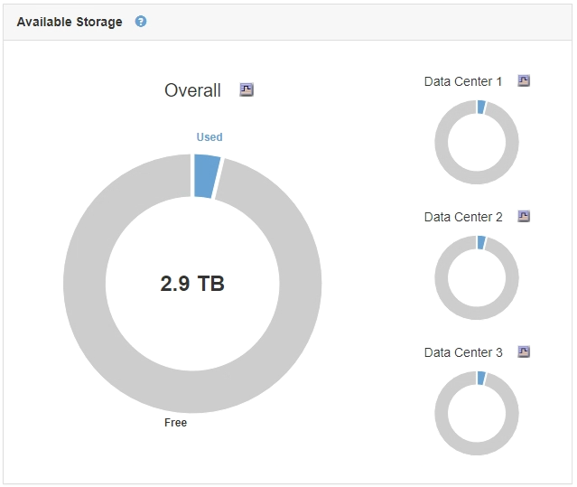
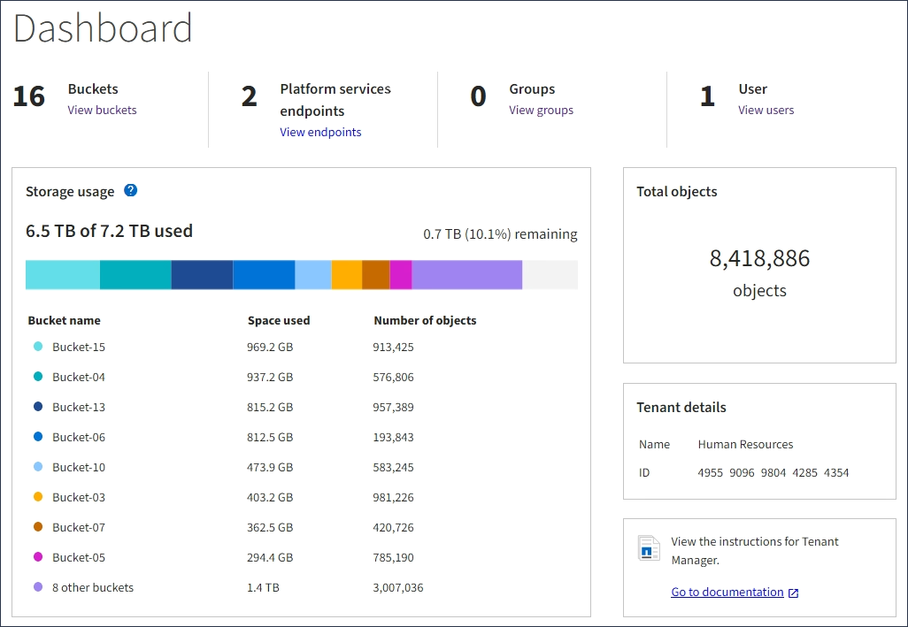
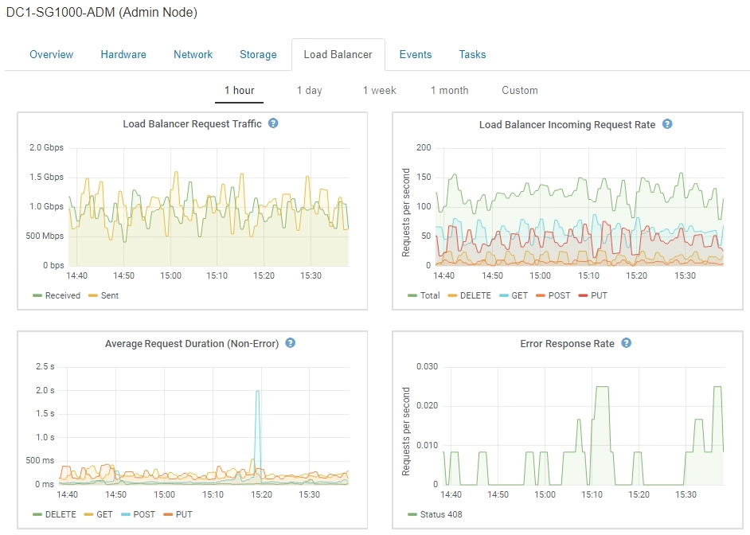
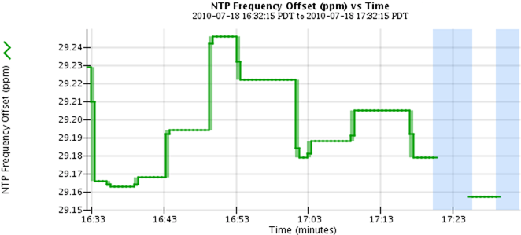
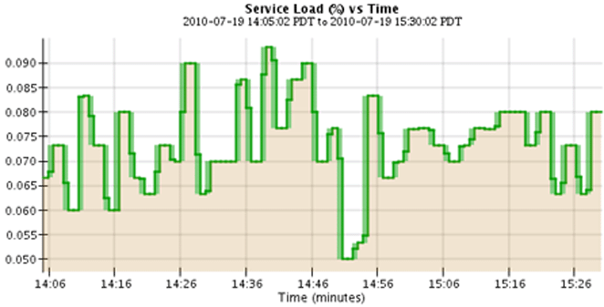
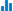
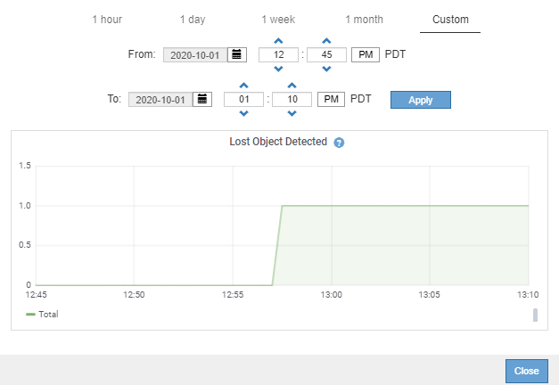
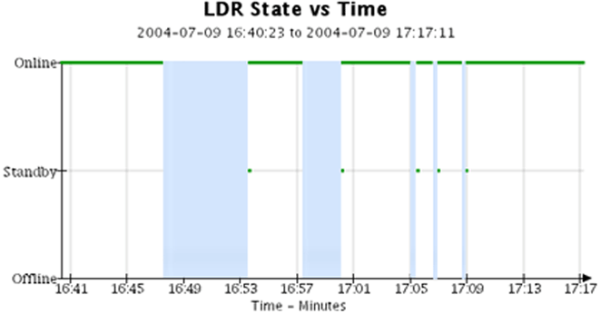

= Types of charts and graphs
:icons: font
:imagesdir: ../media/

[.lead]
Charts and graphs summarize the values of specific StorageGRID metrics and attributes.

The Grid Manager Dashboard includes pie (doughnut) charts to summarize available storage for the grid and each site.

The Storage usage panel on the Tenant Manager Dashboard displays the following:

* A list of the largest buckets (S3) or containers (Swift) for the tenant
* A bar chart that represents the relative sizes of the largest buckets or containers
* The total amount of space used and, if a quota is set, the amount and percentage of space remaining

In addition, graphs that show how StorageGRID metrics and attributes change over time are available from the Nodes page and from the *Support* > *Tools* > *Grid Topology* page.

There are four types of graphs:

* *Grafana charts*: Shown on the Nodes page, Grafana charts are used to plot the values of Prometheus metrics over time. For example, the *Nodes* > *Load Balancer* tab for an Admin Node includes four Grafana charts.
+

+
NOTE: Grafana charts are also included on the pre-constructed dashboards available from the *Support* > *Tools* > *Metrics* page.

* *Line graphs*: Available from the Nodes page and from the *Support* > *Tools* > *Grid Topology* page (click the chart icon  after a data value), line graphs are used to plot the values of StorageGRID attributes that have a unit value (such as NTP Frequency Offset, in ppm). The changes in the value are plotted in regular data intervals (bins) over time.
+

* *Area graphs*: Available from the Nodes page and from the *Support* > *Tools* > *Grid Topology* page (click the chart icon  after a data value), area graphs are used to plot volumetric attribute quantities, such as object counts or service load values. Area graphs are similar to line graphs, but include a light brown shading below the line. The changes in the value are plotted in regular data intervals (bins) over time.
+

* Some graphs are denoted with a different type of chart icon  and have a different format:
+

* *State graph*: Available from the *Support* > *Tools* > *Grid Topology* page (click the chart icon  after a data value), state graphs are used to plot attribute values that represent distinct states such as a service state that can be online, standby, or offline. State graphs are similar to line graphs, but the transition is discontinuous; that is, the value jumps from one state value to another.
+

.Related information

xref:viewing-nodes-page.adoc[Viewing the Nodes page]

xref:viewing-grid-topology-tree.adoc[Viewing the Grid Topology tree]

xref:reviewing-support-metrics.adoc[Reviewing support metrics]
