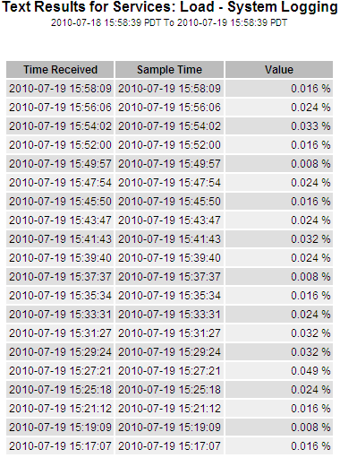
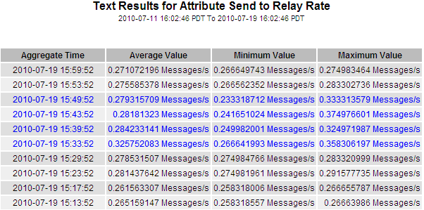

= Types of text reports
:icons: font
:imagesdir: ../media/

[.lead]
Text reports display a textual representation of attribute data values that have been processed by the NMS service. There are two types of reports generated depending on the time period you are reporting on: raw text reports for periods less than a week, and aggregate text reports for time periods greater than a week.

== Raw text reports

A raw text report displays details about the selected attribute:

* Time Received: Local date and time that a sample value of an attribute's data was processed by the NMS service.
* Sample Time: Local date and time that an attribute value was sampled or changed at the source.
* Value: Attribute value at sample time.

== Aggregate text reports

An aggregate text report displays data over a longer period of time (usually a week) than a raw text report. Each entry is the result of summarizing multiple attribute values (an aggregate of attribute values) by the NMS service over time into a single entry with average, maximum, and minimum values that are derived from the aggregation.

Each entry displays the following information:

* Aggregate Time: Last local date and time that the NMS service aggregated (collected) a set of changed attribute values.
* Average Value: The average of the attribute's value over the aggregated time period.
* Minimum Value: The minimum value over the aggregated time period.
* Maximum Value: The maximum value over the aggregated time period.

