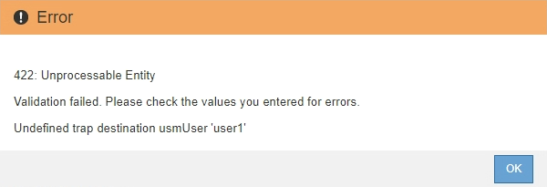

= Update the SNMP agent
:icons: font
:imagesdir: ../media/

[.lead]
You might want to disable SNMP notifications, update community strings, or add or remove agent addresses, USM users, and trap destinations.

.What you'll need
* You must be signed in to the Grid Manager using a xref:../admin/web-browser-requirements.adoc[supported web browser].
* You must have the Root Access permission.

.About this task
Whenever you update the xref:configuring-snmp-agent.adoc[SNMP agent configuration], be aware that you must click *Save* at the bottom on the SNMP Agent page to commit any changes you have made on each tab.

.Steps
. Select *CONFIGURATION* > *Monitoring* > *SNMP agent*.
+
The SNMP Agent page appears.

. If you want to disable the SNMP agent on all grid nodes, unselect the *Enable SNMP* check box, and click *Save*.
+
The SNMP agent is disabled for all grid nodes. If you later re-enable the agent, any previous SNMP configuration settings are retained.

. Optionally, update the values you entered for *System Contact* and *System Location*.
. Optionally, unselect the *Enable SNMP Agent Notifications* check box if you no longer want the StorageGRID SNMP agent to send trap and inform notifications.
+
When this check box is unselected, the SNMP agent supports read-only MIB access, but it does not send any SNMP notifications.

. Optionally, unselect the *Enable Authentication Traps* check box if you no longer want the StorageGRID SNMP agent to send an authentication trap when it receives an improperly authenticated protocol message.
. If you use SNMPv1 or SNMPv2c, optionally update the Community Strings section.
+
The fields in this section are used for community-based authentication in SNMPv1 or SNMPv2c. These fields do not apply to SNMPv3.
+
NOTE: If you want to remove the default community string, you must first ensure that all trap destinations use a custom community string.

. If you want to update agent addresses, select the Agent Addresses tab in the Other Configurations section.
+
image::../media/snmp_other_configurations_agent_addresses_table.png[SNMP Other Configurations Agent Addresses Table]
+
Use this tab to specify one or more "`listening addresses.`" These are the StorageGRID addresses on which the SNMP agent can receive queries. Each agent address includes an internet protocol, a transport protocol, a StorageGRID network, and a port.

 .. To add an agent address, click *Create*. Then, refer to the step for agent addresses in the instructions for configuring the SNMP agent.
 .. To edit an agent address, select the radio button for the address, and click *Edit*. Then, refer to the step for agent addresses in the instructions for configuring the SNMP agent.
 .. To remove an agent address, select the radio button for the address, and click *Remove*. Then, click *OK* to confirm that you want to remove this address.
 .. To commit your changes, click *Save* at the bottom of the SNMP Agent page.

. If you want to update USM users, select the USM Users tab in the Other Configurations section.
+
image::../media/snmp_other_config_usm_users_table.png[SNMP Other Config USM User Table]
+
Use this tab to define the USM users who are authorized to query the MIB or to receive traps and informs.

 .. To add a USM user, click *Create*. Then, refer to the step for USM users in the instructions for configuring the SNMP agent.
 .. To edit a USM user, select the radio button for the user, and click *Edit*. Then, refer to the step for USM users in the instructions for configuring the SNMP agent.
+
The username for an existing USM user cannot be changed. If you need to change a username, you must remove the user and create a new one.
+
NOTE: If you add or remove a user's authoritative engine ID and that user is currently selected for a destination, you must edit or remove the destination, as described in step <<SNMP_TRAP_DESTINATION,SNMP trap destination>>. Otherwise, a validation error occurs when you save the SNMP agent configuration.

 .. To remove a USM user, select the radio button for the user, and click *Remove*. Then, click *OK* to confirm that you want to remove this user.
+
NOTE: If the user you removed is currently selected for a trap destination, you must edit or remove the destination, as described in step <<SNMP_TRAP_DESTINATION,SNMP trap destination>>. Otherwise, a validation error occurs when you save the SNMP agent configuration.
+

 .. To commit your changes, click *Save* at the bottom of the SNMP Agent page.

. [[SNMP_TRAP_DESTINATION, start=9]]If you want to update trap destinations, select the Trap Destinations tab in the Other Configurations section.
+
image::../media/snmp_other_config_trap_dest_table.png[SNMP Other Configurations Trap Dest Table]
+
The Trap Destinations tab allows you to define one or more destinations for StorageGRID trap or inform notifications. When you enable the SNMP agent and click *Save*, StorageGRID starts sending notifications to each defined destination. Notifications are sent when alerts and alarms are triggered. Standard notifications are also sent for the supported MIB-II entities (for example, ifDown and coldStart).

 .. To add a trap destination, click *Create*. Then, refer to the step for trap destinations in the instructions for configuring the SNMP agent.
 .. To edit a trap destination, select the radio button for the user, and click *Edit*. Then, refer to the step for trap destinations in the instructions for configuring the SNMP agent.
 .. To remove a trap destination, select the radio button for the destination, and click *Remove*. Then, click *OK* to confirm that you want to remove this destination.
 .. To commit your changes, click *Save* at the bottom of the SNMP Agent page.

. When you have updated the SNMP agent configuration, click *Save*.
