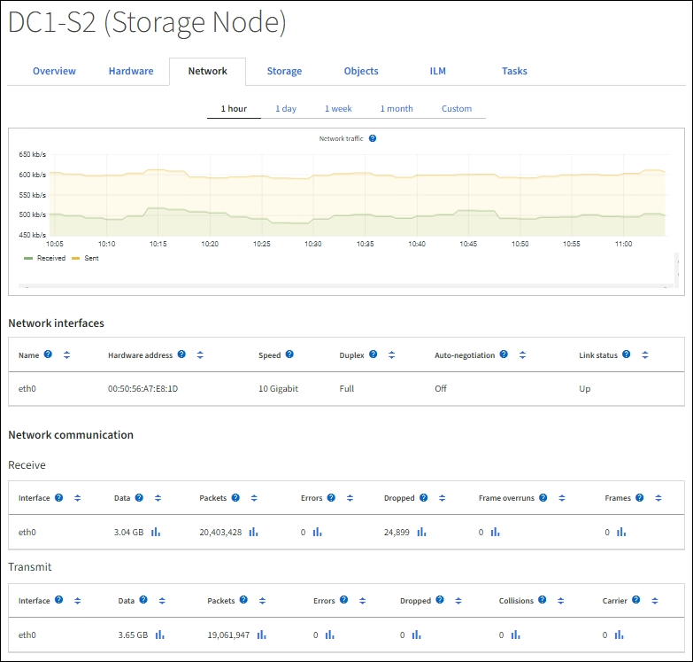
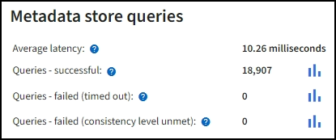
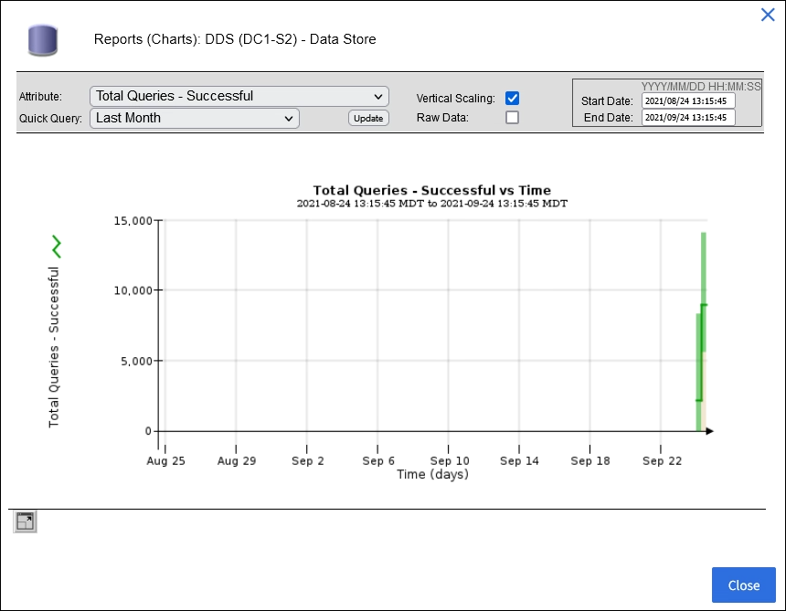
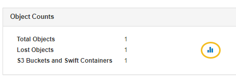
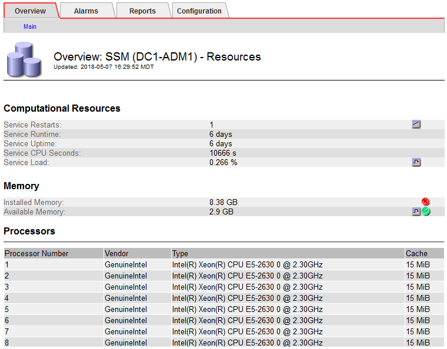

= Use charts and graphs
:icons: font
:imagesdir: ../media/

[.lead]
You can use charts and reports to monitor the state of the StorageGRID system and troubleshoot problems. The types of charts and reports available in the Grid Manager include donut charts (on the Dashboard only), graphs, and text reports.

== Types of charts

Charts and graphs summarize the values of specific StorageGRID metrics and attributes.

The Grid Manager Dashboard includes donut charts to summarize available storage for the grid and each site.

image::../media/dashboard_available_storage_panel.png[Dashboard Available Storage Panel]

The Storage usage panel on the Tenant Manager Dashboard displays the following:

* A list of the largest buckets (S3) or containers (Swift) for the tenant
* A bar chart that represents the relative sizes of the largest buckets or containers
* The total amount of space used and, if a quota is set, the amount and percentage of space remaining

image::../media/tenant_dashboard_with_buckets.png[Tenant Dashboard]

In addition, graphs that show how StorageGRID metrics and attributes change over time are available from the Nodes page and from the *SUPPORT* > *Tools* > *Grid topology* page.

There are four types of graphs:

* *Grafana charts*: Shown on the Nodes page, Grafana charts are used to plot the values of Prometheus metrics over time. For example, the *NODES* > *Network* tab for a Storage Node includes a Grafana chart for network traffic.
+

+
NOTE: Grafana charts are also included on the pre-constructed dashboards available from the *SUPPORT* > *Tools* > *Metrics* page.

* *Line graphs*: Available from the Nodes page and from the *SUPPORT* > *Tools* > *Grid topology* page (select the chart icon image:../media/icon_chart_new_for_11_5.png[Icon Chart (New)] after a data value), line graphs are used to plot the values of StorageGRID attributes that have a unit value (such as NTP Frequency Offset, in ppm). The changes in the value are plotted in regular data intervals (bins) over time.
+
image::../media/line_graph.gif[Line Graph]

* *Area graphs*: Available from the Nodes page and from the *SUPPORT* > *Tools* > *Grid topology* page (select the chart icon image:../media/icon_chart_new_for_11_5.png[Icon Chart (New)] after a data value), area graphs are used to plot volumetric attribute quantities, such as object counts or service load values. Area graphs are similar to line graphs, but include a light brown shading below the line. The changes in the value are plotted in regular data intervals (bins) over time.
+
image::../media/area_graph.gif[Area Graph]

* Some graphs are denoted with a different type of chart icon image:../media/icon_chart_new_for_11_5.png[Chart Icon] and have a different format:
+
image::../media/charts_lost_object_detected.png[Charts Lost Object Detected]

* *State graph*: Available from the *SUPPORT* > *Tools* > *Grid topology* page (select the chart icon image:../media/icon_chart_new_for_11_5.png[Icon Chart (New)] after a data value), state graphs are used to plot attribute values that represent distinct states such as a service state that can be online, standby, or offline. State graphs are similar to line graphs, but the transition is discontinuous; that is, the value jumps from one state value to another.
+
image::../media/state_graph.gif[State Graph]

.Related information

xref:viewing-nodes-page.adoc[View the Nodes page]

xref:viewing-grid-topology-tree.adoc[View the Grid Topology tree]

xref:reviewing-support-metrics.adoc[Review support metrics]

== Chart legend

The lines and colors used to draw charts have specific meaning.

[cols="1a,3a" options="header"]
|===
| Sample| Meaning
|image:../media/dark_green_chart_line.gif[screenshot showing dark green line]
|Reported attribute values are plotted using dark green lines.

|image:../media/light_green_chart_line.gif[screenshot showing shading that indicates data binning]
|Light green shading around dark green lines indicates that the actual values in that time range vary and have been "`binned`" for faster plotting. The dark line represents the weighted average. The range in light green indicates the maximum and minimum values within the bin. Light brown shading is used for area graphs to indicate volumetric data.

|image:../media/no_data_plotted_chart.gif[screenshot showing blank areas on plot line]
|Blank areas (no data plotted) indicate that the attribute values were unavailable. The background can be blue, gray, or a mixture of gray and blue, depending on the state of the service reporting the attribute.

|image:../media/light_blue_chart_shading.gif[screenshot showing light blue shading indicating indeterminate values]
|Light blue shading indicates that some or all of the attribute values at that time were indeterminate; the attribute was not reporting values because the service was in an unknown state.

|image:../media/gray_chart_shading.gif[screenshot showing gray shading due to unknown values]
|Gray shading indicates that some or all of the attribute values at that time were not known because the service reporting the attributes was administratively down.

|image:../media/gray_blue_chart_shading.gif[screenshot showing mix of indeterminate and unknown values]
|A mixture of gray and blue shading indicates that some of the attribute values at the time were indeterminate (because the service was in an unknown state), while others were not known because the service reporting the attributes was administratively down.
|===

== Display charts and graphs

The Nodes page contains the charts and graphs you should access regularly to monitor attributes such as storage capacity and throughput. In some cases, especially when working with technical support, you can use the *SUPPORT* > *Tools* > *Grid topology* page to access additional charts.

.What you'll need
You must be signed in to the Grid Manager using a xref:../admin/web-browser-requirements.adoc[supported web browser].

.Steps
. Select *NODES*. Then, select a node, a site, or the entire grid.
. Select the tab for which you want to view information.
+
Some tabs include one or more Grafana charts, which are used to plot the values of Prometheus metrics over time. For example, the *NODES* > *Hardware* tab for a node includes two Grafana charts.
+
image::../media/nodes_page_hardware_tab_graphs.png[Nodes Page Hardware Tab Graphs]

. Optionally, hover your cursor over the chart to see more detailed values for a particular point in time.
+
image::../media/nodes_page_memory_usage_details.png[Nodes Page Memory Usage Details]

. As required, you can often display a chart for a specific attribute or metric. From the table on the Nodes page, select the chart icon image:../media/icon_chart_new_for_11_5.png[Chart Icon] to the right of the attribute name.
+
NOTE: Charts are not available for all metrics and attributes.
+
*Example 1*: From the Objects tab for a Storage Node, you can select the chart icon image:../media/icon_chart_new_for_11_5.png[Chart Icon] to see the total number of successful metadata store queries for the Storage Node.
+

+

+
*Example 2*: From the Objects tab for a Storage Node, you can select the chart icon image:../media/icon_chart_new_for_11_5.png[Chart Icon] to see the Grafana graph of the count of lost objects detected over time.
+

+
image::../media/charts_lost_object_detected.png[Charts Lost Object Detected]

. To display charts for attributes that are not shown on the Node page, select *SUPPORT* > *Tools* > *Grid topology*.
. Select *_grid node_* > *_component or service_* > *Overview* > *Main*.
+

. Select the chart icon image:../media/icon_chart_new_for_11_5.png[Chart Icon] next to the attribute.
+
The display automatically changes to the *Reports* > *Charts* page. The chart displays the attribute's data over the past day.

== Generate charts

Charts display a graphical representation of attribute data values. You can report on a data center site, grid node, component, or service.

.What you'll need
* You must be signed in to the Grid Manager using a xref:../admin/web-browser-requirements.adoc[supported web browser].
* You must have specific access permissions.

.Steps
. Select *SUPPORT* > *Tools* > *Grid topology*.
. Select *_grid node_* > *_component or service_* > *Reports* > *Charts*.
. Select the attribute to report on from the *Attribute* drop-down list.
. To force the Y-axis to start at zero, deselect the *Vertical Scaling* check box.
. To show values at full precision, select the *Raw Data* check box, or to round values to a maximum of three decimal places (for example, for attributes reported as percentages), deselect the *Raw Data* check box.
. Select the time period to report on from the *Quick Query* drop-down list.
+
Select the Custom Query option to select a specific time range.
+
The chart appears after a few moments. Allow several minutes for tabulation of long time ranges.

. If you selected Custom Query, customize the time period for the chart by entering the *Start Date* and *End Date*.
+
Use the format `_YYYY/MM/DDHH:MM:SS_` in local time. Leading zeros are required to match the format. For example, 2017/4/6 7:30:00 fails validation. The correct format is: 2017/04/06 07:30:00.

. Select *Update*.
+
A chart is generated after a few seconds. Allow several minutes for tabulation of long time ranges. Depending on the length of time set for the query, either a raw text report or aggregate text report is displayed.
