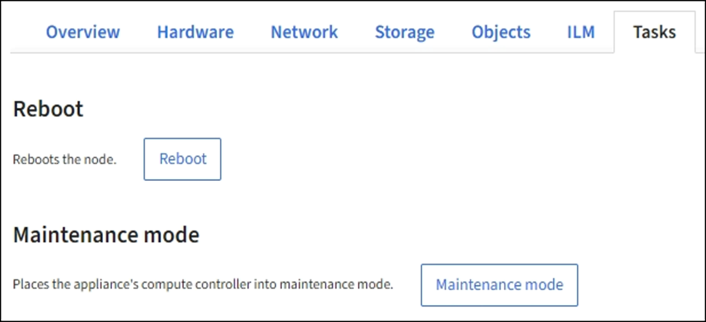

= Using the Task tab to reboot a grid node
:icons: font
:imagesdir: ../media/

[.lead]
The Task tab allows you to reboot the selected node. The Task tab is shown for all nodes.

.What you'll need
* You must be signed in to the Grid Manager using a xref:../admin/web-browser-requirements.adoc[supported web browser].
* You must have the Maintenance or Root Access permission.
* You must have the provisioning passphrase.

.About this task
You can use the Task tab to reboot a node. For appliance nodes, you can also use the Task tab to place the appliance into maintenance mode.

* Rebooting a grid node from the Task tab issues the reboot command on the target node. When you reboot a node, the node shuts down and restarts. All services are restarted automatically.
+
If you plan to reboot a Storage Node, note the following:

 ** If an ILM rule specifies an ingest behavior of Dual commit or the rule specifies Balanced and it is not possible to immediately create all required copies, StorageGRID immediately commits any newly ingested objects to two Storage Nodes on the same site and evaluates ILM later. If you want to reboot two or more Storage Nodes on a given site, you might not be able to access these objects for the duration of the reboot.
 ** To ensure you can access all objects while a Storage Node is rebooting, stop ingesting objects at a site for approximately one hour before rebooting the node.

* You might need to put a StorageGRID appliance into maintenance mode to perform certain procedures, such as changing the link configuration or replacing a storage controller. For instructions, see the hardware installation and maintenance instructions for the appliance.
+
NOTE: Putting an appliance into maintenance mode might make the appliance unavailable for remote access.

.Steps
. Select *Nodes*.
. Select the grid node you want to reboot.
. Select the *Tasks* tab.
+
image::../media/nodes_tasks_reboot.png[Nodes > Tasks > Reboot button]

. Click *Reboot*.
+
A confirmation dialog box appears.
+
image::../media/reboot_node_confirmation.gif[Confirmation dialog for Reboot grid node]
+
NOTE: If you are rebooting the primary Admin Node, the confirmation dialog box reminds you that your browser's connection to the Grid Manager will be lost temporarily when services are stopped.

. Enter the provisioning passphrase, and click *OK*.
. Wait for the node to reboot.
+
It might take some time for services to shut down.
+
When the node is rebooting, the gray icon (Administratively Down) appears on the left side of the Nodes page. When all services have started again, the icon changes back to its original color.

.Related information

xref:../sg6000/index.adoc[SG6000 storage appliances]

xref:../sg5700/index.adoc[SG5700 storage appliances]

xref:../sg5600/index.adoc[SG5600 storage appliances]

xref:../sg100-1000/index.adoc[SG100 & SG1000 services appliances]
