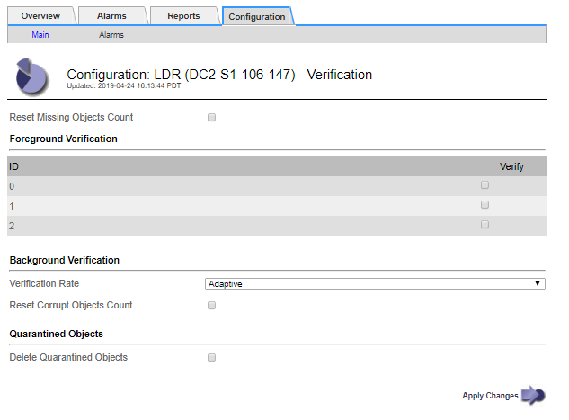
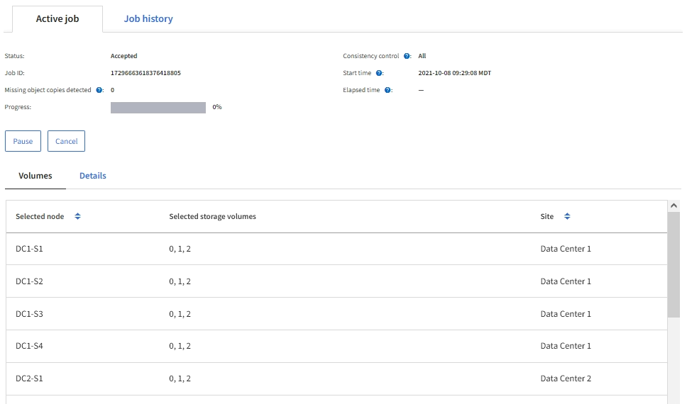
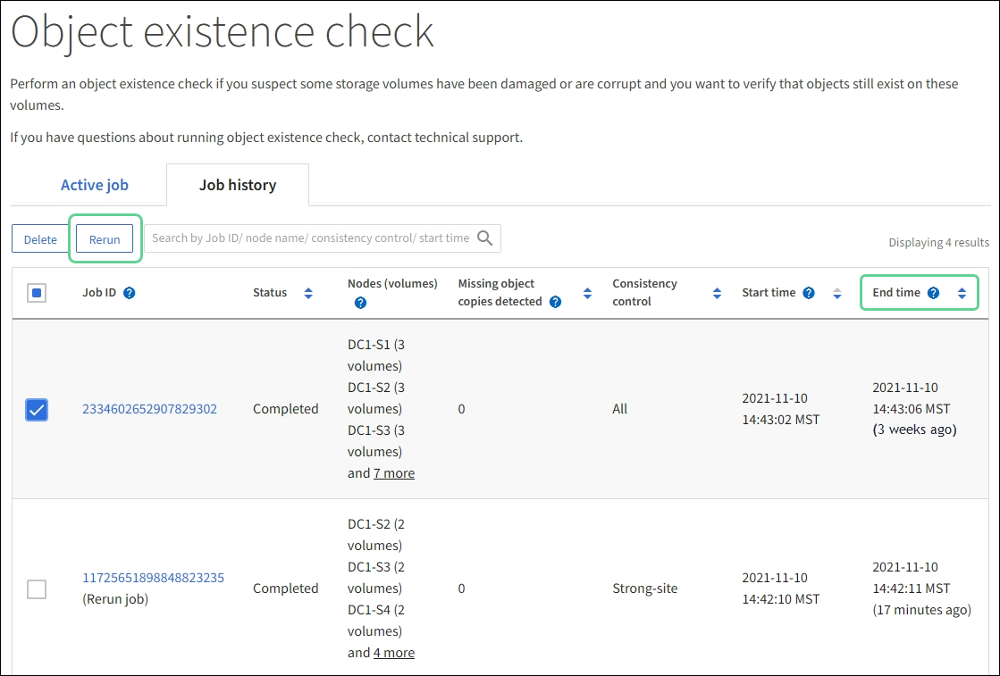

= Verify object integrity
:icons: font
:imagesdir: ../media/

[.lead]
The StorageGRID system verifies the integrity of object data on Storage Nodes, checking for both corrupt and missing objects.

There are two verification processes: background verification and object existence check (formerly called foreground verification). They work together to ensure data integrity. Background verification runs automatically, and continuously checks the correctness of object data. Object existence check can be triggered by a user to more quickly verify the existence (although not the correctness) of objects.

== What is background verification?

The background verification process automatically and continuously checks Storage Nodes for corrupt copies of object data, and automatically attempts to repair any issues that it finds.

Background verification checks the integrity of replicated objects and erasure-coded objects, as follows:

* *Replicated objects*: If the background verification process finds a replicated object that is corrupt, the corrupt copy is removed from its location and quarantined elsewhere on the Storage Node. Then, a new uncorrupted copy is generated and placed to satisfy the active ILM policy. The new copy might not be placed on the Storage Node that was used for the original copy.

NOTE: Corrupt object data is quarantined rather than deleted from the system, so that it can still be accessed. For more information on accessing quarantined object data, contact technical support.

* *Erasure-coded objects*: If the background verification process detects that a fragment of an erasure-coded object is corrupt, StorageGRID automatically attempts to rebuild the missing fragment in place on the same Storage Node, using the remaining data and parity fragments. If the corrupted fragment cannot be rebuilt, an attempt is made to retrieve another copy of the object. If retrieval is successful, an ILM evaluation is performed to create a replacement copy of the erasure-coded object.
+
The background verification process checks objects on Storage Nodes only. It does not check objects on Archive Nodes or in a Cloud Storage Pool. Objects must be older than four days to qualify for background verification.

Background verification runs at a continuous rate that is designed not to interfere with ordinary system activities. Background verification cannot be stopped. However you can increase the background verification rate to more quickly verify the contents of a Storage Node if you suspect a problem.

=== Alerts and alarms (legacy) related to background verification

If the system detects a corrupt object that it cannot correct automatically (because the corruption prevents the object from being identified), the *Unidentified corrupt object detected* alert is triggered.

If background verification cannot replace a corrupted object because it cannot locate another copy, the *Objects lost* alert is triggered.

=== Change the background verification rate

You can change the rate at which background verification checks replicated object data on a Storage Node if you have concerns about data integrity.

.What you'll need
* You must be signed in to the Grid Manager using a xref:../admin/web-browser-requirements.adoc[supported web browser].
* You must have specific access permissions.

.About this task
You can change the Verification Rate for background verification on a Storage Node:

* Adaptive: Default setting. The task is designed to verify at a maximum of 4 MB/s or 10 objects/s (whichever is exceeded first).
* High: Storage verification proceeds quickly, at a rate that can slow ordinary system activities.

Use the High verification rate only when you suspect that a hardware or software fault might have corrupted object data. After the High priority background verification completes, the Verification Rate automatically resets to Adaptive.

.Steps
. Select *SUPPORT* > *Tools* > *Grid topology*.
. Select *_Storage Node_* > *LDR* > *Verification*.
. Select *Configuration* > *Main*.
. Go to *LDR* > *Verification* > *Configuration* > *Main*.
. Under Background Verification, select *Verification Rate* > *High* or *Verification Rate* > *Adaptive*.
+

+
NOTE: Setting the Verification Rate to High triggers the VPRI (Verification Rate) legacy alarm at the Notice level.
+

. Click *Apply Changes*.
. Monitor the results of background verification for replicated objects.
 .. Go to *NODES* > *_Storage Node_* > *Objects*.
 .. In the Verification section, monitor the values for *Corrupt Objects* and *Corrupt Objects Unidentified*.
+
If background verification finds corrupt replicated object data, the *Corrupt Objects* metric is incremented, and StorageGRID attempts to extract the object identifier from the data, as follows:

  *** If the object identifier can be extracted, StorageGRID automatically creates a new copy of the object data. The new copy can be made anywhere in the StorageGRID system that satisfies the active ILM policy.
  *** If the object identifier cannot be extracted (because it has been corrupted), the *Corrupt Objects Unidentified* metric is incremented, and the *Unidentified corrupt object detected* alert is triggered.

 .. If corrupt replicated object data is found, contact technical support to determine the root cause of the corruption.
. Monitor the results of background verification for erasure-coded objects.
+
If background verification finds corrupt fragments of erasure-coded object data, the Corrupt Fragments Detected attribute is incremented. StorageGRID recovers by rebuilding the corrupt fragment in place on the same Storage Node.

 .. Select *SUPPORT* > *Tools* > *Grid topology*.
 .. Select *_Storage Node_* > *LDR* > *Erasure Coding*.
 .. In the Verification Results table, monitor the Corrupt Fragments Detected (ECCD) attribute.

. After corrupt objects have been automatically restored by the StorageGRID system, reset the count of corrupt objects.
 .. Select *SUPPORT* > *Tools* > *Grid topology*.
 .. Select *_Storage Node_* > *LDR* > *Verification* > *Configuration*.
 .. Select *Reset Corrupt Object Count*.
 .. Click *Apply Changes*.
. If you are confident that quarantined objects are not required, you can delete them.
+
NOTE: If the *Objects lost* alert or the LOST (Lost Objects) legacy alarm was triggered, technical support might want to access quarantined objects to help debug the underlying issue or to attempt data recovery.

 .. Select *SUPPORT* > *Tools* > *Grid topology*.
 .. Select *_Storage Node_* > *LDR* > *Verification* > *Configuration*.
 .. Select *Delete Quarantined Objects*.
 .. Select *Apply Changes*.

== What is object existence check?

Object existence check verifies whether all expected replicated copies of objects and erasure-coded fragments exist on a Storage Node. Object existence check does not verify the object data itself (background verification does that); instead, it provides a way to verify the integrity of storage devices, especially if a recent hardware issue could have affected data integrity.

Unlike background verification, which occurs automatically, you must manually start an object existence check job.

Object existence check reads the metadata for every object stored in StorageGRID and verifies the existence of both replicated object copies and erasure-coded object fragments. Any missing data is handled as follows:

* *Replicated copies*: If a copy of replicated object data is missing, StorageGRID automatically attempts to replace the copy from a copy stored elsewhere in the system. The Storage Node runs an existing copy through an ILM evaluation, which will determine that the current ILM policy is no longer being met for this object because another copy is missing. A new copy is generated and placed to satisfy the system’s active ILM policy. This new copy might not be placed in the same location where the missing copy was stored.
* *Erasure-coded fragments*: If a fragment of an erasure-coded object is missing, StorageGRID automatically attempts to rebuild the missing fragment in place on the same Storage Node using the remaining fragments. If the missing fragment cannot be rebuilt (because too many fragments have been lost), ILM attempts to find another copy of the object, which it can use to generate a new erasure-coded fragment.

=== Run object existence check

You create and run one object existence check job at a time. When you create a job, you select the  Storage Nodes and volumes you want to verify. You also select the consistency control for the job.

.What you'll need

* You are signed in to the Grid Manager using a xref:../admin/web-browser-requirements.adoc[supported web browser].
* You have the Maintenance or Root Access permission.
* You have ensured that the Storage Nodes you want to check are online. Select *NODES* to view the table of nodes. Ensure that no alert icons appear next to the node name for the nodes you want to check.
* You have ensured that the following procedures are *not* running on the nodes you want to check:
 ** Grid expansion to add a Storage Node
 ** Storage Node decommission
 ** Recovery of a failed storage volume
 ** Recovery of a Storage Node with a failed system drive
 ** EC rebalance
 ** Appliance node clone

Object existence check does not provide useful information while these procedures are in progress.

.About this task

An object existence check job can take days or weeks to complete, depending on the number of objects in the grid, the selected storage nodes and volumes, and the selected consistency control. You can run only one job at a time, but you can select multiple Storage Nodes and volumes at the same time.

.Steps

. Select *MAINTENANCE* > *Tasks* > *Object existence check*.

. Select *Create job*. The Create an object existence check job wizard appears.
.	Select the nodes containing the volumes you want to verify. To select all online nodes, select the *Node name* check box in the column header.
+
You can search by node name or site.
+
You cannot select nodes that are not connected to the grid.
.	Select *Continue*.
. Select one or more volumes for each node in the list. You can search for volumes using the storage volume number or node name.
+
To select all volumes for each node you selected, select the *Storage volume* check box in the column header.
.	Select *Continue*.
.	Select the consistency control for the job.
+
The consistency control determines how many copies of object metadata are used for the object existence check.
+
* *Strong-site*: Two copies of metadata at a single site.
* *Strong-global*: Two copies of metadata at each site.
* *All* (default): All three copies of metadata at each site.
+
For more information about consistency control, see the descriptions in the wizard.
+
. Select *Continue*.
.	Review and verify your selections. You can select *Previous* to go to a previous step in the wizard to update your selections.
+
An Object existence check job is generated and runs until one of the following occurs:
+
* The job completes.
* You pause or cancel the job. You can resume a job that you have paused, but you cannot resume a job that you have canceled.
* The job stalls. The *Object existence check has stalled* alert is triggered. Follow the corrective actions specified for the alert.
* The job fails. The *Object existence check has failed* alert is triggered. Follow the corrective actions specified for the alert.
* A "`Service unavailable`" or an "`Internal server error`" message appears. After one minute, refresh the page to continue monitoring the job.

+
NOTE: As needed, you can navigate away from the Object existence check page and return to continue monitoring the job.

+
. As the job runs, view the *Active job* tab and note the value of Missing object copies detected.
+
This value represents the total number of missing copies of replicated objects and erasure-coded objects with one or more missing fragments.
+
If the number of Missing object copies detected is greater than 100, there might be an issue with the Storage Node’s storage.

+

.	After the job has completed, take any additional required actions:
*	If Missing object copies detected is zero, then no issues were found. No action is required.
*	If Missing object copies detected is greater than zero and the *Objects lost* alert has not been triggered, then all missing copies were repaired by the system. Verify that any hardware issues have been corrected to prevent future damage to object copies.
* If Missing object copies detected is greater than zero and the *Objects lost* alert has been triggered, then data integrity could be affected. Contact technical support.
* You can investigate lost object copies by using grep to extract the LLST audit messages: `grep LLST audit_file_name`.
+
This procedure is similar to the one for xref:investigating-lost-objects.adoc[investigating lost objects], although for object copies you search for `LLST` instead of `OLST`.

.	If you selected the strong-site or strong-global consistency control for the job, wait approximately three weeks for metadata consistency and then rerun the job on the same volumes again.
+
When StorageGRID has had time to achieve metadata consistency for the nodes and volumes included in the job, rerunning the job could clear erroneously reported missing object copies or cause additional object copies to be checked if they were missed.
+
.. Select *MAINTENANCE* > *Object existence check* > *Job history*.
.. Determine which jobs are ready to be rerun:
... Look at the *End time* column to determine which jobs were run more than three weeks ago.
... For those jobs, scan the Consistency control column for strong-site or strong-global.
.. Select the check box for each job you want to rerun, then select *Rerun*.
+

+
.. In the Rerun jobs wizard, review the selected nodes and volumes and the consistency control.
.. When you are ready to rerun the jobs, select *Rerun*.

The Active job tab appears. All the jobs you selected are rerun as one job at a consistency control of strong-site. A *Related jobs* field in the Details section lists the job IDs for the original jobs.

.After you finish

If you still have concerns about data integrity, go to *SUPPORT* > *Tools* > *Grid topology* > *_site_* > *_Storage Node_* > *LDR* > *Verification* > *Configuration* > *Main* and increase the Background Verification Rate. Background verification checks the correctness of all stored object data and repairs any issues that it finds. Finding and repairing potential issues as quickly as possible reduces the risk of data loss.
