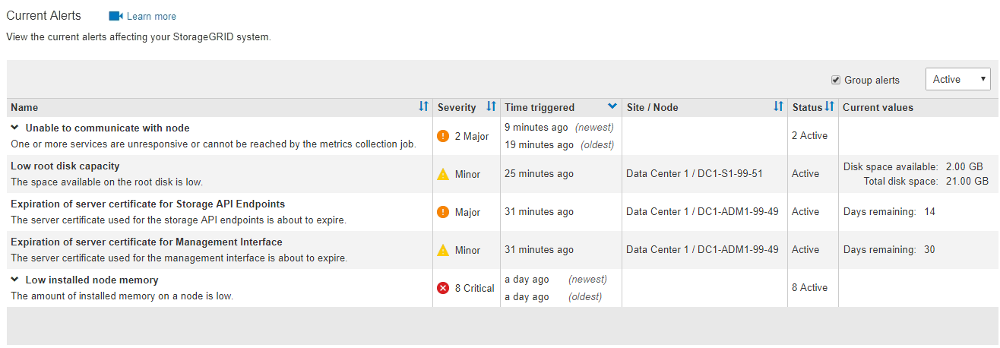
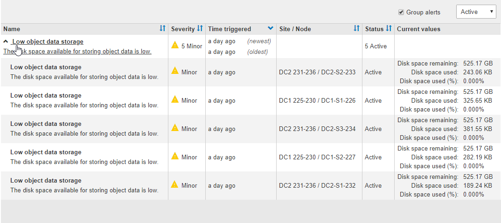
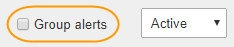
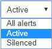

= View current alerts
:icons: font
:imagesdir: ../media/

[.lead]
When an alert is triggered, an alert icon is displayed on the Dashboard. An alert icon is also displayed for the node on the Nodes page. An email notification might also be sent, unless the alert has been silenced.

.What you'll need
* You must be signed in to the Grid Manager using a xref:../admin/web-browser-requirements.adoc[supported web browser].
* Optionally, you have watched the video: https://netapp.hosted.panopto.com/Panopto/Pages/Viewer.aspx?id=2680a74f-070c-41c2-bcd3-acc5013c9cdd[Video: Overview of Alerts^].
+
image::../media/video-screenshot-alert-overview.png[link="https://netapp.hosted.panopto.com/Panopto/Pages/Viewer.aspx?id=2680a74f-070c-41c2-bcd3-acc5013c9cdd" alt="Video: Overview of Alerts", window=_blank]

.Steps
. If one or more alerts are active, do either of the following:

* From the Health panel on the Dashboard, click the alert icon or click *Current alerts*. (An alert icon and the *Current alerts* link appear only if at least one alert is currently active.)
* Select *ALERTS* > *Current*.
+
The Current Alerts page appears. It lists all alerts currently affecting your StorageGRID system.
+

+
By default, alerts are shown as follows:

* The most recently triggered alerts are shown first.
* Multiple alerts of the same type are shown as a group.
* Alerts that have been silenced are not shown.
* For a specific alert on a specific node, if the thresholds are reached for more than one severity, only the most severe alert is shown. That is, if alert thresholds are reached for the minor, major, and critical severities, only the critical alert is shown.

+
The Current Alerts page is refreshed every two minutes.

. Review the information in the table.
+
[cols="1a,3a" options="header"]
|===
| Column header| Description
a|
Name
a|
The name of the alert and its description.
a|
Severity
a|
The severity of the alert. If multiple alerts are grouped, the title row shows how many instances of that alert are occurring at each severity.

 ** *Critical* image:../media/icon_alert_red_critical.png[Icon Alert Red Critical]: An abnormal condition exists that has stopped the normal operations of a StorageGRID node or service. You must address the underlying issue immediately. Service disruption and loss of data might result if the issue is not resolved.
 ** *Major* : An abnormal condition exists that is either affecting current operations or approaching the threshold for a critical alert. You should investigate major alerts and address any underlying issues to ensure that the abnormal condition does not stop the normal operation of a StorageGRID node or service.
 ** *Minor* image:../media/icon_alert_yellow_minor.png[Icon Alert Yellow Minor]: The system is operating normally, but an abnormal condition exists that could affect the system's ability to operate if it continues. You should monitor and resolve minor alerts that do not clear on their own to ensure they do not result in a more serious problem.

a|
Time triggered
a|
How long ago the alert was triggered. If multiple alerts are grouped, the title row shows times for the most recent instance of the alert (_newest_) and the oldest instance of the alert (_oldest_).
a|
Site/Node
a|
The name of the site and node where the alert is occurring. If multiple alerts are grouped, the site and node names are not shown in the title row.
a|
Status
a|
Whether the alert is active or has been silenced. If multiple alerts are grouped and *All alerts* is selected in the drop-down, the title row shows how many instances of that alert are active and how many instances have been silenced.
a|
Current values
a|
The current value of the metric that caused the alert to be triggered. For some alerts, additional values are shown to help you understand and investigate the alert. For example, the values shown for a *Low object data storage* alert include the percentage of disk space used, the total amount of disk space, and the amount of disk space used.

*Note:* If multiple alerts are grouped, current values are not shown in the title row.
|===

. To expand and collapse groups of alerts:
 ** To show the individual alerts in a group, click the down caret  in the heading, or click the group's name.
 ** To hide the individual alerts in a group, click the up caret  in the heading, or click the group's name.
+

. To display individual alerts instead of groups of alerts, unselect the *Group alerts* check box at the top of the table.
+

. To sort alerts or alert groups, click the up/down arrows  in each column header.
 ** When *Group alerts* is selected, both the alert groups and the individual alerts within each group are sorted. For example, you might want to sort the alerts in a group by *Time triggered* to find the most recent instance of a specific alert.
 ** When *Group alerts* is unselected, the entire list of alerts is sorted. For example, you might want to sort all alerts by *Node/Site* to see all alerts affecting a specific node.
. To filter the alerts by status, use the drop-down menu at the top of the table.
+

 ** Select *All alerts* to view all current alerts (both active and silenced alerts).
 ** Select *Active* to view only the current alerts that are active.
 ** Select *Silenced* to view only the current alerts that have been silenced. See xref:silencing-alert-notifications.adoc[Silence alert notifications].

. To view details for a specific alert, select the alert from the table.
+
A dialog box for the alert appears. See xref:viewing-specific-alert.adoc[View a specific alert].
