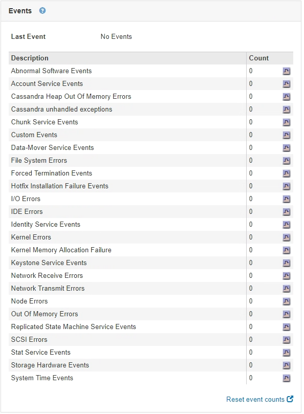

= Viewing the Events tab
:icons: font
:imagesdir: ../media/

[.lead]
The Events tab displays a count of any system error or fault events for a node, including errors such as network errors.

The Events tab is shown for all nodes.

If you experience issues with a particular node, you can use the Events tab to learn more about the issue. Technical support can also use the information on the Events tab to help with troubleshooting.

You can perform these tasks from the Events tab:

* Use the information shown for the *Last Event* field at the top of the table to determine which event occurred most recently.
* Click the chart icon image:../media/icon_chart_new.gif[Chart Icon] for a specific event to see when that event occurred over time.
* Reset event counts to zero after resolving any issues.

.Related information

xref:monitoring-events.adoc[Monitoring events]

xref:displaying-charts-and-graphs.adoc[Displaying charts and graphs]

xref:resetting-event-counts.adoc[Resetting event counts]
