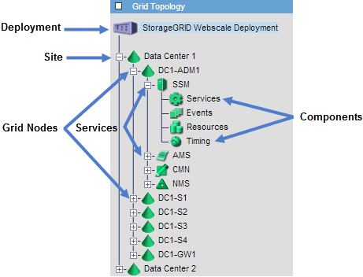

= Viewing the Grid Topology tree
:icons: font
:imagesdir: ../media/

[.lead]
The Grid Topology tree provides access to detailed information about StorageGRID system elements, including sites, grid nodes, services, and components. In most cases, you only need to access the Grid Topology tree when instructed in the documentation or when working with technical support.

To access the Grid Topology tree, select *Support* > *Tools* > *Grid Topology*.

To expand or collapse the Grid Topology tree, click  or  at the site, node, or service level. To expand or collapse all items in the entire site or in each node, hold down the *<Ctrl>* key and click.
