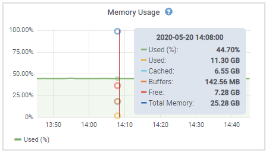

= Viewing the Hardware tab
:icons: font
:imagesdir: ../media/

[.lead]
The Hardware tab displays CPU utilization and memory usage for each node, and additional hardware information about appliances.

The Hardware tab is shown for all nodes.

image::../media/nodes_page_hardware_tab_graphs.png[Nodes page Hardware tab]

To display a different time interval, select one of the controls above the chart or graph. You can display the information available for intervals of 1 hour, 1 day, 1 week, or 1 month. You can also set a custom interval, which allows you to specify date and time ranges.

To see details for CPU utilization and memory usage, hover your cursor over each graph.

If the node is an appliance node, this tab also includes a section with more information about the appliance hardware.

.Related information

xref:viewing-information-about-appliance-storage-nodes.adoc[Viewing information about appliance Storage Nodes]

xref:viewing-information-about-appliance-admin-nodes-and-gateway-nodes.adoc[Viewing information about appliance Admin Nodes and Gateway Nodes]
