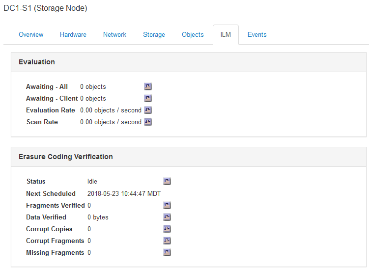

= Viewing the ILM tab
:icons: font
:imagesdir: ../media/

[.lead]
The ILM tab provides information about Information Lifecycle Management (ILM) operations.

The ILM tab is shown for each Storage Node, each site, and the entire grid. For each site and the grid, the ILM tab shows a graph of the ILM queue over time. For the grid, this tab also provides the estimated time to complete a full ILM scan of all objects.

For Storage Nodes, the ILM tab provides details about ILM evaluation and background verification for erasure coded objects.

.Related information

xref:monitoring-information-lifecycle-management.adoc[Monitoring information lifecycle management]

xref:../admin/index.adoc[Administer StorageGRID]
