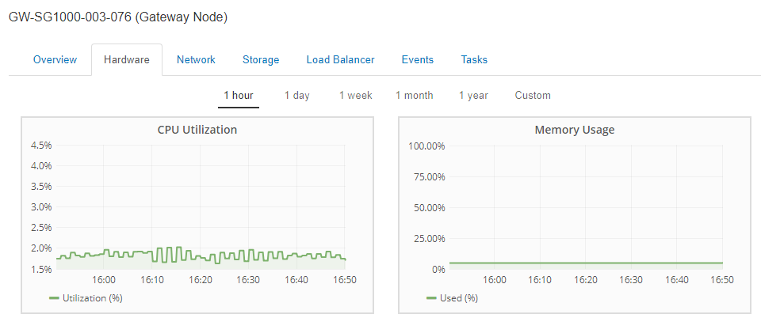
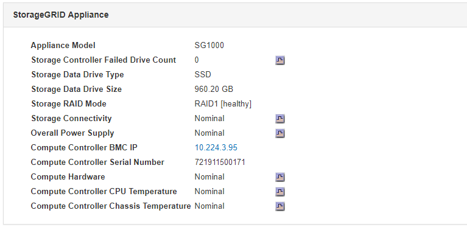
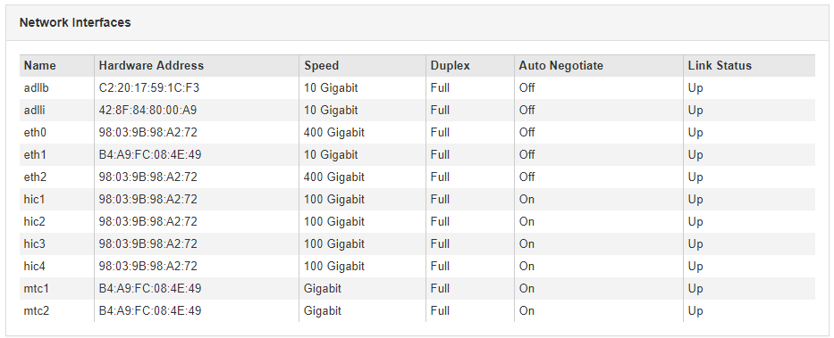
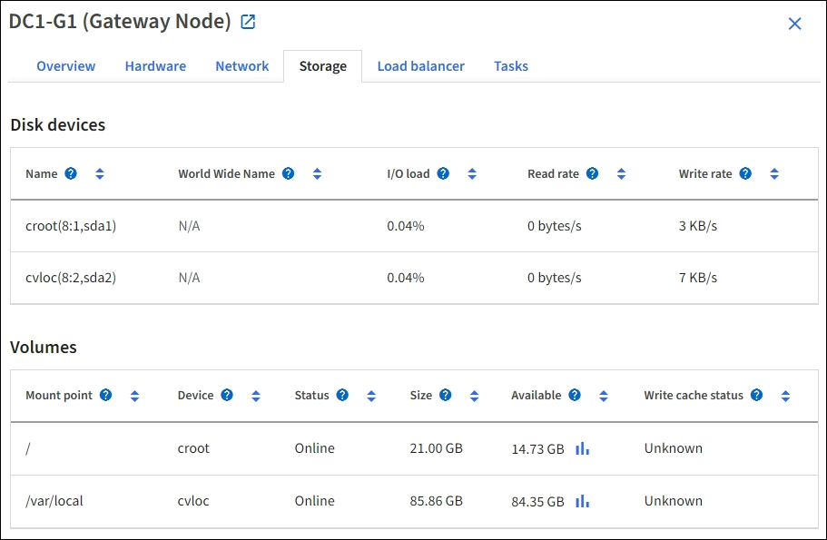

= Viewing information about appliance Admin Nodes and Gateway Nodes
:icons: font
:imagesdir: ../media/

[.lead]
The Nodes page lists information about service health and all computational, disk device, and network resources for each services appliance that is used for an Admin Node or a Gateway Node. You can also see memory, storage hardware, network resources, network interfaces, network addresses, and receive and transmit data.

.Steps
. From the Nodes page, select an appliance Admin Node or an appliance Gateway Node.
. Select *Overview*.
+
The Node Information table on the Overview tab displays the node's ID and name, the node type, the software version installed, and the IP addresses associated with the node. The Interface column contains the name of the interface, as follows:

 ** *adllb* and *adlli*: Shown if active/backup bonding is used for the Admin Network interface
 ** *eth*: The Grid Network, Admin Network, or Client Network.
 ** *hic*: One of the physical 10, 25, or 100 GbE ports on the appliance. These ports can be bonded together and connected to the StorageGRID Grid Network (eth0) and Client Network (eth2).
 ** *mtc*: One of the physical 1 GbE ports on the appliance, which can be bonded or aliased and connected to the StorageGRID Admin Network (eth1).
image:../media/nodes_page_overview_tab_services_appliance.png[Nodes Page Overview tab for services appliance]

. Select *Hardware* to see more information about the appliance.
 .. View the CPU Utilization and Memory graphs to determine the percentages of CPU and memory usage over time. To display a different time interval, select one of the controls above the chart or graph. You can display the information available for intervals of 1 hour, 1 day, 1 week, or 1 month. You can also set a custom interval, which allows you to specify date and time ranges.
+

 .. Scroll down to view the table of components for the appliance. This table contains information such as the model name, serial number, controller firmware version, and the status of each component.
+

+
[options="header"]
|===
| Field in the Appliance table| Description
a|
Appliance Model
a|
The model number for this StorageGRID appliance.
a|
Storage Controller Failed Drive Count
a|
The number of drives that are not optimal.
a|
Storage Data Drive Type
a|
The type of drives in the appliance, such as HDD (hard disk drive) or SSD (solid state drive).
a|
Storage Data Drive Size
a|
The total capacity including all data drives in the appliance.
a|
Storage RAID Mode
a|
The RAID mode for the appliance.
a|
Overall Power Supply
a|
The status of all power supplies in the appliance.
a|
Compute Controller BMC IP
a|
The IP address of the baseboard management controller (BMC) port in the compute controller. You can use this IP to connect to the BMC interface to monitor and diagnose the appliance hardware.

This field is not displayed for appliance models that do not contain a BMC.
a|
Compute Controller Serial Number
a|
The serial number of the compute controller.
a|
Compute Hardware
a|
The status of the compute controller hardware.
a|
Compute Controller CPU Temperature
a|
The temperature status of the compute controller's CPU.
a|
Compute Controller Chassis Temperature
a|
The temperature status of the compute controller.
|===
[start=3}
 .. Confirm that all statuses are "`Nominal.`"
+
If a status is not "`Nominal,`" review any current alerts.
. Select *Network* to view information for each network.
+
The Network Traffic graph provides a summary of overall network traffic.
+
image::../media/nodes_page_network_traffic_graph.gif[Nodes Page Network Traffic Graph]

 .. Review the Network Interfaces section.
+

+
Use the following table with the values in the *Speed* column in the Network Interfaces table to determine whether the four 40/100-GbE network ports on the appliance were configured to use active/backup mode or LACP mode.
+
NOTE: The values shown in the table assume all four links are used.
+
[options="header"]
|===
| Link mode| Bond mode| Individual HIC link speed (hic1, hic2, hic3, hic4)| Expected Grid/Client Network speed (eth0, eth2)
a|
Aggregate
a|
LACP
a|
100
a|
400
a|
Fixed
a|
LACP
a|
100
a|
200
a|
Fixed
a|
Active/Backup
a|
100
a|
100
a|
Aggregate
a|
LACP
a|
40
a|
160
a|
Fixed
a|
LACP
a|
40
a|
80
a|
Fixed
a|
Active/Backup
a|
40
a|
40
|===

 .. Review the Network Communication section.
+
The Receive and Transmit tables show how many bytes and packets have been received and sent across each network as well as other receive and transmission metrics.
+
image::../media/nodes_page_network_communication.gif[Nodes Page Network Comm]

. Select *Storage* to view information about the disk devices and volumes on the services appliance.
+

.Related information

xref:../sg100-1000/index.adoc[SG100 & SG1000 services appliances]
