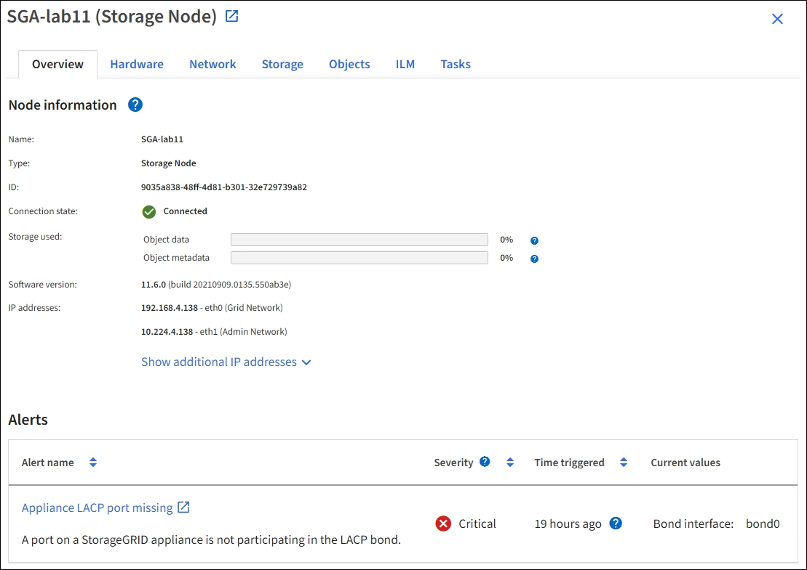
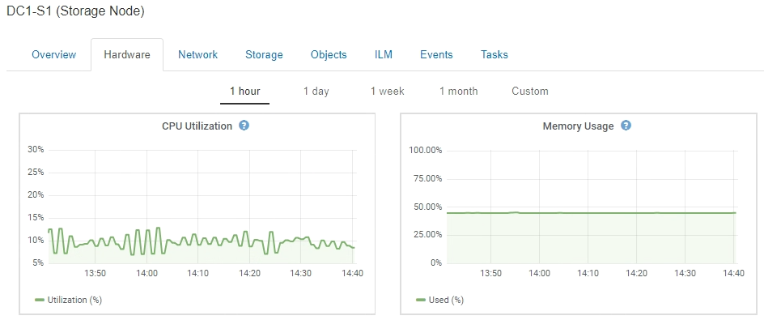
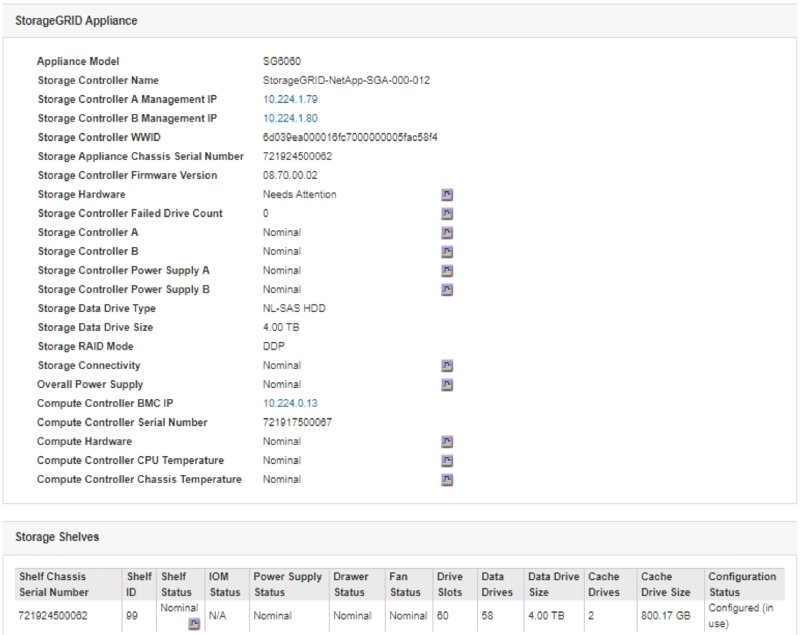
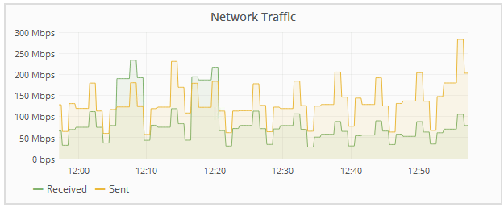
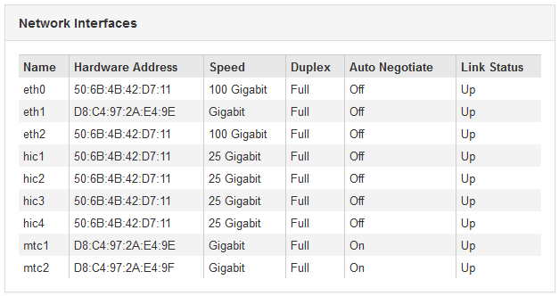
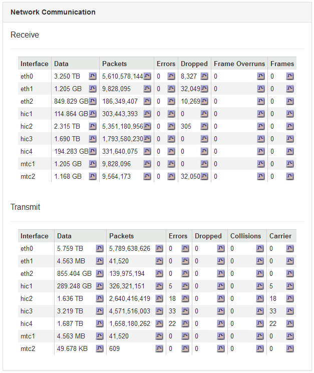

= Viewing information about appliance Storage Nodes
:icons: font
:imagesdir: ../media/

[.lead]
The Nodes page lists information about service health and all computational, disk device, and network resources for each appliance Storage Node. You can also see memory, storage hardware, controller firmware version, network resources, network interfaces, network addresses, and receive and transmit data.

.Steps
. From the Nodes page, select an appliance Storage Node.
. Select *Overview*.
+
The Node Information table on the Overview tab displays the node's ID and name, the node type, the software version installed, and the IP addresses associated with the node. The Interface column contains the name of the interface, as follows:

 ** *eth*: The Grid Network, Admin Network, or Client Network.
 ** *hic*: One of the physical 10, 25, or 100 GbE ports on the appliance. These ports can be bonded together and connected to the StorageGRID Grid Network (eth0) and Client Network (eth2).
 ** *mtc*: One of the physical 1 GbE ports on the appliance, which can be bonded or aliased and connected to the StorageGRID Admin Network (eth1).

. Select *Hardware* to see more information about the appliance.
 .. View the CPU Utilization and Memory graphs to determine the percentages of CPU and memory usage over time. To display a different time interval, select one of the controls above the chart or graph. You can display the information available for intervals of 1 hour, 1 day, 1 week, or 1 month. You can also set a custom interval, which allows you to specify date and time ranges.
+

 .. Scroll down to view the table of components for the appliance. This table contains information such as the model name of the appliance; controller names, serial numbers, and IP addresses; and the status of each component.
+
NOTE: Some fields, such as Compute Controller BMC IP and Compute Hardware, appear only for appliances with that feature.
+
Components for the storage shelves, and expansion shelves if they are part of the installation, appear in a separate table below the appliance table.
+

+
[options="header"]
|===
| Field in the Appliance table| Description
a|
Appliance Model
a|
The model number for this StorageGRID appliance shown in SANtricity software.
a|
Storage Controller Name
a|
The name for this StorageGRID appliance shown in SANtricity software.
a|
Storage Controller A Management IP
a|
IP address for management port 1 on storage controller A. You use this IP to access SANtricity software to troubleshoot storage issues.
a|
Storage Controller B Management IP
a|
IP address for management port 1 on storage controller B. You use this IP to access SANtricity software to troubleshoot storage issues.

Some appliance models do not have a storage controller B.
a|
Storage Controller WWID
a|
The worldwide identifier of the storage controller shown in SANtricity software.
a|
Storage Appliance Chassis Serial Number
a|
The chassis serial number of the appliance.
a|
Storage Controller Firmware Version
a|
The version of the firmware on the storage controller for this appliance.
a|
Storage Hardware
a|
The overall status of the storage controller hardware.        If SANtricity System Manager reports a status of Needs Attention for the storage hardware, the StorageGRID system also reports this value.
+
If the status is "`needs attention,`" first check the storage controller using SANtricity software. Then, ensure that no other alarms exist that apply to the compute controller.
a|
Storage Controller Failed Drive Count
a|
The number of drives that are not optimal.
a|
Storage Controller A
a|
The status of storage controller A.
a|
Storage Controller B
a|
The status of storage controller B. Some appliance models do not have a storage controller B.
a|
Storage Controller Power Supply A
a|
The status of power supply A for the storage controller.
a|
Storage Controller Power Supply B
a|
The status of power supply B for the storage controller.
a|
Storage Data Drive Type
a|
The type of drives in the appliance, such as HDD (hard disk drive) or SSD (solid state drive).
a|
Storage Data Drive Size
a|
The total capacity including all data drives in the appliance.
a|
Storage RAID Mode
a|
The RAID mode configured for the appliance.
a|
Storage Connectivity
a|
The storage connectivity state.
a|
Overall Power Supply
a|
The status of all power supplies for the appliance.
a|
Compute Controller BMC IP
a|
The IP address of the baseboard management controller (BMC) port in the compute controller. You use this IP to connect to the BMC interface to monitor and diagnose the appliance hardware.

This field is not displayed for appliance models that do not contain a BMC.
a|
Compute Controller Serial Number
a|
The serial number of the compute controller.
a|
Compute Hardware
a|
The status of the compute controller hardware.        This field is not displayed for appliance models that do not have separate compute hardware and storage hardware.
a|
Compute Controller CPU Temperature
a|
The temperature status of the compute controller's CPU.
a|
Compute Controller Chassis Temperature
a|
The temperature status of the compute controller.
|===

[options="header"]
|===
| Column in the Storage Shelves table| Description
a|
Shelf Chassis Serial Number
a|
The serial number for the storage shelf chassis.
a|
Shelf ID
a|
The numeric identifier for the storage shelf.

  *** 99: Storage controller shelf
  *** 0: First expansion shelf
  *** 1: Second expansion shelf

*Note:* Expansion shelves apply to the SG6060 only.

a|
Shelf Status
a|
The overall status of the storage shelf.
a|
IOM Status
a|
The status of the input/output modules (IOMs) in any expansion shelves. N/A if this is not an expansion shelf.
a|
Power Supply Status
a|
The overall status of the power supplies for the storage shelf.
a|
Drawer Status
a|
The status of the drawers in the storage shelf. N/A if the shelf does not contain drawers.
a|
Fan Status
a|
The overall status of the cooling fans in the storage shelf.
a|
Drive Slots
a|
The total number of drive slots in the storage shelf.
a|
Data Drives
a|
The number of drives in the storage shelf that are used for data storage.
a|
Data Drive Size
a|
The effective size of one data drive in the storage shelf.
a|
Cache Drives
a|
The number of drives in the storage shelf that are used as cache.
a|
Cache Drive Size
a|
The size of the smallest cache drive in the storage shelf. Normally, cache drives are all the same size.
a|
Configuration Status
a|
The configuration status of the storage shelf.
|===

[start=3]
 .. Confirm that all statuses are "`Nominal.`"
+
If a status is not "`Nominal,`" review any current alerts. You can also use SANtricity System Manager to learn more about some of these hardware values. See the instructions for installing and maintaining your appliance.

[start=4]
. Select *Network* to view information for each network.

The Network Traffic graph provides a summary of overall network traffic.

 .. Review the Network Interfaces section.
+

+
Use the following table with the values in the *Speed* column in the Network Interfaces table to determine whether the 10/25-GbE network ports on the appliance were configured to use active/backup mode or LACP mode.
+
NOTE: The values shown in the table assume all four links are used.
+
[options="header"]
|===
| Link mode| Bond mode| Individual HIC link speed (hic1, hic2, hic3, hic4)| Expected Grid/Client Network speed (eth0,eth2)
a|
Aggregate
a|
LACP
a|
25
a|
100
a|
Fixed
a|
LACP
a|
25
a|
50
a|
Fixed
a|
Active/Backup
a|
25
a|
25
a|
Aggregate
a|
LACP
a|
10
a|
40
a|
Fixed
a|
LACP
a|
10
a|
20
a|
Fixed
a|
Active/Backup
a|
10
a|
10
|===
See the installation and maintenance instructions for your appliance for more information about configuring the 10/25-GbE ports.

 .. Review the Network Communication section.
+
The Receive and Transmit tables show how many bytes and packets have been received and sent across each network as well as other receive and transmit metrics.
+

[start=5]
. Select *Storage* to view graphs that show the percentages of storage used over time for object data and object metadata, as well as information about disk devices, volumes, and object stores.
+
image::../media/nodes_page_storage_used_object_data.png[Storage Used - Object Data]
+
image::../media/storage_used_object_metadata.png[Storage Used - Object Metadata]

 .. Scroll down to view the amounts of available storage for each volume and object store.
+
The Worldwide Name for each disk matches the volume world-wide identifier (WWID) that appears when you view standard volume properties in SANtricity software (the management software connected to the appliance's storage controller).
+
To help you interpret disk read and write statistics related to volume mount points, the first portion of the name shown in the *Name* column of the Disk Devices table (that is, _sdc_, _sdd_, _sde_, and so on) matches the value shown in the *Device* column of the Volumes table.
+
image::../media/nodes_page_storage_tables.png[Nodes Page Storage Tables]

.Related information

xref:../sg6000/index.adoc[SG6000 storage appliances]

xref:../sg5700/index.adoc[SG5700 storage appliances]

xref:../sg5600/index.adoc[SG5600 storage appliances]
